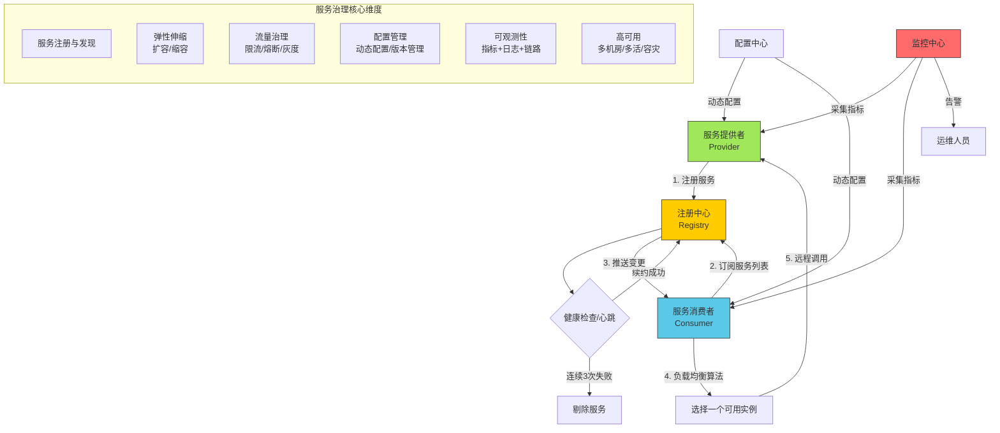
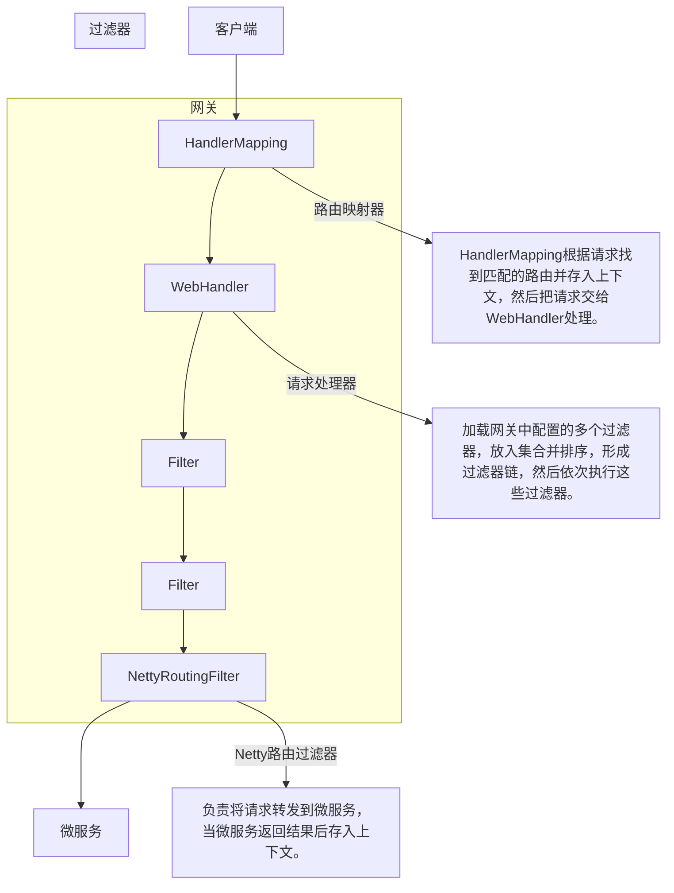
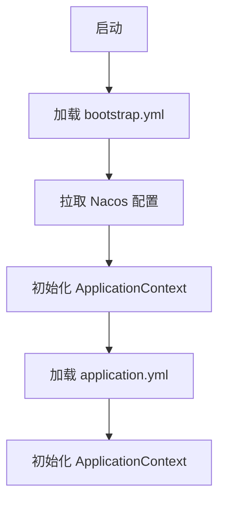

# SpringCloud 微服务架构实践
学习内容: SpringCloud单架构拆分，Nacos注册中心，OpenFeign，网关路由，配置管理

## 一、SpringCloud 单架构拆分

在进行微服务架构拆分时，首先需要修改 Spring 的配置，为每个微服务分配不同的端口和服务名称。以下是 `cart-service` 服务的配置示例：

```yaml
server:
  port: 8082
spring:
  application:
    name: cart-service # 服务名称
  profiles:
    active: dev
  datasource:
    url: jdbc:mysql://${hm.db.host}:3306/hm-cart?useUnicode=true&characterEncoding=UTF-8&autoReconnect=true&serverTimezone=Asia/Shanghai
    driver-class-name: com.mysql.cj.jdbc.Driver # 选择一个独立的数据库架构
    username: root
    password: ${hm.db.pw}
```

当有了多个微服务架构时，它们之间的通信需要通过网络请求来完成。Spring 提供了 `RestTemplate` 工具来发送 HTTP 请求。例如，在 `cart-service` 服务中，可以通过以下方式使用 `RestTemplate` 发送请求：

```java
@MapperScan("com.hmall.cart.mapper")
@SpringBootApplication
public class CartApplication {
    public static void main(String[] args) {
        SpringApplication.run(CartApplication.class, args);
    }

    @Bean
    public RestTemplate restTemplate() {
        return new RestTemplate();
    }
}
```

通过 `restTemplate` 发送 HTTP 请求的示例代码如下：

```java
ResponseEntity<List<ItemDTO>> response = restTemplate.getForEntity("http://192.168.142.130/items?ids={ids}",
                new ParameterizedTypeReference<List<ItemDTO>>() {},
                Map.of("ids", CollUtils.join(itemIds,","))
        );
if(!response.getStatusCode().is2xxSuccessful()) return;
List<ItemDTO> items = response.getBody();
```

然而，在使用 `ParameterizedTypeReference` 时可能会遇到以下问题：

```
Unable to make field private final java.lang.Class java.lang.invoke.SerializedLambda.capturingClass accessible
```

原因是 JDK 9+ 的模块系统把 `java.lang.invoke` 包默认“关死”了，而 MyBatis-Plus 3.4.3 仍要反射访问 `SerializedLambda`，只要运行在没有“开洞”的 JVM 上就会继续失败。解决方法是将以下参数添加到 JVM 启动参数中：

```
--add-opens java.base/java.lang.invoke=ALL-UNNAMED
```

## 二、Nacos 注册中心

在微服务架构中，将请求 URL 写死（如`http://192.168.142.130`）显然不太合适，因为通常会有多个实例共同处理请求。Nacos 注册中心可以很好地解决这个问题。

以下是服务治理的全流程示意图：



对于服务治理，我们需要了解三个概念：

- **服务提供者**：暴露接口给其他服务使用。
- **服务调用者**：使用其他服务提供的接口。
- **注册中心**：中介，管理提供者和调用者的信息。

在数据库服务器上配置好 Nacos 注册中心后，需要在后端引入相关依赖。以下是引入依赖的代码示例：

```xml
<!--nacos 服务注册发现-->
<dependency>
    <groupId>com.alibaba.cloud</groupId>
    <artifactId>spring-cloud-starter-alibaba-nacos-discovery</artifactId>
</dependency>
```

接着，需要配置 Nacos 的地址，示例代码如下：

```yaml
spring:
  application:
    name: cart-service
  cloud:
    nacos:
      server-addr: 192.168.142.130:8848 # nacos地址
```

配置完成后，可以通过访问浏览器地址`http://192.168.142.130:8848/nacos`来查看相关实例信息。

在调用服务时，可以根据服务名称获取实例，代替固定的 URL 访问。示例代码如下：

```java
List<ServiceInstance> instances = discoveryClient.getInstances("item-service");
if(instances.isEmpty()) return;

ServiceInstance instance = instances.get(RandomUtil.randomInt(instances.size()));
ResponseEntity<List<ItemDTO>> response = restTemplate.exchange(instance.getUri()+ "/items?ids={ids}",
        HttpMethod.GET,
        null,
        new ParameterizedTypeReference<List<ItemDTO>>() {},
        Map.of("ids", CollUtils.join(itemIds,","))
);
```

## 三、OpenFeign

通过 OpenFeign，可以进一步简化 API 调用流程。

首先，需要引入相关依赖。示例代码如下：

```xml
<!-- OpenFeign -->
<dependency>
    <groupId>org.springframework.cloud</groupId>
    <artifactId>spring-cloud-starter-openfeign</artifactId>
</dependency>
<!-- 负载均衡-->
<dependency>
    <groupId>org.springframework.cloud</groupId>
    <artifactId>spring-cloud-starter-loadbalancer</artifactId>
</dependency>
```

然后，编写 client 接口，用类似 controller 的风格编写请求方法。示例代码如下：

```java
@FeignClient(value = "item-service", configuration = DefaultFeignConfig.class)
public interface ItemClient {
    @GetMapping("/items")
    List<ItemDTO> queryItemsByIds(@RequestParam("ids") List<Long> ids);
}
```

在启动器上添加注解，示例代码如下：

```java
@EnableFeignClients(basePackages = "com.hmall.api.client", defaultConfiguration = DefaultFeignConfig.class)
public class CartApplication
```

接着，就可以简单地实现 HTTP 请求了。示例代码如下：

```java
List<ItemDTO> items = itemClient.queryItemsByIds(new ArrayList<>(itemIds));
```

需要注意的是，OpenFeign 默认使用 `HttpURLConnection` 实现 HTTP 请求，因为没有连接池，所以效率上会比较慢。它支持 Apache HttpClient 和 OKHttp。

这里以 OKHttp 为例，只需引入依赖并编写配置类即可。示例代码如下：

```xml
<!--ok http-->
<dependency>
    <groupId>io.github.openfeign</groupId>
    <artifactId>feign-okhttp</artifactId>
</dependency>
```

```yaml
#开启连接池
feign:
  okhttp:
    enabled: true
```

关于 OpenFeign 的日志输出规则，需要注意以下几点：

- 只在 FeignClient 所在包的日志级别为 DEBUG 时才输出。
- 日志级别有 4 级，默认是 NONE：
  - **NONE**：不记录（默认）。
  - **BASIC**：方法、URL、响应码、执行时间。
  - **HEADERS**：BASIC + 请求 / 响应头。
  - **FULL**：全部明细（头、体、元数据）。

如果需要自定义日志级别，可以声明一个 Bean。示例代码如下

好的，继续之前的输出内容：

```java
public class DefaultFeignConfig {
    @Bean
    public Logger.Level feignLoggerLevel() {
        return Logger.Level.FULL;
    }
}
```

如果需要局部输出日志，可以在目标 client 添加 `defaultConfiguration` 配置。示例代码如下：

```java
@FeignClient(value = "item-service", configuration = DefaultFeignConfig.class)
public interface ItemClient
```

如果需要全局输出日志，可以在启动类上添加 `defaultConfiguration` 配置。示例代码如下：

```java
@EnableFeignClients(basePackages = "com.hmall.api.client", defaultConfiguration = DefaultFeignConfig.class)
@SpringBootApplication
public class CartApplication
```

此外，还可以借助 OpenFeign 的拦截器接口来跨组件传递上下文信息。示例代码如下：

```java
public class DefaultFeignConfig {
    @Bean
    public RequestInterceptor userInfoRequestInterceptor() {
        return new RequestInterceptor() {
            @Override
            public void apply(RequestTemplate requestTemplate) {
                Long userId = UserContext.getUser();
                if(userId != null){
                    requestTemplate.header("user-info", userId.toString());
                }
            }
        };
    }
}
```

## 四、网关路由

配置一个专门的微服务来作为网络的关口，进行路由转发。

首先，需要引入相应的网关依赖。示例代码如下：

```xml
<!--网关-->
<dependency>
    <groupId>org.springframework.cloud</groupId>
    <artifactId>spring-cloud-starter-gateway</artifactId>
</dependency>
```

接着，添加路由配置。示例代码如下：

```yaml
spring:
  application:
    name: gateway
  cloud:
    nacos:
      server-addr: 192.168.142.130:8848
    gateway:
      routes:
        - id: item # 路由规则id，自定义，唯一
          uri: lb://item-service # 路由的目标服务，lb代表负载均衡，会从注册中心拉取服务列表
          predicates: # 路由断言，判断当前请求是否符合当前规则，符合则路由到目标服务
            - Path=/items/**,/search/** # 这里是以请求路径作为判断规则
```

过滤器配置的流程如下图所示：



全局过滤器的位置在网关的 `WebHandler` 之后。可以通过继承全局过滤器和 `Ordered` 来实现。示例代码如下：

```java
@Component
public class MyGlobalFilter implements GlobalFilter, Ordered {

    @Override
    public Mono<Void> filter(ServerWebExchange exchange, GatewayFilterChain chain) {
        ServerHttpRequest request = exchange.getRequest();
        return chain.filter(exchange);
    }

    @Override
    public int getOrder() {
        return 0; //决定执行顺序，越小优先级越高
    }
}
```

通过网关来转发信息时，可以对下游的请求进行修改。例如，以登录 token 为例，将 `userId` 信息存入请求头之中。示例代码如下：

```java
try{
    Long userId = jwtTool.parseToken(token);
    exchange.mutate().request(builder -> builder.header("user-info",userId.toString())).build();
    return chain.filter(exchange);
}
```

接着，可以在下游的微服务的拦截器上获取到请求头的信息，并存入上下文中。示例代码如下：

```java
@RequiredArgsConstructor
public class UserInfoInterceptor implements HandlerInterceptor {

    @Override
    public boolean preHandle(HttpServletRequest request, HttpServletResponse response, Object handler) throws Exception {
        String userInfo = request.getHeader("user-info");
        if (userInfo != null) {
            UserContext.setUser(Long.valueOf(userInfo));
        }
        return true;
    }

    @Override
    public void afterCompletion(HttpServletRequest request, HttpServletResponse response, Object handler, Exception ex) throws Exception {
        // 清理用户
        UserContext.removeUser();
    }
}
```

因为注册该拦截器的 `MvcConfig` 在 `common` 包下，为了其他不同包下的微服务能够对其实现自动装配，需要在 `spring.factories` 配置注明该配置类。示例代码如下：

```properties
org.springframework.boot.autoconfigure.EnableAutoConfiguration=\
  com.hmall.common.config.MyBatisConfig,\
  com.hmall.common.config.JsonConfig,\
  com.hmall.common.config.MvcConfig
```

为了提高兼容性，指定当 `DispatcherServlet.class` 存在时才装配 `MvcConfig`（即 SpringMvc 依赖存在）。示例代码如下：

```java
@Configuration
@RequiredArgsConstructor
@ConditionalOnClass(DispatcherServlet.class)
public class MvcConfig implements WebMvcConfigurer {
    @Override
    public void addInterceptors(InterceptorRegistry registry) {
      registry.addInterceptor(new UserInfoInterceptor());
    }
}
```

## 五、配置管理

将众多微服务的公共配置提取出来，可以方便我们进行管理。Nacos 注册中心提供了配置管理的功能。

首先，需要安装相关依赖。示例代码如下：

```xml
<!--nacos配置管理-->
<dependency>
    <groupId>com.alibaba.cloud</groupId>
    <artifactId>spring-cloud-starter-alibaba-nacos-config</artifactId>
</dependency>
<!--读取bootstrap文件-->
<dependency>
    <groupId>org.springframework.cloud</groupId>
    <artifactId>spring-cloud-starter-bootstrap</artifactId>
</dependency>
```

因为加载 `application` 配置在拉取 Nacos 配置之后，所以不能直接写在配置文件里，而是通过加载 `cloud` 的 `bootstrap.yaml`。加载顺序如下图所示：



在 Nacos 的 `config` 里标明需要线上拉取的配置文件。示例代码如下：

```yaml
spring:
  application:
    name: cart-service
  profiles:
    active: dev
  cloud:
    nacos:
      server-addr: 192.168.142.130:8848 # nacos地址
      config:
        file-extension: yaml
        shared-configs:
          - data-id: shared-jdbc.yaml
          - data-id: shared-log.yaml
          - data-id: shared-swagger.yaml
```

```yaml
mybatis-plus:
  configuration:
    default-enum-type-handler: com.baomidou.mybatisplus.core.handlers.MybatisEnumTypeHandler
  global-config:
    db-config:
      update-strategy: not_null
      id-type: auto
```

原来的 `application.yaml` 中只保留该微服务相关的配置即可。示例代码如下：

```yaml
server:
  port: 8082
```

Spring 会把这些配置文件合并到一起，所以线上的配置文件也是可以写 `${}` 的。例如：

```yaml
hm:
  db:
    database: hm-cart
```

同样地，可以用配置类来接收线上配置，来实现热更新配置。示例代码如下：

```java
@Data
@RefreshScope
@Component
public class CartProperties {
    @Value("${hm.cart.maxItems}")
    private Integer maxItems;
}
```

借助于线上配置来实现动态路由。示例代码如下：

```java
@Component
@Slf4j
@RequiredArgsConstructor
public class DynamicRouteLoader {
    private final NacosConfigManager nacosConfigManager;
    private final RouteDefinitionWriter routeDefinitionWriter;

    private final String dataId = "gateway-routes.json";
    private final String group = "DEFAULT_GROUP";

    private final Set<String> routeIds = new HashSet<>();
    @PostConstruct // Bean 初始化完成之后执行
    public void initRouteConfigListener() throws NacosException {
        String configInfo = nacosConfigManager.getConfigService().getConfigAndSignListener(dataId, group, 5000, new Listener() {
            @Override
            public Executor getExecutor() {
                return null;
            }

            @Override
            public void receiveConfigInfo(String configInfo) {
                updateConfigInfo(configInfo);
            }
        });
        updateConfigInfo(configInfo);
    }

    private void updateConfigInfo(String configInfo){
        log.debug("更新路由配置信息 -> {}", configInfo);
        //解析配置信息
        List<RouteDefinition> routeDefinitions = JSONUtil.toList(configInfo, RouteDefinition.class);
        //清理旧路由表
        for(String routeId:routeIds){
            routeDefinitionWriter.delete(Mono.just(routeId)).subscribe();
        }
        routeIds.clear();
        //更新路由表
        for(RouteDefinition routeDefinition:routeDefinitions){
            routeDefinitionWriter.save(Mono.just(routeDefinition)).subscribe();
            routeIds.add(routeDefinition.getId());
        }
    }
}
```

原来的路由配置写成 json 格式如下：

```json
[
    {
        "id": "item",
        "predicates": [{
            "name": "Path",
            "args": {"_genkey_0":"/items/**", "_genkey_1":"/search/**"}
        }],
        "filters": [],
        "uri": "lb://item-service"
    }
]
```
