# Sentinel 微服务流量控制与 Seata 分布式事务学习笔记

## Sentinel 微服务保护

### 1.1 官网与依赖

官网地址：[Sentinel 官网](https://sentinel.sh/)

在官网下载 jar 包，并通过以下命令启动：
```bash
java -Dserver.port=8090 -Dcsp.sentinel.dashboard.server=localhost:8090 -Dproject.name=sentinel-dashboard -jar sentinel-dashboard.jar
```

引入依赖：
```xml
<!--sentinel-->
<dependency>
    <groupId>com.alibaba.cloud</groupId>
    <artifactId>spring-cloud-starter-alibaba-sentinel</artifactId>
</dependency>
```

### 1.2 配置控制台与监听

配置控制台，使 Sentinel 能够监听微服务的路由：
```yaml
sentinel:
  transport:
    dashboard: localhost:8090
  http-method-specify: true # 启用http方法级别限流
```

开启 Sentinel 对 OpenFeign 转发的监听：
```yaml
feign:
  #集簇监控
  sentinel:
    enabled: true
```

### 1.3 簇点链路与规则

在 Sentinel 中，簇点链路是“一次请求在系统里实际走过的所有被监控点（资源）连成的路径”。可以把它想成一张“调用地图”：

- 地图上的每个“点”叫资源（一次 URL、一个方法、一段代码块）。
- 请求从入口开始，每经过一个资源就留下一个“脚印”，这些脚印按顺序连成一条链路。
- 所有链路汇总后，同一资源不管被多少条链路经过，都会归到一个**簇点**上，形成“簇点链路”视图。
- 限流、熔断、热点、授权等规则，都是基于簇点链路生效的。

### 1.4 请求限流

限制流向下游链路的请求数量，防止其过载。

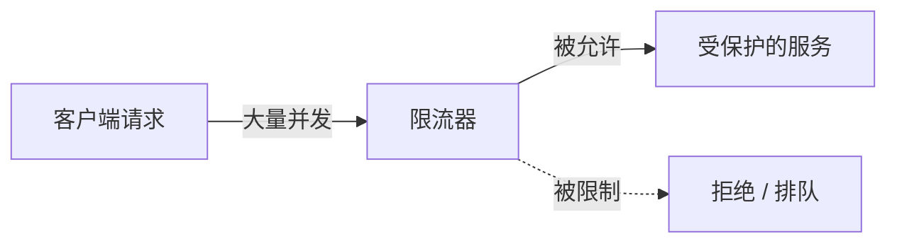

### 1.5 舱壁隔离

限制处理发送到某个下游的请求的线程数量，将超载隔离到局部。

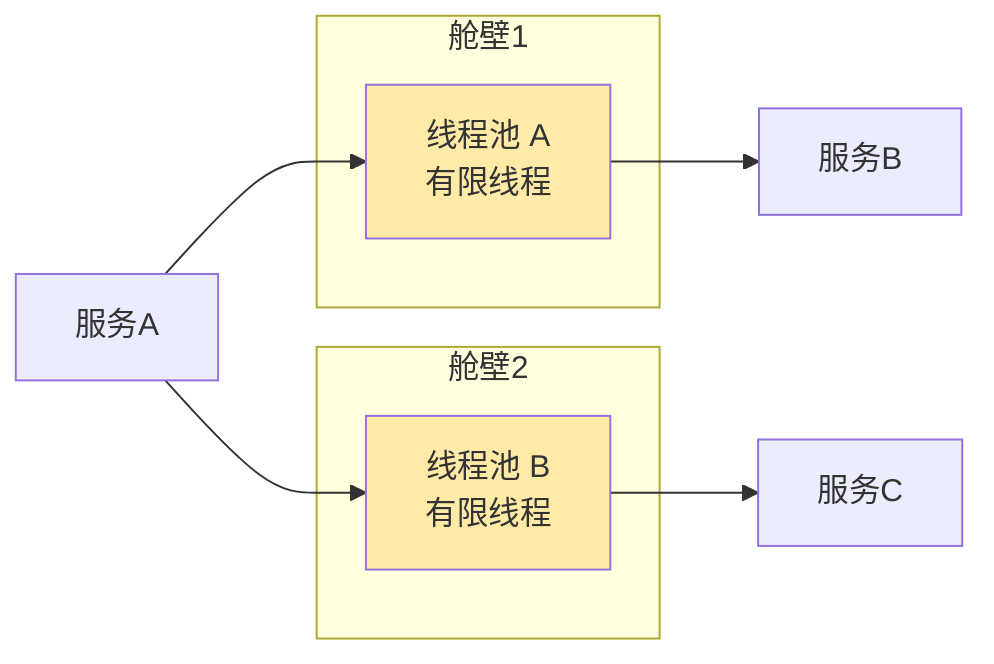

### 1.6 Fallback 逻辑

设置 Fallback 逻辑让被拒请求快速失败来减少资源占用时间。

定义 FallbackFactory：
```java
@Slf4j
public class ItemClientFallbackFactory implements FallbackFactory<ItemClient> {
    @Override
    public ItemClient create(Throwable cause) {
        return new ItemClient() {
            @Override
            public List<ItemDTO> queryItemsByIds(List<Long> ids) {
                log.error("查询商品信息失败：{}", cause.getMessage());
                return Collections.emptyList();
            }

            @Override
            public void deductStock(List<OrderDetailDTO> detailDTOS) {
                log.error("扣减库存失败：{}", cause.getMessage());
                throw new RuntimeException("扣减库存失败");
            }
        };
    }
}
```

注册 bean 到 config：
```java
public class DefaultFeignConfig {

    @Bean
    public ItemClientFallbackFactory itemClientFallbackFactory() {
        return new ItemClientFallbackFactory();
    }
}
```

在 client 中注明使用的 factory：
```java
@FeignClient(value = "item-service", configuration = DefaultFeignConfig.class,fallbackFactory = ItemClientFallbackFactory.class)
public interface ItemClient {
    @GetMapping("/items")
    List<ItemDTO> queryItemsByIds(@RequestParam("ids") List<Long> ids);

    @PutMapping("items/stock/deduct")
    void deductStock(List<OrderDetailDTO> detailDTOS);
}
```

### 1.7 服务熔断

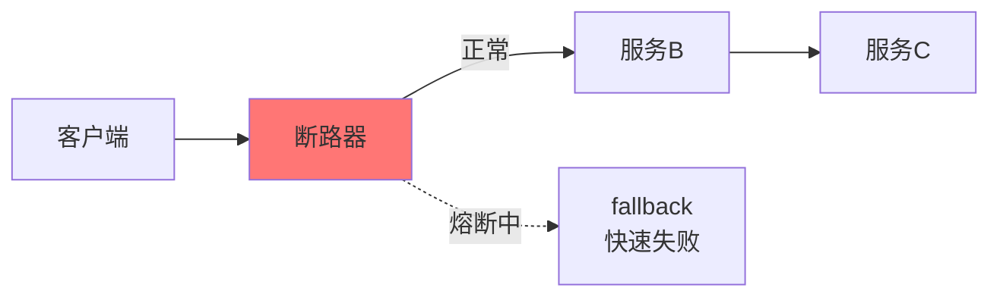

Sentinel 断路器的状态机机制：
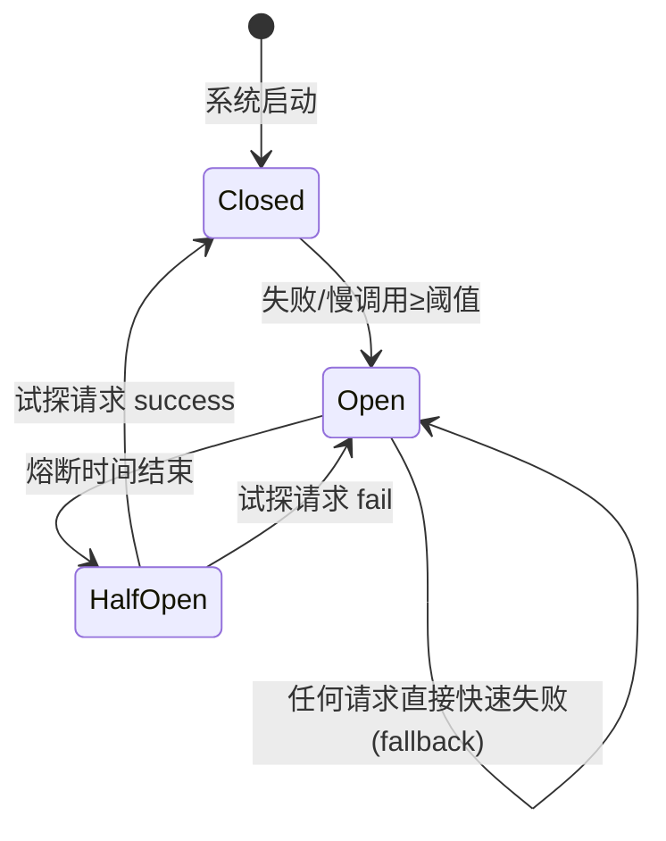

## Seata 分布式事务

### 2.1 分布式事务问题

因为分布式事务在多个数据库里进行了数据的 CURD，所以发生错误时会难以回滚。

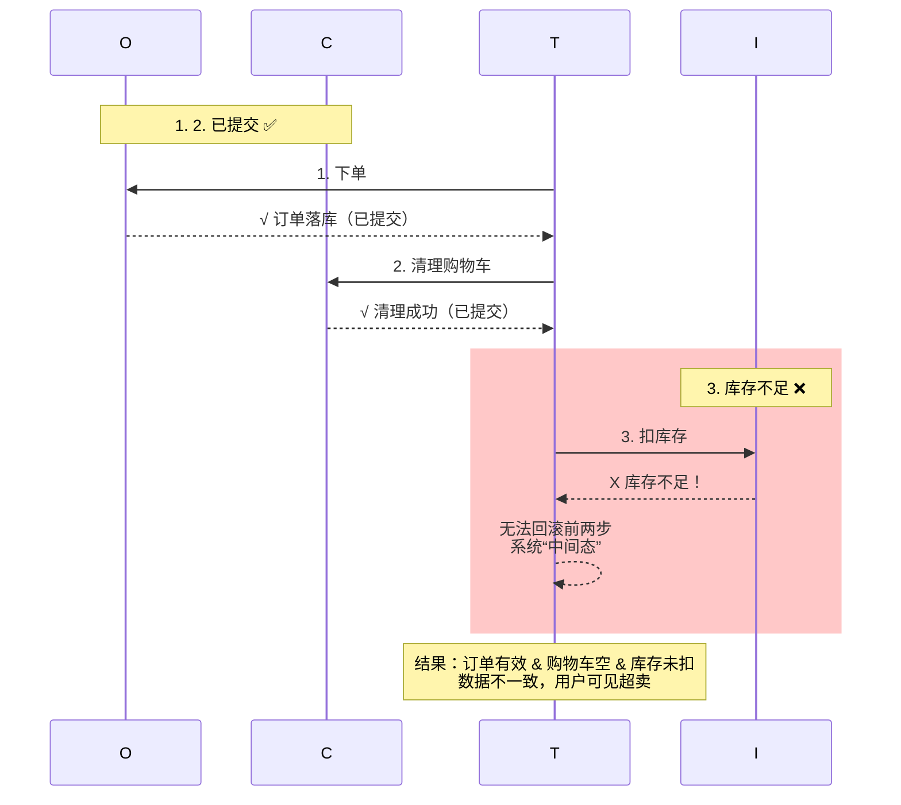

### 2.2 Seata 解决方案

Seata 是一个成熟的分布式问题解决方案，它通过全局性的事务管理来控制事务的回滚。

#### 2.2.1 三大角色

- **TC**：TransactionCoordinator，事务协调者，维护全局及分支事务状态。
- **TM**：TransactionManager，事务管理器，定义全局事务范围，发起提交/回滚。
- **RM**：ResourceManager，资源管理器，管理分支事务，向 TC 注册并汇报。

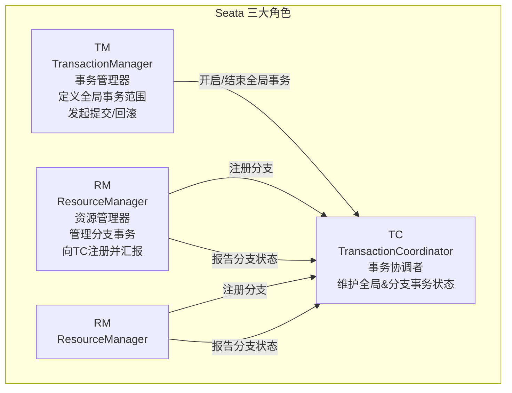

#### 2.2.2 事务流程

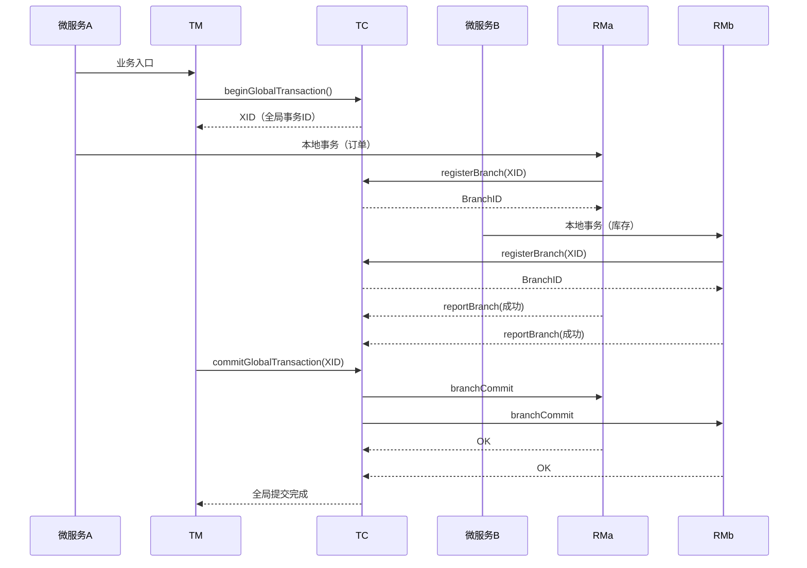

### 2.3 部署 TC 服务

准备 Seata 的 sql 脚本和配置文件，部署到 Docker 容器中：
```bash
docker run --name seata \
-p 8099:8099 \
-p 7099:7099 \
-e SEATA_IP=192.168.142.130 \
-v ./seata:/seata-server/resources \
--privileged=true \
--network hm-net \
-d \
seataio/seata-server:1.5.2
```

它必须与数据库和 Nacos 在同一个网络中。

引入 Seata 依赖：
```xml
<!--seata-->
<dependency>
    <groupId>com.alibaba.cloud</groupId>
    <artifactId>spring-cloud-starter-alibaba-seata</artifactId>
</dependency>
```

在 Nacos 中添加 Seata 的全局配置：
```yaml
seata:
  registry: # TC服务注册中心的配置，微服务根据这些信息去注册中心获取tc服务地址
    type: nacos # 注册中心类型 nacos
    nacos:
      server-addr: 192.168.142.130:8848 # nacos地址
      namespace: "" # namespace，默认为空
      group: DEFAULT_GROUP # 分组，默认是DEFAULT_GROUP
      application: seata-server # seata服务名称
      username: nacos
      password: nacos
  tx-service-group: hmall # 事务组名称
  service:
    vgroup-mapping: # 事务组与tc集群的映射关系
      hmall: "default"
```

加入到 Nacos 配置组当中：
```yaml
spring:
  cloud:
    nacos:
      server-addr: 192.168.142.130:8848 # nacos地址
      config:
        file-extension: yaml
        shared-configs:
          - data-id: shared-seata.yaml
```

我使用了 JDK17，所以需要在启动项中额外配置：
```bash
--add-opens java.base/java.lang=ALL-UNNAMED
--add-opens java.base/sun.net.util=ALL-UNNAMED
```

接着将 `@Transactional` 注解改成 `@GlobalTransactinal` 即可。

### 2.4 XA 模式

在每个局部线程上上锁，直到全部微服务报告完成再统一写入数据库。

#### 优点

- 强一致性

#### 缺点

- 资源占用时间长

#### 一阶段

注册 + 执行业务 SQL 但不提交。

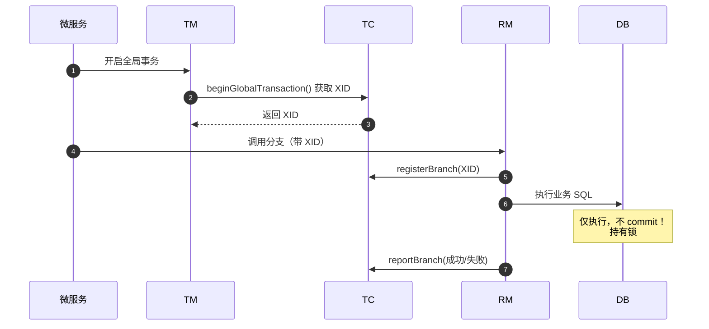

#### 二阶段

TC 统一决策提交 or 回滚。

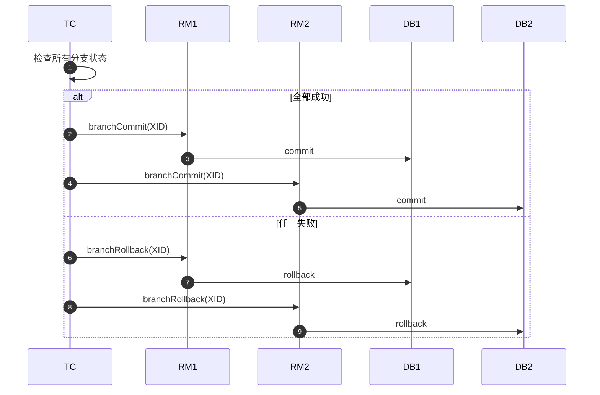

### 2.5 AT 模式

每个局部线程可以直接提交，以一份 log 快照储存原来的状态，当需要回滚时以 log 快照进行状态的重置。

#### 优点

- 效率高

#### 缺点

- 数据库实际被写入，所以回滚期间会出现短暂的数据不一致的问题

#### 一阶段

注册 + 执行业务 SQL 并提交（留 undo-log）。

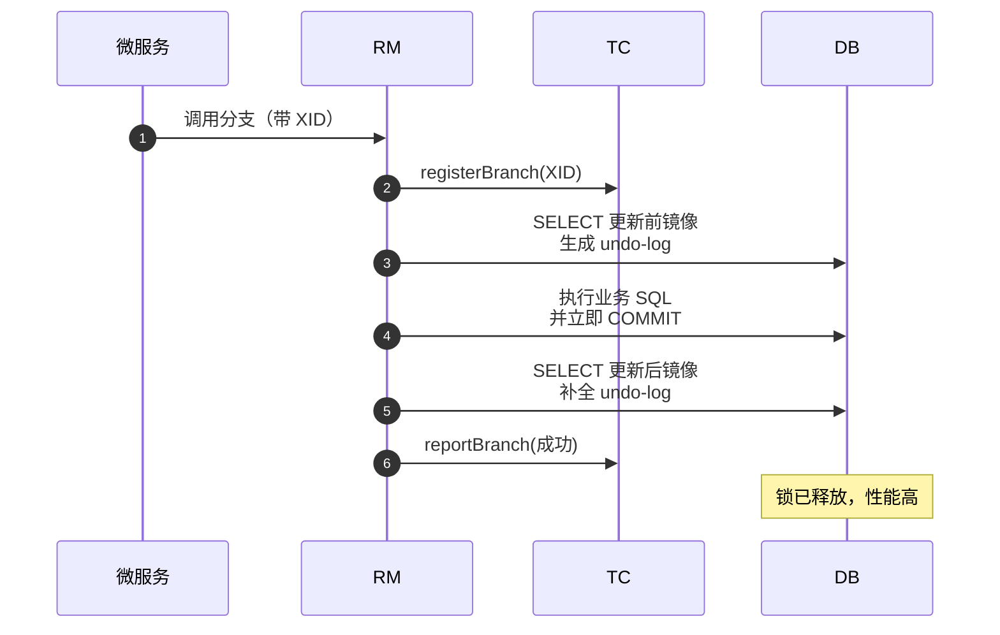

#### 二阶段 - 回滚

用 undo-log 补偿数据到更新前。

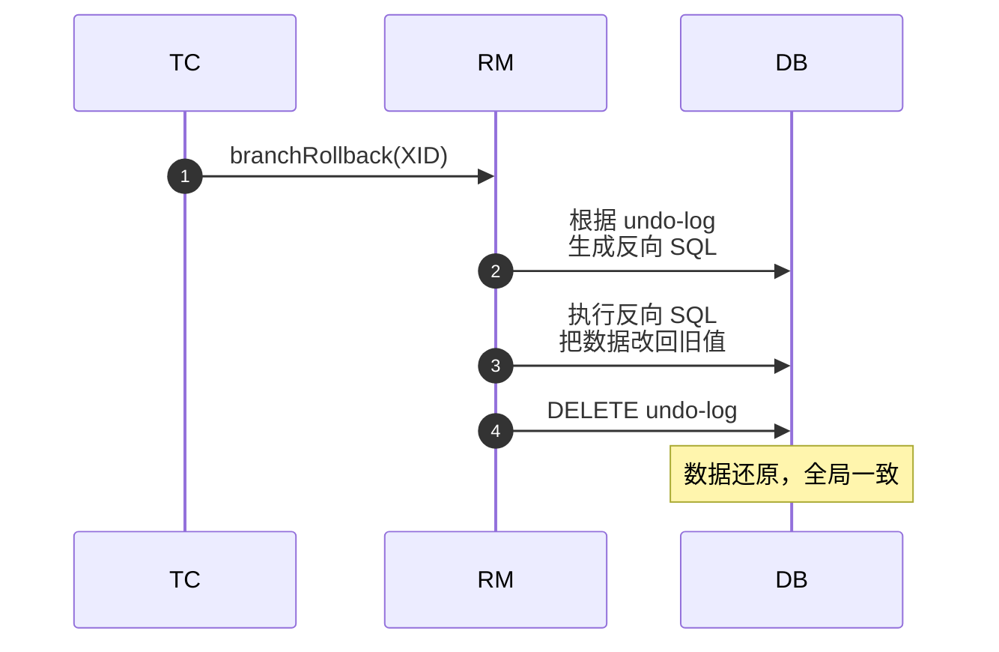

要配置 XA 或者 AT 模式只需要更改一下配置即可：
```yaml
seata:
  data-source-proxy-mode: XA
```

AT 模式需要在数据库中添加一张 undo-log 表：
```sql
-- for AT mode you must to init this sql for you business database. the seata server not need it.
CREATE TABLE IF NOT EXISTS `undo_log`
(
    `branch_id`     BIGINT       NOT NULL COMMENT 'branch transaction id',
    `xid`           VARCHAR(128) NOT NULL COMMENT 'global transaction id',
    `context`       VARCHAR(128) NOT NULL COMMENT 'undo_log context,such as serialization',
    `rollback_info` LONGBLOB     NOT NULL COMMENT 'rollback info',
    `log_status`    INT(11)      NOT NULL COMMENT '0:normal status,1:defense status',
    `log_created`   DATETIME(6)  NOT NULL COMMENT 'create datetime',
    `log_modified`  DATETIME(6)  NOT NULL COMMENT 'modify datetime',
    UNIQUE KEY `ux_undo_log` (`xid`, `branch_id`)
) ENGINE = InnoDB
  AUTO_INCREMENT = 1
  DEFAULT CHARSET = utf8mb4 COMMENT ='AT transaction mode undo table';
```
