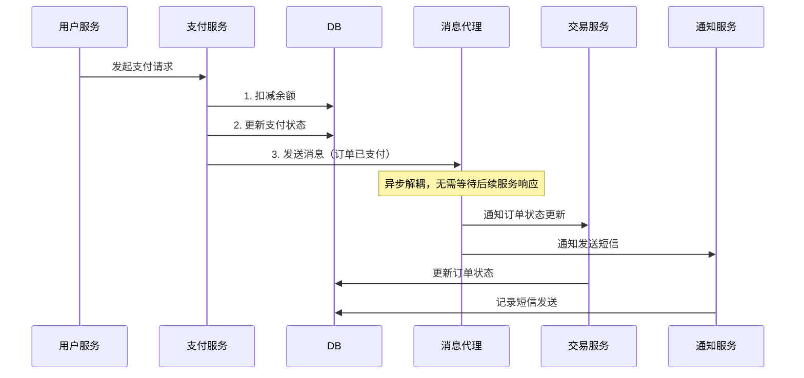
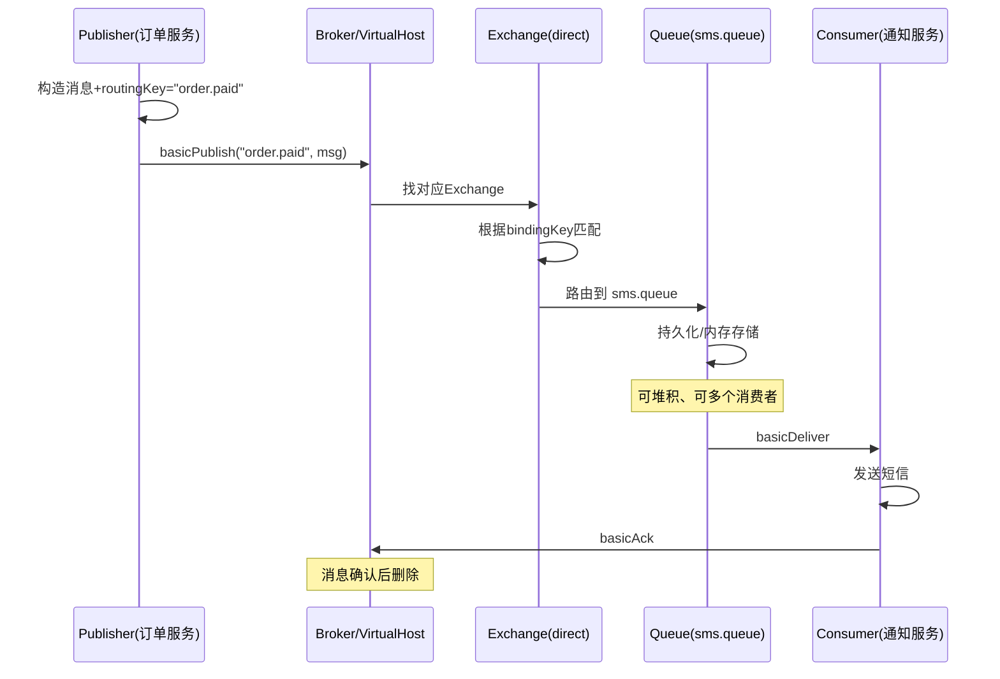

# RabbitMQ入门与Spring AMQP实战指南

## 导航

- RabbitMQ入门
- Spring AMQP
- 三种交换机模式
- 通过Bean/注解声明交换机和队列
- 消息转换器

## RabbitMQ入门

异步通信技术是指将消息通过消息代理发送给下游，上游不关心消息何时到达，处理情况如何。以下是一个典型的异步通信流程：



RabbitMQ是一种常用的消息队列技术选型，其工作原理如下：



- **Publisher**：消息的发送者。
- **VirtualHost**：数据库里的“库”，同一RabbitMQ实例下用不同vhost做业务/环境隔离。
- **Exchange**：交换机，只负责“路由”，不存消息；消息只落在Queue里。
- **Queue（队列）**：与Consumer（消息接收者）的关系是多对多，一个Queue可被多个Consumer共享（轮询），也可独占。

通过Docker安装RabbitMQ的命令如下：

```bash
docker run \
 -e RABBITMQ_DEFAULT_USER=itheima \
 -e RABBITMQ_DEFAULT_PASS=123321 \
 -v mq-plugins:/plugins \
 --name mq \
 --hostname mq \
 -p 15672:15672 \
 -p 5672:5672 \
 --network hm-net\
 -d \
 rabbitmq:3.8-management
```

## Spring AMQP

### 引入依赖

```xml
<!-- rabbitmq-->
<dependency>
    <groupId>org.springframework.boot</groupId>
    <artifactId>spring-boot-starter-amqp</artifactId>
</dependency>
```

### 添加配置

```yaml
spring:
  rabbitmq:
    host: 192.168.142.130
    port: 5672
    username: itheima
    password: 123321
    virtual-host: /
```

### 发送消息

```java
@Test
public void testSimpleQueue(){
    String queueName = "simple.queue";

    String message = "hello, simple queue";
    rabbitTemplate.convertAndSend(queueName, message);
}
```

### 消费消息

```java
@Slf4j
@Component
public class SpringRabbitListener {
    @RabbitListener(queues = "simple.queue")
    public void listenerSimpleQueue(String message) {
        log.info("消费者1接收到的消息是：{}", message);
    }
}
```

一个队列对多个消费者时，默认是轮询发送，即将总数一分为二，每个消费者分别获取相同的消息数。可以通过限制消费者一次获取的消息数量来让处理快的消费者处理更多消息：

```yaml
spring:
  rabbitmq:
    listener:
      simple:
        prefetch: 1
```

## 三种交换机模式

| 交换机类型      | 路由算法（Exchange 行为）             | 典型绑定（Binding）写法       | 消息会被投递到…   | 使用场景一句话    |
| ---------- | ----------------------------- | --------------------- | ---------- | ---------- |
| **Fanout** | 纯广播：无视 routingKey             | 无需 key（空串即可）          | **所有**绑定队列 | 群发公告、配置刷新  |
| **Direct** | 全字匹配：routingKey == bindingKey | `order.paid`          | **唯一**精确队列 | 单点通知、任务分发  |
| **Topic**  | 模式匹配：支持 `*`（一层）与 `#`（多层）      | `order.*` 或 `order.#` | **一类**队列   | 多维度订阅、事件分级 |

收发示例：

```java
@Test
public void testRabbitListenerBinding(){
    String exchangeName = "direct.exchange";
    for(int i = 1; i <= 50; i++){
        String message = "message: " + i;
        rabbitTemplate.convertAndSend(exchangeName, "blue", message);
    }
    for(int i = 1; i <= 50; i++){
        String message = "message: " + i;
        rabbitTemplate.convertAndSend(exchangeName, "red", message);
    }
}
// key和交换机在Rabbit控制台上绑定
@RabbitListener(queues = "direct.queue1")
public void listenerDirectQueue(String message) {
    log.info("directQ1接收到消息是：{}", message);
}
```

## 通过Bean/注解声明交换机和队列

### Bean声明

```java
@Configuration
public class FanoutConfig {
    @Bean
    public FanoutExchange fanoutExchange(){
        return new FanoutExchange("fanout.exchange");
    }

    @Bean
    public Queue fanoutQueue1(){
        return new Queue("fanout.queue1");
    }

    @Bean
    public Binding bindingQueue1(FanoutExchange fanoutExchange, Queue fanoutQueue1){
        return BindingBuilder.bind(fanoutQueue1).to(fanoutExchange);
    }

    @Bean
    public Binding bindingQueue2(DirectExchange directExchange, Queue directQueue1){
        return BindingBuilder.bind(directQueue1).to(directExchange).with("blue");
        //一次只能绑定一个key
    }
}
```

### 注解声明

```java
@RabbitListener(bindings = @QueueBinding(
        value = @Queue(name = "direct.queue1"),
        exchange = @Exchange(name = "direct.exchange", type = "direct"),
        key = {"red", "blue"}
))
public void listenerDirectQueue1(String message) {
    log.info("directQ1接收到消息是：{}", message);
}

@RabbitListener(bindings = @QueueBinding(
        value = @Queue(name = "direct.queue2"),
        exchange = @Exchange(name = "direct.exchange", type = ExchangeTypes.DIRECT),
        key = {"red"}
))
public void listenerDirectQueue2(String message) {
    log.error("directQ2接收到消息是：{}", message);
}
```

工作原理：在Spring Boot里，这段代码只是“声明式绑定”，它只负责告诉RabbitMQ：

1. 我想要一个名为`direct.exchange`、类型为`DIRECT`的交换机；
2. 我想要一个名为`direct.queue2`的队列；
3. 我想用路由键`red`把队列绑定到交换机。

真正把这些对象创建出来的动作发生在第一次建立连接的时候（Spring AMQP的`RabbitAdmin`会在`ConnectionListener`里自动`declareXXX()`）。因此：

- 如果RabbitMQ里还没有这些对象，`RabbitAdmin`会把它们自动创建（默认都是durable）。
- 如果RabbitMQ里已经存在同名但属性完全一致的对象，声明会被忽略，不会报错。
- 如果同名但属性冲突（例如已有一个叫`direct.exchange`的`fanout`类型交换机），`declareXXX()`会收到RabbitMQ返回的`406 PRECONDITION_FAILED`，Spring AMQP会抛出`AmqpIOException`并打印日志，应用启动失败。

## 消息转换器

Spring对消息对象的处理由`org.springframework.amqp.support.converter.MessageConverter`完成。默认实现是`SimpleMessageConverter`，其基于JDK的`ObjectOutputStream`进行序列化。存在的问题包括：

- JDK序列化存在安全风险；
- JDK序列化后的消息体积大；
- JDK序列化后的消息可读性差。

可以使用Json序列化代替原本的JDK序列化：

### 引入依赖

```xml
<!-- rabbitmq-->
<dependency>
    <groupId>org.springframework.boot</groupId>
    <artifactId>spring-boot-starter-amqp</artifactId>
</dependency>
```

### 通过Bean注入

```java
@Configuration
public class MqConfig {
    @Bean
    public MessageConverter messageConverter(){
        return new Jackson2JsonMessageConverter();
    }
}
```

### 补充

`spring.factories`尾部不能有多余的逗号，否则会视为逗号后面的空字符串是一个类，导致报错。例如：

```properties
org.springframework.boot.autoconfigure.EnableAutoConfiguration=\
  com.hmall.common.config.MyBatisConfig,\
  com.hmall.common.config.JsonConfig,\
  com.hmall.common.config.MvcConfig,\
  com.hmall.common.config.MqConfig, <-- 多余的逗号
```