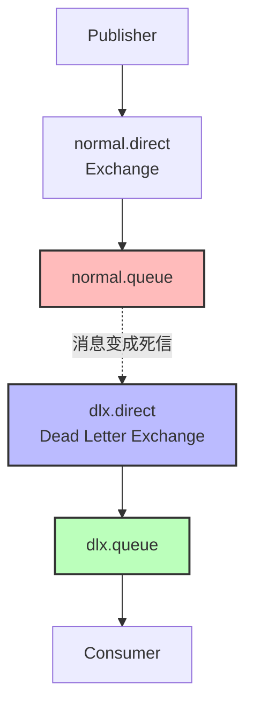

# MQ 消息可靠性与延迟消息实践指南

在分布式系统中，消息队列（MQ）扮演着至关重要的角色，用于实现服务间的异步通信。然而，确保消息的可靠传输以及实现延迟消息功能是实际开发中常见的需求。本文将深入探讨如何保障 MQ 消息的可靠性，并介绍延迟消息的实现方式，助力开发者构建更加健壮、灵活的系统。

## 一、MQ 消息可靠性保障策略

要确保异步消息的可靠性，可从发送者、传输管道、消费者这三个关键环节入手，全方位筑牢消息传输的可靠性防线。

### （一）发送者可靠性

发送者需要明确知晓消息是否成功发送，以下是实现其可靠性的两种主要方式：

1. **超时重连机制**
   当连接 MQ 失败时，通过设置合理的超时时间和重试策略，尝试重新建立连接，确保消息能够顺利发出。以 Spring 配置为例：
   ```yaml
   spring:
     rabbitmq:
       connection-timeout: 1s # 连接超时时间
       template:
         retry: # 重试
           enabled: true
           initial-interval: 1000ms # 延迟时间
           multiplier: 1 # 延迟倍数
           max-attempts: 3 # 最大重试次数
   ```
2. **发送者确认机制**
   MQ 在消息发送后，将确认结果返回给发送者，以便发送者根据确认信息采取相应措施。其工作原理如下图所示：

   ```mermaid
   graph TD
       subgraph 发送者确认机制
           A[Publisher] -->|发送消息| B[Exchange]
           B -->|路由失败| C[PublisherReturn: 路由异常原因]
           B -->|路由成功| D[Queue]
           C --> E[ACK: 投递成功]
           D -->|临时消息| F[Queue1: non-durable]
           D -->|持久消息| G[Queue2: durable]
           F --> H[ACK: 投递成功]
           G --> I[ACK: 投递成功]
           B -->|其它情况| J[NACK: 投递失败]
       end

       style A fill:#f9f,stroke:#333,stroke-width:2px
       style B fill:#bbf,stroke:#333,stroke-width:2px
       style C fill:#fbb,stroke:#333,stroke-width:2px
       style D fill:#bbf,stroke:#333,stroke-width:2px
       style E fill:#bfb,stroke:#333,stroke-width:2px
       style F fill:#fbf,stroke:#333,stroke-width:2px
       style G fill:#fbf,stroke:#333,stroke-width:2px
       style H fill:#bfb,stroke:#333,stroke-width:2px
       style I fill:#bfb,stroke:#333,stroke-width:2px
       style J fill:#fbb,stroke:#333,stroke-width:2px
   ```

   相关配置如下：
   ```yaml
   spring:
     rabbitmq:
       publisher-confirm-type: correlated # 确认模式-异步回调
       publisher-returns: true # 发送确认
   ```

   `confirm-type` 有三种类型：
   - none：关闭（默认）
   - simple：同步阻塞
   - correlated：异步回调

   为 `RabbitTemplate` 设置 `ReturnCallback`：
   ```java
   public class MqConfig {
       private final RabbitTemplate rabbitTemplate;

       @PostConstruct
       public void init(){
           rabbitTemplate.setReturnsCallback(new RabbitTemplate.ReturnsCallback() {
               @Override
               public void returnedMessage(ReturnedMessage returnedMessage) {
                   log.debug("exchange: {}", returnedMessage.getExchange());
                   log.debug("routingKey: {}", returnedMessage.getRoutingKey());
                   log.debug("message: {}", returnedMessage.getMessage());
                   log.debug("replyCode: {}", returnedMessage.getReplyCode());
                   log.debug("replyText: {}", returnedMessage.getReplyText());
               }
           });
       }
   }
   ```

   通过 `CorrelationData` 设置回调的处理方式：
   ```java
   @Test
   public void testConfirmCallback(){
       CorrelationData cd = new CorrelationData(UUID.randomUUID().toString());
       cd.getFuture().addCallback(new ListenableFutureCallback<CorrelationData.Confirm>() {
           /**
            * 确认失败，处理时抛出了异常
            */
           @Override
           public void onFailure(Throwable ex) {
           }

           /**
           * 确认成功 - 消息发送了出去，结果可能是ack 或者 nack
           */
           @Override
           public void onSuccess(CorrelationData.Confirm result) {
               if(result.isAck()){
                   log.info("消息发送成功");
               }else{
                   log.error("消息发送失败 {}",result.getReason());
               }
           }
       });
   }
   ```

### （二）传输管道可靠性

传输管道的可靠性主要依赖于消息的持久化策略。默认情况下，RabbitMQ 将消息保存在内存中，当堆积过多时才向磁盘写入，这会导致消息处理效率降低。为优化这一问题，可采取以下措施：

1. **设置交换机和队列的持久化**
   通过 `Durable` 属性，确保交换机和队列在 RabbitMQ 重启后依然存在，保障消息的持久存储。例如：
   ```java
   @Bean
   public Queue durableQueue(){
       return QueueBuilder.durable("durable.queue").build();
   }
   ```

2. **设置消息的持久化**
   在 Spring 方式下，消息默认是持久化的，但也可以根据需要设置为非持久化（`NON_PERSISTENT`）。示例代码如下：
   ```java
   Message message = MessageBuilder
               .withBody("hello, publisher".getBytes(StandardCharsets.UTF_8))
               .setDeliveryMode(MessageDeliveryMode.NON_PERSISTENT)
               .build();
   ```

3. **使用 LazyQueue**
   LazyQueue 将接收的消息直接存入磁盘，需要时才从磁盘中读取，可有效缓解内存压力。RabbitMQ 3.12 及以上版本的所有队列默认为 LazyQueue，低版本则需手动指定，如：
   ```java
   @Bean
   public Queue fanoutQueue2(){
       return QueueBuilder.durable("fanout.queue2").lazy().build();
   }
   ```

   或通过 `@RabbitListener` 注解配置：
   ```java
   @RabbitListener(bindings = @QueueBinding(
       value = @Queue(name = "lazy.queue", durable = "true", arguments = @Argument(name = "x-queue-mode", value = "lazy")), exchange = null))
   ```

### （三）消费者可靠性

消费者端的可靠性同样至关重要，主要包括以下两个方面：

1. **消费者确认机制**
   SpringAMQP 已实现消息确认功能，可通过配置文件选择 ACK 处理方式，共有三种模式：
   - none：不处理，消息投递给消费者后立刻 ACK，随即从 MQ 删除，这种方式非常不安全，不建议使用。
   - manual：手动模式，需在业务代码中手动调用 API 发送 ACK 或 reject，虽然存在业务入侵，但灵活性更高。
   - auto：自动模式，SpringAMQP 利用 AOP 对消息处理逻辑进行环绕增强，业务正常执行时自动返回 ACK；若业务出现异常，则根据异常类型返回不同结果：
     - 若是业务异常，自动返回 nack。
     - 若是消息处理或校验异常，自动返回 reject。

2. **失败重试机制**
   配置合理的重试策略，当消息消费失败时，可进行多次重试，提高消息处理的成功率。Spring 配置示例：
   ```yaml
   spring:
     rabbitmq:
       listener:
         simple:
           prefetch: 1
           retry: # 重试
             enabled: true
             initial-interval: 1000ms # 初始等待时间
             multiplier: 1 # 等待倍数
             max-attempts: 3 # 最大尝试次数
             stateless: true # 无状态; 如果包含事务，则需要设为有状态
   ```

3. **失败消息处理策略**
   当重试次数耗尽，消息依然失败时，需借助 `MessageRecoverer` 接口进行处理，它有以下三种实现方式：
   - RejectAndDontRequeueRecoverer：重试耗尽后，直接 reject，丢弃消息。这是默认方式。
   - ImmediateRequeueMessageRecoverer：重试耗尽后，返回 nack，消息重新入队。
   - RepublishMessageRecoverer：重试耗尽后，将失败消息投递到指定的交换机。例如，可设置 `RepublishMessageRecoverer` 将失败消息重投到错误交换机：
     ```java
     public class ErrorMessageConfig {
         private final RabbitTemplate rabbitTemplate;
         @Bean
         public DirectExchange errorExchange(){
             return new DirectExchange("error.exchange");
         }

         @Bean
         public Queue errorQueue(){
             return new Queue("error.queue");
         }

         @Bean
         public Binding bindingErrorQueue(DirectExchange errorExchange, Queue errorQueue){
             return BindingBuilder.bind(errorQueue).to(errorExchange).with("error");
         }

         @Bean
         public MessageRecoverer messageRecoverer(){
             return new RepublishMessageRecoverer(rabbitTemplate, "error.exchange", "error");
         }
     }
     ```

4. **业务幂等性**
   确保业务的多次执行对业务的影响一致，可通过以下两种方式实现：
   - **唯一性消息**：为每个消息设置唯一 ID，处理成功后保存到数据库，后续可根据数据库中的消息 ID 判断是否为重复消息。示例配置：
     ```java
     @Bean /* org.springframework.amqp.support.converter */
     public MessageConverter messageConverter(){
         Jackson2JsonMessageConverter jjmc = new Jackson2JsonMessageConverter();
         jjmc.setCreateMessageIds(true); // 设置消息ID
         return jjmc;
     }
     ```
   - **业务判断**：结合实际业务逻辑进行判断，以满足幂等性要求。

## 二、延迟消息实现方式

在某些业务场景中，需要将消息延迟一段时间后再发送给消费者，RabbitMQ 本身并不直接支持延迟消息，但可通过以下两种方式实现：

### （一）利用死信交换机结构模拟延迟消息

回顾之前提到的 `RepublishMessageRecoverer`，它会重发失败的消息。基于此，可让带有过期时间的消息发送到一个没有消费者的队列，等待消息过期后被重投到死信交换机，进而实现延迟消息的效果。工作原理如下图所示：



发送带过期时间的消息示例：
```java
@Test
public void testSendExpireMessage(){
    String exchangeName = "normal.exchange";
    String message = "hello";
    rabbitTemplate.convertAndSend(exchangeName, "hi", message, message1 -> { //后置消息处理器MessagePostProcessor 通过匿名类实现
        message1.getMessageProperties().setExpiration("5000");
        return message1;
    });
}
```

### （二）安装延迟消息插件实现延迟消息

安装 [DelayExchange 插件](https://github.com/rabbitmq/rabbitmq-delayed-message-exchange)，并将其放入挂载的卷位置，通过以下命令安装：
```bash
docker exec -it mq rabbitmq-plugins enable rabbitmq_delayed_message_exchange
```

配置相关代码：
```java
@RabbitListener(bindings = @QueueBinding(
        value = @Queue(name = "delay.queue", durable = "true"),
        exchange = @Exchange(name = "delay.direct", delayed = "true"),
        key = "delay"
))
public void listenDelayMessage(String msg){
    log.info("接收到delay.queue的延迟消息：{}", msg);
}

@Bean
public DirectExchange delayExchange(){
    return ExchangeBuilder
            .directExchange("delay.direct") // 指定交换机类型和名称
            .delayed() // 设置delay的属性为true
            .durable(true) // 持久化
            .build();
}
```

发送延迟消息示例：
```java
@Test
void testPublisherDelayMessage() {
    // 1.创建消息
    String message = "hello, delayed message";
    // 2.发送消息，利用消息后置处理器添加消息头
    rabbitTemplate.convertAndSend("delay.direct", "delay", message, new MessagePostProcessor() {
        @Override
        public Message postProcessMessage(Message message) throws AmqpException {
            // 添加延迟消息属性
            message.getMessageProperties().setDelay(5000);
            return message;
        }
    });
}
```