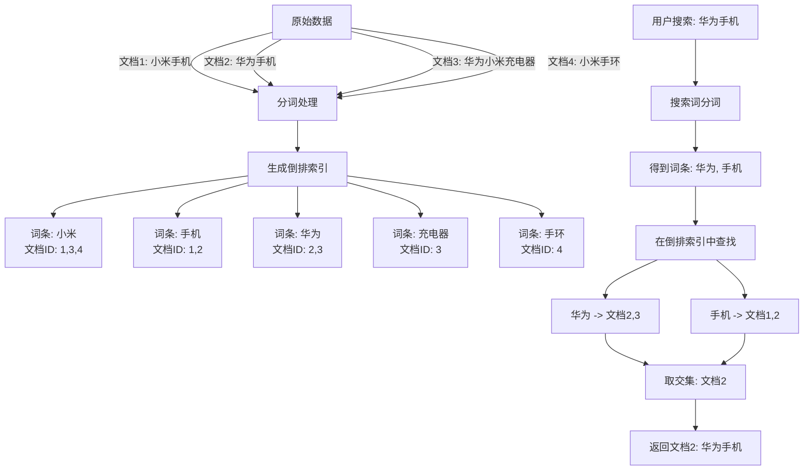

# Elasticsearch入门与JavaRestClient实践

## 1. Elasticsearch入门

Elasticsearch是一个高性能的搜索引擎框架，其核心是通过倒排索引来实现高效的搜索功能。倒排索引的工作原理如下：

将文档（数据）进行分词，基于词条创建索引，通过查询词条来获得文档ID。以下是倒排索引的示意图：



### IK分词器

IK分词器是处理中文语义的分词器，可以通过RESTful风格的请求来测试分词器：

```json
POST /_analyze
{
  "analyzer": "ik_smart",
  "text": "你好"
}
```

IK分词器有两种模式：

- **ik_smart**：智能切分，粗粒度
- **ik_max_word**：最细切分，细粒度

可以通过配置`config`目录的`IKAnalyzer.cfg.xml`文件来拓展分词器词库中的词条。

## 2. 基本概念

Elasticsearch与MySQL的对比：

| MySQL 概念/术语 | Elasticsearch 概念/术语 | 说明                                             |
|-----------------|-------------------------|--------------------------------------------------|
| Table（表）     | Index（索引）           | 索引是文档的集合，类似数据库的表。                |
| Row（行）       | Document（文档）        | 文档是一条条的数据，类似数据库的行，文档为JSON格式。|
| Column（列）    | Field（字段）           | 字段是JSON文档中的字段，类似数据库的列。          |
| Schema（表结构）| Mapping（映射）         | 映射是索引中文档的约束，例如字段类型约束，类似数据库的表结构。|
| SQL             | DSL                     | DSL是Elasticsearch提供的JSON风格的请求语句，用于定义搜索条件。|

### Mapping映射

Mapping将实体映射为索引库的文档约束，常见的Mapping属性如下：

| 属性名            | 作用               | 常用取值示例                                                                                                             |
|-------------------|--------------------|------------------------------------------------------------------------------------------------------------------------|
| **type**          | 字段数据类型       | 字符串：`text`（可分词）、`keyword`（精确值）<br>数值：`long`、`integer`、`double`、`float`<br>布尔：`boolean`<br>日期：`date`<br>对象：`object` |
| **index**         | 是否创建倒排索引   | `true`（默认）、`false`                                                                                                 |
| **analyzer**      | 指定分词器         | 如：`ik_max_word`、`ik_smart`                                                                                         |
| **properties**    | 定义子字段（object类型）| 例如：`name.firstName`、`name.lastName`                                                                                |

例如，定义一个`Book`类的Mapping：

```json
PUT /book
{
  "mappings": {
    "properties": {
      "id": {
        "type": "long"
      },
      "title": {
        "type": "text",
        "analyzer": "ik_max_word"
      },
      "author": {
        "type": "text",
        "analyzer": "ik_max_word"
      },
      "isbn": {
        "type": "keyword"
      },
      "price": {
        "type": "double"
      },
      "onSale": {
        "type": "boolean"
      },
      "publishDate": {
        "type": "date"
      }
    }
  }
}
```

## 3. JavaRestClient

### 引入依赖

```xml
<!-- elasticsearch-->
<dependency>
    <groupId>org.elasticsearch.client</groupId>
    <artifactId>elasticsearch-rest-high-level-client</artifactId>
    <version>7.12.1</version>
</dependency>
```

### 与Elasticsearch连接

```java
@BeforeEach
public void init(){
    client = new RestHighLevelClient(
            RestClient.builder(
                    new HttpHost("192.168.142.130", 9200, "http")
            )
    );
}

@AfterEach
public void destroy(){
    try {
        client.close();
    } catch (Exception e) {
        e.printStackTrace();
    }
}
```

## 4. 索引库与文档操作

### 索引库操作

| 功能   | 请求方式   | 请求路径          | 请求参数说明                   |
|-------|----------|----------------|-----------------------------|
| 查询用户 | GET      | `/users/{id}`  | 路径参数：用户ID               |
| 新增用户 | POST     | `/users`       | 请求体：JSON格式用户对象          |
| 修改用户 | PUT      | `/users/{id}`  | 路径参数：用户ID + JSON格式用户对象 |
| 删除用户 | DELETE   | `/users/{id}`  | 路径参数：用户ID               |

#### 创建索引库

```json
PUT /items
{
  "mappings": {
    "properties": {
      ......
    }
  }
}
```

对应到JavaRestClient的操作：

```java
@Test
void testCreateHotelIndex() throws IOException {
    // 创建请求
    CreateIndexRequest request = new CreateIndexRequest("items");
    // 设置参数
    request.source(MAPPING_TEMPLATE, XContentType.JSON);
    // 发起请求
    client.indices().create(request, RequestOptions.DEFAULT);
}
```

#### 获取和删除索引

```java
@Test
void testGetHotelIndex() throws IOException {
    GetIndexRequest request = new GetIndexRequest("items");
    GetIndexResponse exists = client.indices().get(request, RequestOptions.DEFAULT);
    System.out.println(exists);
}

@Test
void testDeleteHotelIndex() throws IOException {
    DeleteIndexRequest request = new DeleteIndexRequest("items");
    client.indices().delete(request, RequestOptions.DEFAULT);
}
```

### 文档操作

#### 插入一条数据

```java
@Test
void testIndexDocument() throws IOException {
    // 准备数据
    Item item = itemService.getById(317578L);
    ItemDoc itemDoc = BeanUtil.copyProperties(item, ItemDoc.class);

    // 创建请求
    IndexRequest request = new IndexRequest("items").id(itemDoc.getId());
    // 请求参数
    request.source(JSONUtil.toJsonStr(itemDoc),XContentType.JSON);
    // 发送请求
    client.index(request, RequestOptions.DEFAULT);
}
```

#### 获取数据

```java
@Test
void testGetDocument() throws IOException {
    // 创建请求
    GetRequest request = new GetRequest("items", "317578");
    // 发送请求
    GetResponse response = client.get(request, RequestOptions.DEFAULT);
    // 获取数据
    String json = response.getSourceAsString();
    // 转换成对象
    ItemDoc itemDoc = JSONUtil.toBean(json, ItemDoc.class);
    System.out.println(itemDoc);
}
```

#### 删除数据

```java
@Test
void testDeleteDocument() throws IOException {
    DeleteRequest request = new DeleteRequest("items", "317578");
    client.delete(request, RequestOptions.DEFAULT);
}
```

#### 文档更新

Elasticsearch的文档更新分为全量和增量两种方式：

- **全量更新**：直接替换掉整个旧文档
  ```json
  PUT /索引库/_doc/文档id
  {
      "字段名":"值"
      ......
      //必须包含所有的完整字段
  }
  ```

- **增量更新**：处理部分数据
  ```json
  POST /索引库/_update/文档id
  {
      "doc":{
          "字段名":"newValue"
      }
  }
  ```

对应到JavaRestClient的操作：

```java
@Test
void testUpdateDocument() throws IOException {
    UpdateRequest request = new UpdateRequest("items", "317578");
    request.doc(
            "price", 9999
    );
    client.update(request, RequestOptions.DEFAULT);
}
```

#### 批处理

一次性进行多条文档操作：

```java
@Test
void testBulkDoc() throws IOException {
    int pageNo = 1;int pageSize = 500;
    while ( true){
        // 准备请求参数
        Page<Item> page = itemService.lambdaQuery()
                .eq(Item::getStatus, 1)
                .page(Page.of(pageNo, pageSize));
        List<Item> records = page.getRecords();
        if(records == null || records.isEmpty()){
            return;
        }
        BulkRequest request = new BulkRequest();
        for(Item item : records){
            ItemDoc itemDoc = BeanUtil.copyProperties(item, ItemDoc.class);
            request.add(new IndexRequest("items").source(JSONUtil.toJsonStr(itemDoc),XContentType.JSON));
        }
        client.bulk(request, RequestOptions.DEFAULT);
        pageNo++;
    }
}
```

### 查询

在进行查询时，获取的response结构大致如下：

```json
{
  "took" : 109,
  "timed_out" : false,
  "_shards" : {
    "total" : 6,
    "successful" : 6,
    "skipped" : 0,
    "failed" : 0
  },
  "hits" : {
    "total" : {
      "value" : 10000,
      "relation" : "gte"
    },
    "max_score" : 1.0,
    "hits" : [
      {
        "_index" : ".kibana-event-log-7.12.1-000001",
        "_type" : "_doc",
        "_id" : "pUdzJJoBn6OMEyyxh_b6",
        "_score" : 1.0,
        "_source" : {
          "@timestamp" : "2025-10-27T06:54:56.044Z",
          "event" : {
            "provider" : "eventLog",
            "action" : "starting"
          },
          "message" : "eventLog starting",
          "ecs" : {
            "version" : "1.6.0"
          },
          "kibana" : {
            "server_uuid" : "d2a0f545-6cd0-43cd-ae8e-372cfd963bf6"
          }
        }
      }
    ]
  }
}
```

要获取真正的数据部分，需要解析其层级：

```java
private static void extractedResponse(SearchResponse response) {
    // 解析结果
    SearchHits hits = response.getHits();
    Long total = hits.getTotalHits().value;
    SearchHit[] items = hits.getHits();
    for(SearchHit item : items){
        String json = item.getSourceAsString();
        ItemDoc itemDoc = JSONUtil.toBean(json, ItemDoc.class);
        System.out.println(itemDoc);
    }
}
```

### 条件查询

Elasticsearch的条件查询支持多种子句，如下表所示：

| 子句名        | 作用描述            | 类比逻辑  | 是否参与算分 |
|--------------|--------------------|----------|------------|
| `must`       | 必须匹配            | 与 AND   | 是          |
| `should`     | 选择性匹配（可配置最少匹配数）| 或 OR     | 是          |
| `must_not`   | 必须不匹配           | 非 NOT   | 否          |
| `filter`     | 必须匹配            | ——       | 否          |

例如，使用`must`和`filter`进行查询：

```java
@Test
void testMatchQuery() throws IOException {
    SearchRequest request = new SearchRequest("items");
    request.source()
            .query(
                    QueryBuilders.boolQuery()
                            .must(QueryBuilders.matchQuery("name", "小米"))
                            .filter(QueryBuilders.termQuery("category", "手机"))
                            .filter(QueryBuilders.rangeQuery("price").lte(20000).gte(1000))
            );
    SearchResponse response = client.search(request, RequestOptions.DEFAULT);
    extractedResponse(response);
}
```

### 排序与分页

Elasticsearch支持排序和分页操作，示例如下：

```java
@Test
void testPageQuery() throws IOException {
    int  pageNo = 1;int pageSize = 5;
    SearchRequest request = new SearchRequest("items");
    request.source()
            .query(QueryBuilders.matchAllQuery())
            .from((pageNo - 1) * pageSize)
            .size(pageSize)
            .sort("price", SortOrder.ASC)
            .sort("sold", SortOrder.DESC);
    SearchResponse response = client.search(request, RequestOptions.DEFAULT);
    extractedResponse(response);
}
```