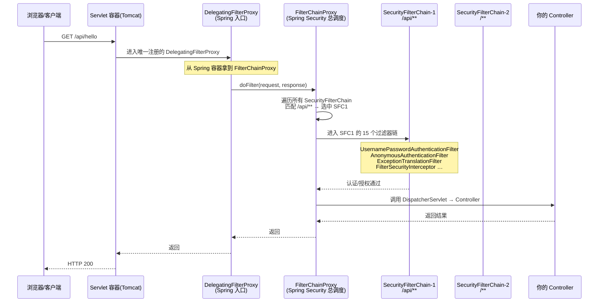
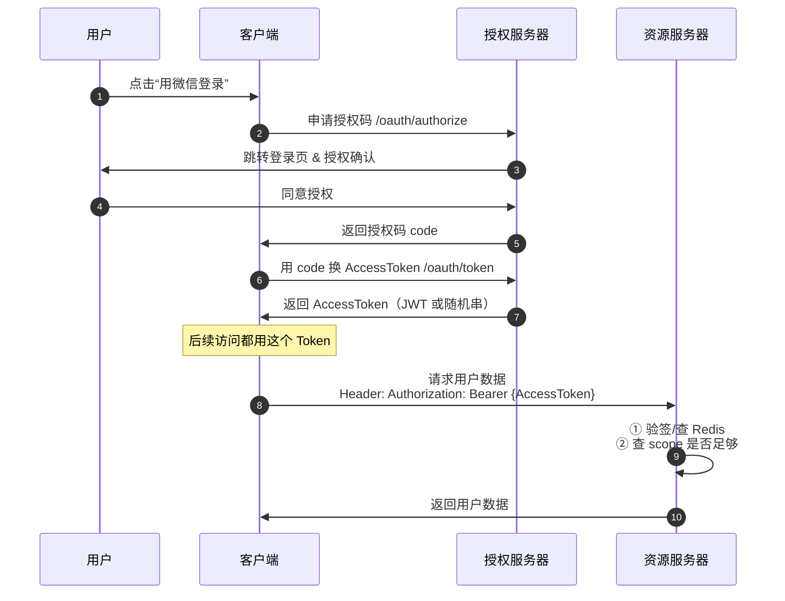
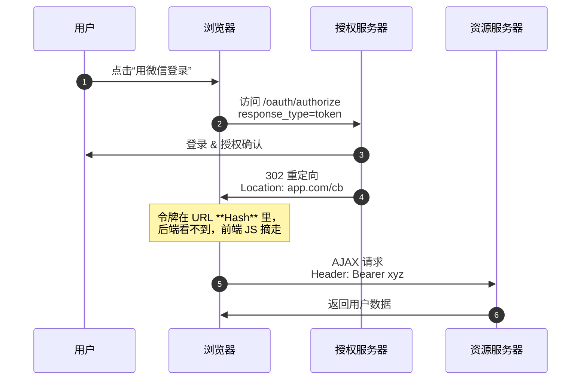
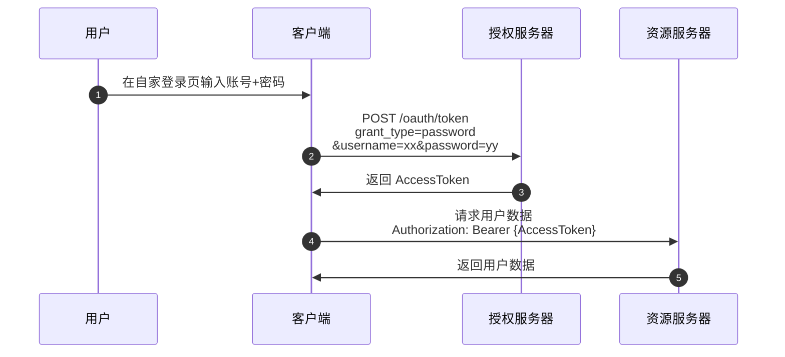
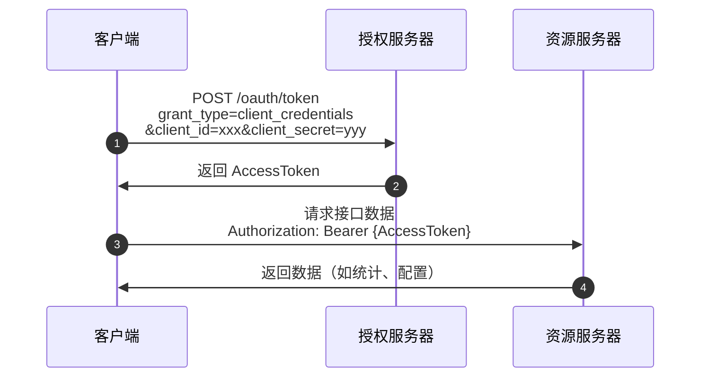
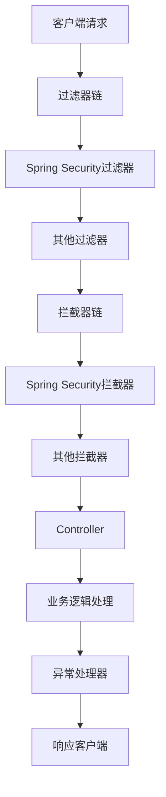

# Spring Security与OAuth2学习笔记

## 导航
- [Spring Security](#spring-security)
- [OAuth2](#oauth2)

---

## Spring Security

### 基本功能与底层原理

Spring Security 是 Spring 官方提供的一套安全策略，主要用于保护应用程序的安全性。以下是其主要功能：

- **保护应用程序 URL**：要求对应用程序的任何交互进行身份验证。
- **默认用户生成**：程序启动时生成一个默认用户 "user"，并生成一个默认的随机密码，记录在控制台上。
- **默认登录表单**：生成默认的登录表单和注销页面。
- **请求处理**：
  - 对于 Web 请求，重定向到登录页面。
  - 对于服务请求，返回 401 未经授权。
- **安全防护**：
  - 处理跨站请求伪造（CSRF）攻击。
  - 处理会话劫持攻击。
  - 写入 Strict-Transport-Security 以确保 HTTPS。
  - 写入 X-Content-Type-Options 以处理嗅探攻击。
  - 写入 Cache-Control 头来保护经过身份验证的资源。
  - 写入 X-Frame-Options 以处理点击劫持攻击。

Spring Security 的底层是基于对过滤器链的代理实现的，本质上是一条过滤器链。以下是 Spring Security 底层原理的时序图：



### 在 Spring Boot 中使用

#### 引入依赖

在 Spring Boot 项目中使用 Spring Security，需要引入以下依赖：

```xml
<dependency>
    <groupId>org.springframework.boot</groupId>
    <artifactId>spring-boot-starter-security</artifactId>
</dependency>
```

#### 创建用户对象

可以通过 `UserDetailsService` 接口来创建可以被 Spring Security 验证的用户对象。以下是一个示例：

```java
@Bean
UserDetailsService userDetailsService() {
    InMemoryUserDetailsManager manager = new InMemoryUserDetailsManager();
    manager.createUser(User.withDefaultPasswordEncoder().username("user").password("password").roles("USER").build());
    return manager;
}
```

也可以在 `application.yml` 中配置用户信息（优先级比 Bean 注入低）：

```yaml
spring:
  security:
    user:
      name: kat
      password: 123456
```

以上方法都是将用户信息保存在内存中的 `ConcurrentHashMap` 中。如果需要基于数据库进行登录用户验证，可以实现 `UserDetailsManager` 接口。以下是一个示例：

```java
@Component
public class DBUserDetailsManager implements UserDetailsManager, UserDetailsPasswordService {
    private final UserMapper userMapper;

    public DBUserDetailsManager(UserMapper userMapper) {
        this.userMapper = userMapper;
    }

    // 省略其他代码

    @Override
    public UserDetails loadUserByUsername(String username) throws UsernameNotFoundException {
        QueryWrapper<User> queryWrapper = new QueryWrapper<>();
        queryWrapper.eq("username", username);
        User user = userMapper.selectOne(queryWrapper);
        if (user == null) {
            throw new UsernameNotFoundException("用户不存在");
        }

        return new org.springframework.security.core.userdetails.User(
                user.getUsername(),
                user.getPassword(),
                user.isEnabled(),
                true, // 账号是否过期
                true, // 凭证是否过期
                true, // 账号是否锁定
                authorities // 权限列表
        );
    }
}
```

在配置类中注入 `UserDetailsService` Bean：

```java
@Bean
UserDetailsService userDetailsService(DBUserDetailsManager dbUserDetailsManager) {
    return dbUserDetailsManager;
}
```

#### 配置密码编码器和认证提供器

Spring Security 默认的密码加密器是 `BCrypt`，这是一种加盐的自适应单项函数，通过强行拖慢 CPU 处理来阻止暴力破解。以下是一个示例：

```java
@Bean
public PasswordEncoder passwordEncoder() {
    return new BCryptPasswordEncoder(); // 最常用
}

@Bean
public DaoAuthenticationProvider daoAuthenticationProvider(
        UserDetailsService userDetailsService,
        PasswordEncoder passwordEncoder) {
    DaoAuthenticationProvider provider = new DaoAuthenticationProvider();
    provider.setUserDetailsService(userDetailsService);
    provider.setPasswordEncoder(passwordEncoder);
    return provider;
}
```

### 授权保护

授权保护是通过往过滤器中添加规则来对路由的访问进行控制。以下是一个示例：

```java
@Bean
public SecurityFilterChain filterChain(HttpSecurity http) throws Exception {
    http.authorizeHttpRequests(
            auth -> auth // 原则是匹配则通过，类似与过滤器的放行机制
                    .requestMatchers("/login").permitAll()
                    .requestMatchers("/user/list").hasAuthority("USER_LIST")
                    .requestMatchers("/user/add").hasAuthority("USER_ADD")
                    .requestMatchers("/user/**").hasRole("USER")
                    .anyRequest().authenticated()
            )
            .formLogin(form -> form.loginPage("/login").permitAll() // 自定义登录页面
                    .usernameParameter("username")) // 自定义用户名参数
            .httpBasic().and()
            //.oauth2Login(Customizer.withDefaults()) // oauth2登录
            .cors().disable();

    return http.build();
}
```

- `hasAuthority("USER_LIST")` 基于权限控制：用户对象需要具有对应的权限才能匹配规则。
- `hasRole("USER")` 基于角色控制：同理，不过是把权限换成了角色。

除了通过添加 request 规则，也可以基于方法控制。以下是一个示例：

```java
@EnableMethodSecurity // 开启方法控制
@MapperScan("com.kacat.mapper")
@SpringBootApplication
public class SecurityDemoApplication {
    public static void main(String[] args) {
        SpringApplication.run(SecurityDemoApplication.class, args);
    }
}
```

添加 `@PreAuthorize` 注解：

```java
@PreAuthorize("hasAuthority('USER_LIST') and hasRole('USER')")
@Operation(summary = "获取用户列表")
@GetMapping("/list")
public List<User> list() {
    return userService.list();
}
```

也可以通过 `@PreAuthorize` 来处理自定义的 Spring Security 验证规则。以下是一个示例：

```java
@PreAuthorize("@ss.Ojbk()")
@PostMapping("/login")
public Result login(
        LoginUser loginUser
) {
    LoginUserVo loginUserVo = loginService.login(loginUser);
    return Result.success(loginUserVo);
}
```

```java
@Component("ss")
public class SecurityService {
    private final SecurityMapper securityMapper;
    private final RedisService redisService;

    public SecurityService(SecurityMapper securityMapper,
                           RedisService redisService) {
        this.securityMapper = securityMapper;
        this.redisService = redisService;
    }

    /**
     * 检查权限
     *
     * @param permission 权限字符串
     * @return true
     */
    public boolean hasPermi(String permission) {
        // 检查权限是否合法
        Matcher matcher = Pattern.compile(DefaultConstants.DEFAULT_PERMISSION_KEY_REGEX).matcher(permission);
        if (!matcher.matches()) throw new SecurityException("系统权限格式有误", ResultCode.FAIL);
        // 获取当前用户
        String username = SecurityUtil.getUsername();
        String roleKey = getRoleKey(username);
        if (Objects.equals(roleKey, DefaultConstants.DEFAULT_SUPER_ADMIN_ROLE_KEY)) return true;
        // 获取权限列表
        List<String> permissionKeys = getPermissionKeys(roleKey);
        if (permissionKeys.contains(permission)) return true;

        throw new SecurityException("没有对应权限", ResultCode.FORBIDDEN);
    }

    /**
     * 不需要权限验证
     *
     * @return true
     */
    public boolean Ojbk() {
        return true;
    }
}
```

### 自定义验证失败处理逻辑

可以通过 `AccessDeniedHandler` 来自定义验证失败处理逻辑。以下是一个示例：

```java
http.exceptionHandling(exception -> {
    exception.accessDeniedHandler(new AccessDeniedHandler() {
        @Override
        public void handle(HttpServletRequest request, HttpServletResponse response, AccessDeniedException accessDeniedException) throws IOException, ServletException {
            Map<String, String> map = new HashMap<>();
            map.put("code", "403");
            map.put("msg", "无权限");
            response.setStatus(403);
            response.setContentType("application/json");
            response.setCharacterEncoding("UTF-8");
            response.getWriter().write(objectMapper.writeValueAsString(map));
        }
    });
});
```

---

## OAuth2

OAuth2 是一种开放授权规则，通常用于客户端访问第三方的资源服务器。

### 授权码模式

授权码模式是最经典的 OAuth2 授权模式。简单来说，就是去前台（授权服务器的授权端点）拿临时门禁条（授权码），再去保安室（授权服务器的令牌端点）换正式门卡（AccessToken），最后刷卡进资料室拿文件（用户数据）。以下是授权码模式的时序图：



### 隐藏模式

隐藏模式省略了授权码这一步。以下是隐藏模式的时序图：



### 密码模式

密码模式简单粗暴，直接用密码换令牌。以下是密码模式的时序图：



### 凭证模式

凭证模式是客户端用自己的 id+secret 直接换令牌访问后台资源，通常用于非用户环境。以下是凭证模式的时序图：



### Spring 实现 GitHub 授权登录

#### 引入依赖

在 Spring Boot 项目中实现 GitHub 授权登录，需要引入以下依赖：

```xml
<!-- OAuth2 -->
<dependency>
    <groupId>org.springframework.boot</groupId>
    <artifactId>spring-boot-starter-oauth2-client</artifactId>
</dependency>
```

#### 配置客户端信息

在 `application.yml` 中配置客户端信息：

```yaml
spring:
  security:
    oauth2:
      client:
        registration:
          github:
            client-id: ${oauth2.client.registration.github.client-id}
            client-secret: ${oauth2.client.registration.github.client-secret}
```

`client-id` 信息需要在 GitHub 上获取：[https://github.com/settings/applications/new](https://github.com/settings/applications/new)

#### 添加 Controller 方法

添加一个 Controller 方法来处理 GitHub 授权登录：

```java
@Controller
public class OpenAuth2LoginController {
    @GetMapping("/OpenAuth2")
    public String index(Model model,
                        @RegisteredOAuth2AuthorizedClient("github") OAuth2AuthorizedClient authorizedClient,
                        @AuthenticationPrincipal OAuth2User oauth2User) {
        model.addAttribute("userName", oauth2User.getAttribute("name"));
        model.addAttribute("clientName", authorizedClient.getClientRegistration().getClientName());
        model.addAttribute("userAttributes", oauth2User.getAttributes());
        return "OpenAuth2Index";
    }
}
```

在过滤器链中补充 OAuth2 登录：

```java
.oauth2Login(Customizer.withDefaults()) // OAuth2登录
```

### 杂项问题

#### 异常处理器

Spring Security 的过滤器属于 Servlet 容器，其中的异常无法被异常处理器捕获。以下是请求链的流程图：



#### Session 缓存认证

**SecurityContext 持久化**：Spring Security 默认会将认证信息存储在 `SecurityContextHolder` 中，而 `SecurityContextHolder` 默认使用 `ThreadLocal` 存储。但在 Web 应用中，通常会有 `SecurityContextPersistenceFilter` 将 `SecurityContext` 存储在 Session 中，以便在多次请求间保持登录状态。

**Session 缓存认证**：一旦用户成功认证，认证信息会被存储在 `HttpSession` 中。后续请求会直接从 Session 中获取认证信息，而不会每次都执行 JWT 验证。

在 request 链中禁用 session，确保 token 能正常工作：

```java
.sessionManagement()
.sessionCreationPolicy(SessionCreationPolicy.STATELESS).and()
```