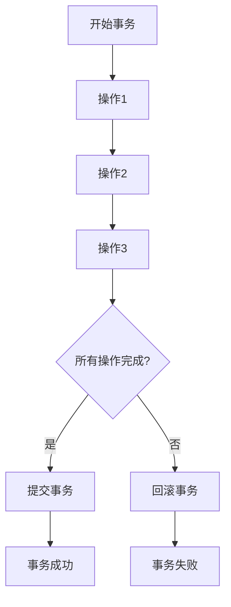
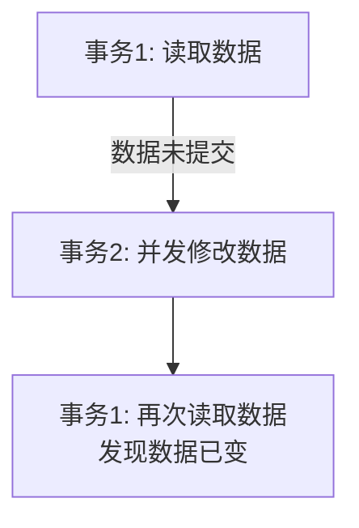
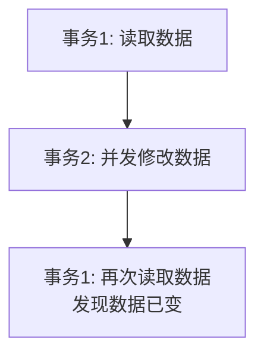
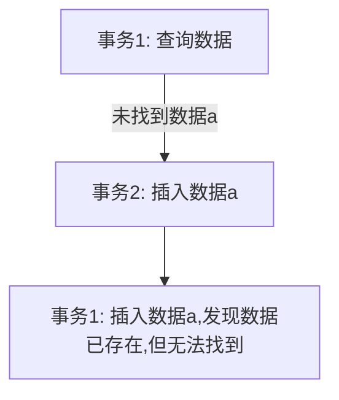
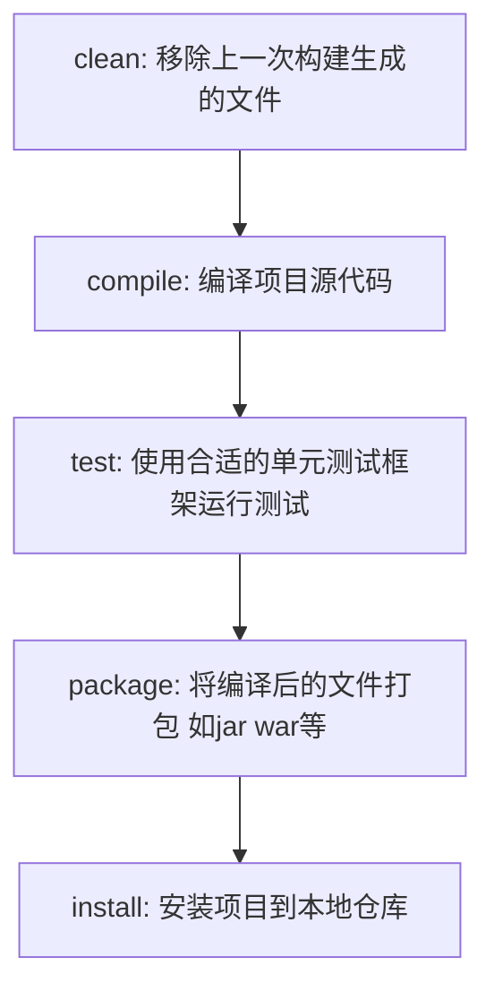

# 今日学习总结与计划

## 前言
早八上完了，来看看今天要学的：  
MySQL剩下的事务，把前两天的内容复习一下，做做总结。  
开始JDBC，有时间的话研究一下AI提示词。

---

## 日程
- **早11点多**：把事务看完了。  
- **2：30**：偷了一会小懒，现在开始写blog。  
- **3：25**：看得差不多了，现在开始学JDBC。  
- **发现**：学习JDBC时发现jar包管理要用到Maven，所以先学Maven。  
- **晚7点**：Maven看完了，记下blog。因为现在紧张度没有那么高，所以重新考虑学习计划。预计web基础和JDBC一天之内可以学完，同时预留周日打比赛和做报告的时间。时间线拉到3.31，将阶段二延期到4.5。中间还有5天时间，足够推进课程，再学一些开发相关的知识，最好能到实操项目的部分。具体如何安排，还是要根据实际情况来。  
- **web基础**：做完一个小案例，今天截至，感觉分层解耦可能会比较难。

---

## 学习内容
省流：
1. 事务
2. MySQL的小结
3. Maven入门
4. springboot入门
5. HTTP协议
6. 案例：通过服务端完成用户列表渲染展示（要点） 

### 1. 事务
- **定义**：将一群操作视为一个整体，要么同时成功，要么同时失败。
- **四大特性**：
  - **原子性**：不可分割。
  - **一致性**：完成时，所有数据必须保持一致。
  - **隔离性**：不受其他并发操作的影响（和隔离等级挂钩）。
  - **持久性**：提交或回滚对数据的改变是永久的。
- **事务操作**：
  - 查看/设置事务提交方式：
    ```sql
    select @@autocommit;
    set @@autocommit = 0;
    ```
  - 提交/回滚事务：
    ```sql
    commit;
    rollback;
    ```
  - 手动开启事务：
    ```sql
    start transaction;
    ```
- **流程图**：

- **并发事务问题**：
  - **脏读**：

  - **不可重复读**：

  - **幻读**：

- **事务隔离级别**：
高隔离性的代价是性能。
| 隔离级别                | 脏读 | 不可重复读 | 幻读 |
|-------------------------|------|------------|------|
| Read uncommitted        | √    | √          | √    |
| Read committed          | ×    | √          | √    |
| Repeatable Read(MySQL默认)   | ×    | ×          | √    |
| Serializable(串行化)            | ×    | ×          | ×    |
- **查看/设置事务隔离级别**：
```sql
select @@transaction_isolation;
set 【session|global】transaction isolation level {隔离级别};
```

### 2. MySQL的小结
- **重点**：
  - **DAY1**：MySQL的启动；数据库的`show`，`use`，`select`，`create`，`drop`；表的结构查询`desc`，创建表，`add`，`change`字段。
  - **DAY2**：DML对表的插入，修改，删除；DQL，条件查询，聚合函数，通过子查询进行嵌套查询（非常重要），分组，排序，语句的执行顺序；给字段添加约束，特别是怎么添加外键约束，设置更新/删除行为；多表关系；查询多表的内连接，左连接，右连接方式；子查询。

### 3. Maven
- **简介**：项目管理和构建工具。
- **官网**：[Apache Maven](https://maven.apache.org/)
- **配置及IDEA集成**：
  1. **配置本地仓库**：
     - 在源文件中找到`conf/settings.xml`，配置本地仓库：
       ```xml
       <localRepository>仓库位置(mvn_repo)</localRepository>
       ```
     - 配置阿里云私服：
       ```xml
       <mirror>
           <id>alimaven</id>
           <name>aliyun maven</name>
           <url>http://maven.aliyun.com/nexus/content/groups/public/</url>
           <mirrorOf>central</mirrorOf>
       </mirror>
       ```
  2. **配置环境变量**：
     ```
     %MAVEN_HOME%\bin
     ```
  3. **IDEA中修改Maven的配置**。
- **依赖配置**：
  - 引入项目需要的jar包，坐标信息可在 [mvnrepository.com](https://mvnrepository.com/) 查询。
  - 在`<dependencies>`中引入：
    ```xml
    <dependency>
        <!-- 引入依赖项 -->
        <groupId>org.springframework</groupId>
        <artifactId>spring-context</artifactId>
        <version>6.1.4</version>
        <!-- 排除jar包的部分依赖项 -->
        <exclusions>
            <exclusion>
                <groupId>io.micrometer</groupId>
                <artifactId>micrometer-commons</artifactId>
            </exclusion>
        </exclusions>
    </dependency>
    ```
- **生命周期**：

- **单元测试**：
  
  - 在实际开发中，通过测试框架对类功能进行测试，如JUnit。
  - 引入：
    ```xml
    <dependency>
        <groupId>org.junit.jupiter</groupId>
        <artifactId>junit-jupiter</artifactId>
        <version>5.9.1</version>
        <scope>test</scope> <!--控制依赖作用的范围-->
    </dependency>
    ```
  - **scope值**：
    
    | scope值       | 主程序 | 测试程序 | 打包（运行） | 范例       |
    |---------------|--------|----------|--------------|------------|
    | compile（默认） | Y      | Y        | Y            | log4j      |
    | test          | -      | Y        | -            | junit      |
    | provided      | Y      | Y        | -            | servlet-api |
    | runtime       | -      | Y        | Y            | jdbc驱动   |
  - **断言**：
    | 断言方法                                      | 描述                                   |
    |-----------------------------------------------|----------------------------------------|
    | `Assertions.assertEquals(Object exp, Object act, String msg)` | 检查两个值是否相等，不相等就报错。         |
    | `Assertions.assertNotEquals(Object unexp, Object act, String msg)` | 检查两个值是否不相等，相等就报错。       |
    | `Assertions.assertNull(Object act, String msg)` | 检查对象是否为null，不为null，就报错。     |
    | `Assertions.assertNotNull(Object act, String msg)` | 检查对象是否不为null，为null，就报错。     |
    | `Assertions.assertTrue(boolean condition, String msg)` | 检查条件是否为true，不为true，就报错。     |
    | `Assertions.assertFalse(boolean condition, String msg)` | 检查条件是否为false，不为false，就报错。   |
    | `Assertions.assertThrows(Class<Exception> expType, Executable executable, String msg)` | 检查两个对象引用是否相等，不相等，就报错。 |
  - **常见注解**：
    | 注解                   | 说明                                                                 | 备注                           |
    |------------------------|----------------------------------------------------------------------|--------------------------------|
    | `@Test`                | 测试类中的方法用它修饰才能成为测试方法，才能启动执行                     | 单元测试                       |
    | `@ParameterizedTest`   | 参数化测试的注解（可以让单个测试运行多次，每次运行时仅参数不同）         | 用了该注解，就不需要`@Test`注解了 |
    | `@ValueSource`         | 参数化测试的参数来源，赋予测试方法参数                                   | 与参数化测试注解配合使用        |
    | `@DisplayName`         | 指定测试类、测试方法显示的名称（默认为类名、方法名）                     |                                |
    | `@BeforeEach`          | 用来修饰一个实例方法，该方法会在每一个测试方法执行之前执行一次。         | 初始化资源(准备工作)           |
    | `@AfterEach`           | 用来修饰一个实例方法，该方法会在每一个测试方法执行之后执行一次。         | 释放资源(清理工作)             |
    | `@BeforeAll`           | 用来修饰一个静态方法，该方法会在所有测试方法之前只执行一次。             | 初始化资源(准备工作)           |
    | `@AfterAll`            | 用来修饰一个静态方法，该方法会在所有测试方法之后只执行一次。             | 释放资源(清理工作)             |
  - **示例代码**：
    ```java
    //将实例化标记为@BeforeEach
    @BeforeEach
    public void setUp(){
        userService = new UserService();
    }
    //通过参数化来批量测试
    @DisplayName("测试用户性别")
    @ParameterizedTest
    @ValueSource(strings = {"100000200010011011","100000200010011021","100000200010011041"})
    public void testGender(String idCard){
        String gender = userService.getGender(idCard);
        System.out.println(gender);
    }
    ```
    - **注意**：提高测试的覆盖率（也可以通过AI来生成测试方法）。

### 4. SpringBoot
- **简介**：JavaWeb的开发框架。
- **官网**：[Spring.io](https://spring.io/)
- **入门程序**：
  - 构建SpringBoot工程后，会生成一个启动类，通过它运行启动（依赖项）内嵌的Tomcat。
  - 通过`localhost`访问来测试入门程序：
    ```java
    @RestController //标识为一个请求处理类
    public class HelloController {
        @RequestMapping("/hello") //请求路径为 /hello时，调用该方法
        public String hello(String name){
            System.out.println("name : " + name);
            return "hello" + name + '~';
        }
    }
    ```
    - 测试地址：`http://localhost:8080/hello?name=heyi`

### 5. HTTP协议
- **规定**：浏览器和服务器的数据传输规则。
- **请求协议**：
  
  - **请求行**：第一行（包括请求方式，资源路径，协议）。
  - **请求头**：第二行开始（格式`key: value`）。
  - **请求体**：`post`请求存放请求参数的位置。
- **案例：请求数据获取**：
  ```java
  @RestController
  public class RequestController {
      @RequestMapping("/request")
      public String request(HttpServletRequest request) {
          //1.获取请求方式
          String method = request.getMethod();
          System.out.println("method : " + method);
          //2.获取请求路径
          String url = request.getRequestURL().toString();
          String uri = request.getRequestURI();
          System.out.printf("url : %s, uri : %s\n", url, uri);
          //3.获取请求协议
          String protocol = request.getProtocol();
          System.out.printf("protocol : %s\n", protocol);
          //4.获取请求参数
          String name = request.getParameter("name");
          String age = request.getParameter("age");
          System.out.printf("name : %s, age : %s\n", name, age);
          //5.获取请求头
          String header = request.getHeader("Accept");
          System.out.printf("header : %s\n", header);
  
          return "ok";
      }
  }
  ```
  - **返回的数据**：
    ```
    name : heyi
    method : GET
    url : http://localhost:8080/request, uri : /request
    protocol : HTTP/1.1
    name : heyi, age : null
    header : text/html,application/xhtml+xml,application/xml;q=0.9,*/*;q=0.8
    ```
- **响应协议**：
  - 格式与请求协议类似：请求头，请求行，请求体。
- **状态码**：
  | 状态码 | 描述 |
  |--------|------|
  | 1XX    | 响应中 - 临时状态码，表示请求已经接收，告诉客户端应该继续请求或者如果它已经完成则忽略它。 |
  | 2XX    | 成功 - 表示请求已经被成功接收，处理已完成。 |
  | 3XX    | 重定向 - 重定向到其他地方；让客户端再发起一次请求以完成整个处理。 |
  | 4XX    | 客户端错误 - 处理发生错误，责任在客户端。如：请求了不存在的资源、客户端未被授权、禁止访问等。 |
  | 5XX    | 服务器错误 - 处理发生错误，责任在服务器端。如：程序抛出异常等。 |
- **常见状态码**：
  | 状态码（常见） | 描述                           |
  |--------|--------------------------------|
  | 200    | 客户端请求成功。               |
  | 404    | 请求资源不存在，URL输入有误，或者网站资源被删除了。 |
  | 500    | 服务器发生不可预期的错误。     |
- **案例：设置响应数据**：
  ```java
  @RestController
  public class ResponseController {
      @RequestMapping("/response")
      public void response(HttpServletResponse response) {
          //1.设置响应状态码
          response.setStatus(401);
          //2.设置响应头
          response.setHeader("name","heyi");
          //3.设置响应体
          try {
              response.getWriter().write("<h1>hello response<h1>");
          } catch (IOException e) {
              throw new RuntimeException(e);
          }
          return;
      }
      //通过Spring的ResponseEntity来设置响应
      @RequestMapping("/response2")
      public ResponseEntity<String> response2() {
          return ResponseEntity
                  .status(401)
                  .header("name", "heyi")
                  .body("<h1>hello response<h1>");
      }
  }
  ```
  - **通过浏览器查看相关信息**。

### 6. 案例：通过服务端完成用户列表渲染展示（要点）
- **主要代码**：
  ```java
  @RestController
  //用户信息的控制器
  public class UserController {
      @RequestMapping("/list")
      public List<User> list() throws FileNotFoundException {
          //读取用户信息文件
          InputStream in = this.getClass().getClassLoader().getResourceAsStream("user.txt");
          ArrayList<String> lines = IoUtil.readLines(in, StandardCharsets.UTF_8,new ArrayList<>());
  
          //解析文件内容
          List<User> userList = lines.stream().map(line->{
              String[] split = line.split(",");
              Integer id = Integer.parseInt(split[0]);
              String username = split[1];
              String password = split[2];
              String name = split[3];
              Integer age = Integer.parseInt(split[4]);
              LocalDateTime updateTime = LocalDateTime.parse(split[5], DateTimeFormatter.ofPattern("yyyy-MM-dd HH:mm:ss"));
              return new User(id, username, password, name, age, updateTime);
          }).collect(Collectors.toList());
  
          //返回用户信息（json）
          return userList;
      }
  }
  ```
- **要点**：
  1. 静态文件（txt，html，js等）放在`resources`文件夹中。
  2. 通过自解码对象获取到文件的路径：
     ```java
     InputStream in = this.getClass().getClassLoader().getResourceAsStream("user.txt");
     ```
  3. `axios`通过`get`来访问请求路径：
     ```javascript
     methods: {
         async search(){
             const result = await axios.get('/list');
             this.userList = result.data;
         }
     },
     ```
  4. 服务器会自动解析对象或者集合为`json`，这是通过`@RestController`包含的`@ResponseBody`注解实现的。

---

## 结语
每次写完blog，都感觉好像其实没有多少知识（明明写得很累啊喂）。  
JavaSE的内容确实忘得太严重了，明天稍微复习一下吧。  
ps：终于不是凌晨才写完的blog了。
