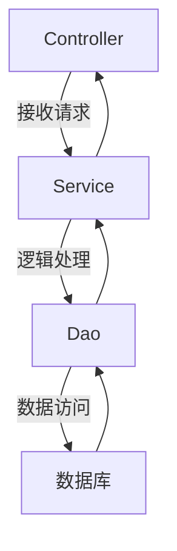
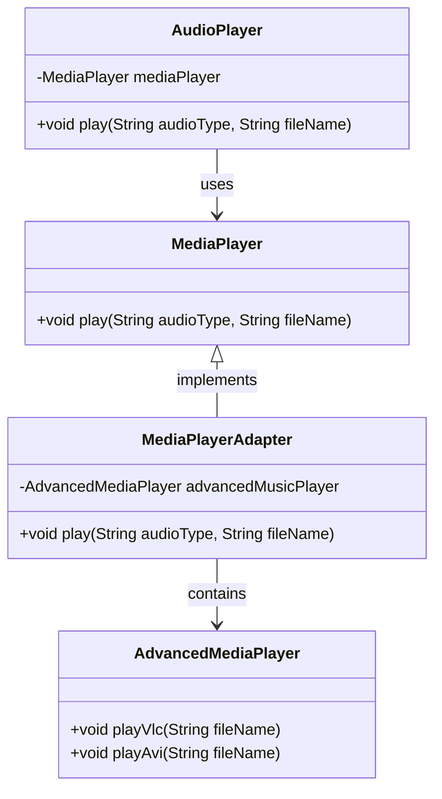
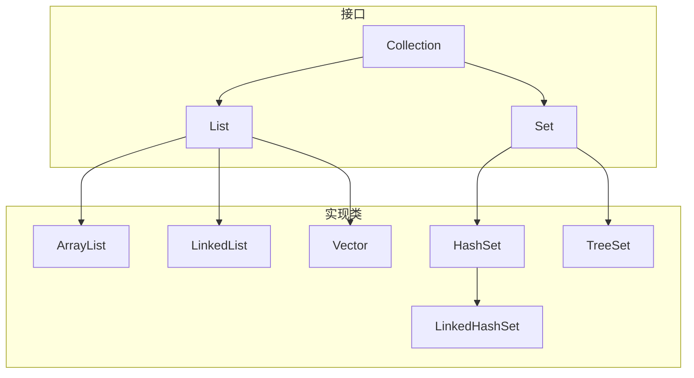
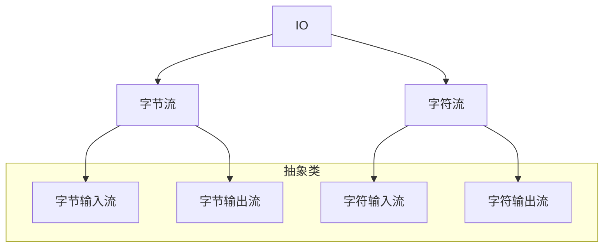

# 今日学习总结：Web 分层解耦与 JavaSE 复习

## 前言
早上9点，根据某项研究（我瞎扯的）表明，早上不要做太多分泌多巴胺的事情，不然一天就废了，比如打游戏，不然一天就废了😭。今天的计划是：学习 Web 的分层解耦，复习 JavaSE，完成一个课题报告的 PPT，如果还有时间就学习 JDBC。

## 日程
- **11点**：看完分层解耦，其实不是特别复杂，开始写博客。
- **下午2点**：开始做课题报告，争取一个下午搞定。
- **6点**：做不完，根本做不完😭
- **晚上8点30分**：有点写嗨了，剩下一些技术相关的内容还没看，先复习 JavaSE。
- **晚上10点**：想摸一会儿🐟，今天的学习任务基本完成，明天再解决 JDBC。

## 学习内容
### 1. 分层解耦
在实际开发中，我们通常会把解决方案拆分为三层架构，以提高代码的可维护性和可扩展性。



- **Controller（控制层）**：接收前端请求，响应数据。
- **Service（业务逻辑层）**：处理数据。
- **Dao（数据访问层）**：访问数据。

#### 案例代码
以下是未解耦的代码示例：

```java
@RestController
public class UserController {
    @RequestMapping("/list")
    public List<User> list() throws FileNotFoundException {
        InputStream in = this.getClass().getClassLoader().getResourceAsStream("user.txt");
        ArrayList<String> lines = IoUtil.readLines(in, StandardCharsets.UTF_8, new ArrayList<>());

        List<User> userList = lines.stream().map(line -> {
            String[] split = line.split(",");
            Integer id = Integer.parseInt(split[0]);
            String username = split[1];
            String password = split[2];
            String name = split[3];
            Integer age = Integer.parseInt(split[4]);
            LocalDateTime updateTime = LocalDateTime.parse(split[5], DateTimeFormatter.ofPattern("yyyy-MM-dd HH:mm:ss"));
            return new User(id, username, password, name, age, updateTime);
        }).collect(Collectors.toList());

        return userList;
    }
}
```

定义dao,controller,service三个包，分别实现对应的接口和实现类。

解耦后的代码结构如下（以UserService为例）：

#### 定义接口
```java
public interface UserService {
    List<User> findAll();
}
```

#### 实现接口
```java
public class UserServiceImpl implements UserService {
    private UserDao userDao = new UserDaoImpl(); // 连接 Dao 层

    @Override
    public List<User> findAll() {
        List<String> lines = userDao.getList();
        List<User> userList = lines.stream().map(line -> {
            String[] split = line.split(",");
            Integer id = Integer.parseInt(split[0]);
            String username = split[1];
            String password = split[2];
            String name = split[3];
            Integer age = Integer.parseInt(split[4]);
            LocalDateTime updateTime = LocalDateTime.parse(split[5], DateTimeFormatter.ofPattern("yyyy-MM-dd HH:mm:ss"));
            return new User(id, username, password, name, age, updateTime);
        }).collect(Collectors.toList());
        return userList;
    }
}
```

#### 控制器调用
```java
@RestController
public class UserController {
    private UserService userService = new UserServiceImpl(); // 通过接口连接实现方法

    @RequestMapping("/list")
    public List<User> list() throws FileNotFoundException {
        List<User> userList = userService.findAll();
        return userList;
    }
}
```

#### Spring 的 IOC 和 DI
Spring 提供了一套实现分层解耦的方案：

- **IOC（控制反转）**：将对象创建的控制权由自身转交给外部容器。
  
  - `@Component`：声明 Bean 的基础注解。
  - `@Controller`、`@Service`、`@Repository`：`@Component` 的衍生注解，分别用于标注控制层、业务层和数据访问层。
  - 注解的生效需要 `@ComponentScan` 的扫描，默认范围为启动项包及其子包。
  
- **DI（依赖注入）**：容器为程序提供运行时的依赖资源。
  
  - **属性注入**（简单，依赖关系不明显）：
    
    ```java
    @Autowired
    private UserDao userDao;
    ```
  - **构造函数注入**（清晰，相对麻烦）：
    
    ```java
    @Autowired
    private final UserService userService;
    
    public UserController(UserService userService) {
        this.userService = userService;
    }
    ```
  - **Setter 方法注入**（不常用）：
    ```java
    @Autowired
    public void setUserService(UserService userService) {
        this.userService = userService;
    }
    ```

当存在多个实现类时，可以通过以下方式设置目标实现类：
- `@Primary`：标注接口的默认实现类。
- `@Qualifier`：依赖注入时指定目标实现类。
- `@Resource`：通过注解指定目标实现类。

### 2. JavaSE 复习
#### 继承
```java
public class Student extends Person {}
// Java 只支持单继承
```

#### 多态
```java
Father f = new Son();
// 调用成员方法时，编译看左边，运行看右边
```

#### 静态代码块
```java
static {}
// 随类加载自动加载，只执行一次
```

#### 接口
```java
public interface 接口名 {}
// 对应实现类
public class 类名 implements 接口名 {}
// 接口不能实例化，接口可以多继承
```

#### 适配器模式
假设有一个旧的音频播放器类 `AudioPlayer`，它只能播放 MP3 格式的音频。现在需要扩展它的功能，让它也能播放 VLC 和 AVI 格式的音频。通过适配器模式可以解决这个问题。



#### 方法引用
```java
对象::成员方法
new Function()::method;
Student::new; // 引用构造方法
```

#### 反射
通过反射可以获取类中的信息，动态创建对象。

- 获取 Class 字节码：
  1. `Class.forName("全类名")` // 源码阶段
  2. `类名.class` // 加载阶段
  3. `对象.getClass()` // 运行阶段

- 获取方法：
  | 获取方法 | 构造方法 | 成员变量 | 设置方法 | 参数 | 修饰符 | 私有的 |
  |----------|----------|----------|----------|------|--------|--------|
  | get      | Constructor | Field    | set      | Parameter | Modifiers | Declared |
  |          |           |          |          |        |         |         |

#### 可变字符串容器
```java
StringBuilder
```

#### 集合体系


#### 流
```java
Stream 流：从集合中获取数据
HashMap<String, Integer> hm = new HashMap<>();
hm.entrySet().stream().forEach(s -> System.out.println(s));
// 注意中间方法和终结方法
```

#### 异常流
```java
try {
    要捕获异常的代码
} catch (异常类型) {
    处理方法
} catch (异常类型2 | 异常类型3) {
    ......
}
```

#### File
| 方法名称 | 说明 |
|----------|------|
| public File(String pathname) | 根据文件路径创建文件对象 |
| public File(String parent, String child) | 根据父路径名字符串和子路径名字符串创建文件对象 |
| public File(File parent, String child) | 根据父路径对应文件对象和子路径名字符串创建文件对象 |

#### IO 流


## 其他
### 模拟小说生成器
今天摸鱼写了个模拟小说生成器的 Deepseek 提示词，真难绷吧😂。
``
<流程>
第一步：与用户确认需求
	你需要先输出以下语句对用户提问：“我们开始小说创作，请你用一句话描述小说，并从以下选项中进行选择：”
	“A.目标受众 【选择1个】”
	男生群体|女生群体|特殊爱好者群体
	“B.逐字稿字数【选择1个】”
	500字|1000字|2000字|3000字|其他
	“C.小说主题【选择1个】”
	科幻|侦探|都市|奇幻|其他

第二步：引导用户对内容进行设定
	当第一步完成后，你可以输出小说的设定大纲，并就细节方面向用户提问，
	如：“请问主人公的名字是什么？”
		“主人公正在经历那些故事？”
		“主人公都有哪些性格特点？”
	接收用户的设定后，你需要对用户提问“如果你的设定已经完成，请输出‘/设定完成’。
否则输出‘/继续设定’，我将重复输出你之前的所有设定，并重复进行第二步的提问”
第三步：生成小说内容
	当用户输出“/设定完成”示意第二步完成后，根据逐字稿字数的要求生成小说的实际内容

1.每完成一段逐字稿的生成后，询问用户:"以上是本段内容，如果认为合适，请输入‘/下一步’"，我将继续下一段的输出；如果不合适，请提出修改意见，我将重新生成本段内容。"
2.当用户输入‘/下一步’后，继续对下一段内容进行生成
3.当用户输入‘/结束’后，询问用户："所有内容已完成，如果满意，我们将结束聊天"
</流程>

当用户上传内容后，你需要根据逐字稿中对字数的限制进行详细拆解，并根据<流程></流程>中的要求生成逐字稿大纲与用户确认
你需要复述上述条件，并询问用户:"我已经了解你的需求，请输入你要处理的内容"
``

## 结语
今天的学习内容相对较少，算是对压力的小调节。明天要加油，坚持住！