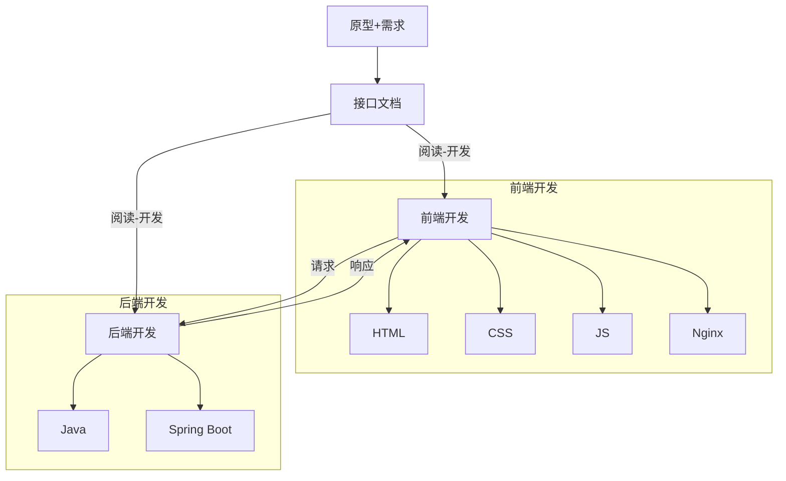

# 项目实战：前后端分离开发与部门管理实现

## 前言
早八上完，现在开始学习。最近几天主要会以项目实战为主，所以学习内容部分主要会针对一些实现上的细节。

## 日程
- 2点，继续来学习。
- 现在是5点30分，看完了部门管理部分，因为晚上有课，所以先来写blog。
- 被晚6强行中断了，原因是移动了文件导致远程开不了，所以在那边先把PPO、GRPO、MLA看了，真是头昏眼花啊。
- 现在是将近10点，先把blog写了。
- 10分钟速写完了，我简直就是神人啊，来继续学习。

## 学习内容

### 1. 准备工作
#### 前后端分离的开发模式


#### RESTful 请求方式
**REST（Representational State Transfer）架构风格** 是一种用于描述性状态转换的软件架构风格。

##### 传统风格 URL
| URL                                      | 请求方式 | 含义                     |
|------------------------------------------|----------|--------------------------|
| http://localhost:8080/user/getUser?id=1   | GET      | 查询id为1的用户          |
| http://localhost:8080/user/saveUser       | POST     | 新增用户                 |
| http://localhost:8080/user/updateUser     | POST     | 修改用户                 |
| http://localhost:8080/user/deleteUser?id=1| GET      | 删除id为1的用户          |

##### REST风格 URL
| URL                                      | 请求方式 | 含义                     |
|------------------------------------------|----------|--------------------------|
| http://localhost:8080/users/1             | GET      | 查询id为1的用户          |
| http://localhost:8080/users/1             | DELETE   | 删除id为1的用户          |
| http://localhost:8080/users               | POST     | 新增用户                 |
| http://localhost:8080/users               | PUT      | 修改用户                 |

**注意**：描述功能模块用复数（s）形式，如 `user -> users`。

[Apifox](https://apifox.com/) 提供了便利的API测试功能。

#### 添加工程依赖项
- Spring Web
- MySQL Driver
- MyBatis Framework
- Log4j2

#### 封装响应结果类 `Result`
```java
/**
 * 后端统一返回结果
 */
@Data
public class Result {
    private Integer code; // 编码：1成功，0为失败
    private String msg; // 错误信息
    private Object data; // 数据

    public static Result success() {
        Result result = new Result();
        result.code = 1;
        result.msg = "success";
        return result;
    }

    public static Result success(Object object) {
        Result result = new Result();
        result.data = object;
        result.code = 1;
        result.msg = "success";
        return result;
    }

    public static Result error(String msg) {
        Result result = new Result();
        result.msg = msg;
        result.code = 0;
        return result;
    }
}
```

### 2. 部门管理实现

#### 数据封装
- 实体类属性名和数据库表查询返回的字段名一致，MyBatis会自动封装。
- 如果实体类属性名和数据库表查询返回的字段名不一致，不能自动封装。
  - 解决方法：
    1. 通过起别名让字段名保持一致。
    2. 通过`@Results`手动映射，例如：
       ```java
       @Results({
           @Result(column = "create_time", property = "createTime"),
           @Result(column = "update_time", property = "updateTime"),
       })
       ```
    3. 开启MyBatis的驼峰命名自动映射：
       ```yaml
       mybatis:
         configuration:
           map-underscore-to-camel-case: true
       ```
- 在预处理SQL文件中，`#{}`内是属性名，用驼峰命名法，例如：
  ```java
  @Insert("insert into dept(name,create_time,update_time) values(#{name},#{createTime},#{updateTime})")
  ```

#### 请求参数
- 请求参数格式：`http://localhost:8080/depts?id=2`（`?`后面跟字段名和数据，不能有多余空格）。

#### 如何在响应层中获取请求数据？
1. 通过原始的`HttpServletRequest`对象：
   ```java
   @RequestMapping(value = "/depts", method = RequestMethod.DELETE)
   public Result delete(HttpServletRequest request) {
       String idStr = request.getParameter("id");
       int id = Integer.parseInt(idStr);
       System.out.println(id);
       return Result.success();
   }
   ```
2. 通过Spring Boot的`@RequestParam`注解：
   ```java
   @RequestMapping(value = "/depts", method = RequestMethod.DELETE)
   public Result deleteById(@RequestParam("id") Integer id) {
       System.out.printf(String.valueOf(id));
       return Result.success();
   }
   ```
   **注意**：如果形参名和请求参数名相同，注解可以省略。

#### 接收参数
- 使用`@RequestBody`自动解析JSON格式：
  ```java
  @RequestMapping(value = "/depts", method = RequestMethod.POST)
  public Result addDept(@RequestBody Dept dept) {
      System.out.println(dept);
      deptService.addDept(dept);
      return Result.success();
  }
  ```
  **注意**：JSON数据属于请求体的内容，需要通过请求体（Body）来输送。

#### 路径参数
- 路径参数通过在请求URL中使用`{...}`来标识，需要使用`@PathVariable`注解来获取路径参数：
  ```java
  @RequestMapping(value = "/depts/{id}", method = RequestMethod.GET)
  public Result selectById(@PathVariable("id") Integer id) {
      System.out.println(id);
      Dept dept = deptService.getInfo(id);
      return Result.success(dept);
  }
  ```

#### 补充
- 一个完整的请求路径由两部分组成：
  - 类（Controller）上的`@RequestMapping`注解的`value`属性值。
  - 方法（Method）上的`@RequestMapping`注解的`value`属性值。
- 如果有两个`@RequestMapping`的路径和方法相同，会出现启动时错误。

### 3. 日志技术
| 日志框架       | 描述                                                                 |
|----------------|----------------------------------------------------------------------|
| JUL            | JavaSE平台提供的官方日志框架，配置相对简单，但不够灵活，性能较差。     |
| Log4j          | 流行的日志框架，提供了灵活的配置选项，支持多种输出目标。               |
| Logback        | 基于Log4j升级而来，提供了更多的功能和配置选项，性能优于Log4j。         |
| SLF4j          | 简单日志门面，提供了一套日志操作的标准接口及抽象类，允许应用程序使用不同的底层日志框架。 |

#### Logback入门
- **引入依赖**
- **引入配置文件**
  ```xml
  <?xml version="1.0" encoding="UTF-8"?>
  <configuration>
      <!-- 控制台输出 -->
      <appender name="STDOUT" class="ch.qos.logback.core.ConsoleAppender">
          <encoder class="ch.qos.logback.classic.encoder.PatternLayoutEncoder">
              <!--格式化输出：%d表示日期，%thread表示线程名，%-5level：级别从左显示5个字符宽度  %logger{50}: 最长50个字符(超出.切割)  %msg：日志消息，%n是换行符 -->
              <pattern>%d{yyyy-MM-dd HH:mm:ss.SSS} [%thread] %-5level %logger{50} - %msg%n</pattern>
          </encoder>
      </appender>
      
      <!-- 日志输出级别 -->
      <root level="debug">
          <appender-ref ref="STDOUT" /> <!--与上面的 appender name="STDOUT" 进行连接 -->
      </root>
  </configuration>
  ```

#### 日志级别
大于配置的日志级别的日志才会输出。

| 日志级别 | 说明                                       | 记录方式        |
|----------|--------------------------------------------|-----------------|
| trace    | 追踪，记录程序运行轨迹【使用很少】           | `log.trace("...")` |
| debug    | 调试，记录程序调试过程中的信息，实际应用中一般将其视为最低级别【使用较多】 | `log.debug("...")`  |
| info     | 记录一般信息，描述程序运行的关键事件，如：网络连接、io操作【使用较多】 | `log.info("...")`   |
| warn     | 警告信息，记录潜在有害的情况【使用较多】     | `log.warn("...")`  |
| error    | 错误信息【使用较多】                         | `log.error("...")` |

#### 使用 Logback
- 实例化日志对象：
  ```java
  private static final Logger log = LoggerFactory.getLogger(DeptController.class); // 当前类的字节码
  ```
  或者使用Lombok提供的`@Slf4j`注解。
- 输出语句：
  ```java
  log.info("增加部门{}", dept); // {}会逐个匹配后面的变量
  ```

## 结语
睡觉，感觉看到后面有点烦躁，稳住心态。希望明天的演讲顺利，不然今天白学PPO了。

