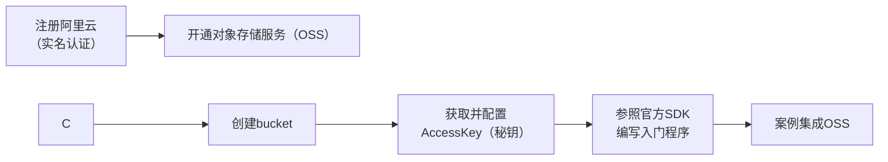

# 今日学习总结：事务管理、文件上传与更多

## 前言
下午4点了，没忍住玩了会游戏😭。来看看今天安排：事务管理，文件上传，员工的删除和修改。

## 日程
五点，看完事务管理，去恰饭之前把blog写写。  
现在是8：30，烦躁，非常烦躁，决定先去洗个澡，因为烦躁影响注意力，先把blog写了。  
好像写了会blog又没那么燥了，真奇怪哈。  
11点10分，来收个尾。

## 学习内容

### 省流：
1. Spring 事务管理
2. 文件上传
3. 自定义结果集
4. 逆天 Bug

### 1. Spring 事务管理
Spring 提供了方便的事务管理注解 `@Transactional`，它可以作用在方法、类，或者接口上（出于性能考虑，一般作用在方法上）。

通过配置可以查看 Spring 事务的底层日志：
```yaml
logging:
  level:
    org.springframework.jdbc.support.JdbcTransactionManager: debug
```

- **rollbackFor**：用于控制抛出何种异常时对事务进行回滚（默认是运行时异常 `RuntimeException`）。  
  例如：
  ```java
  @Transactional(rollbackFor = Exception.class) // 设置为所有异常
  ```

- **propagation**：控制事务的传播行为  
  | 属性值         | 含义                                       |  
  |----------------|--------------------------------------------|  
  | REQUIRED       | 【默认值】需要事务，有则加入，无则创建新事务 |  
  | REQUIRES_NEW   | 需要新事务，无论有无，总是创建新事务       |  
  | SUPPORTS       | 支持事务，有则加入，无则在无事务状态中运行   |  
  | NOT_SUPPORTED  | 不支持事务，在无事务状态下运行，如果当前存在已有事务，则挂起当前事务 |  
  | MANDATORY      | 必须有事务，否则抛异常                       |  
  | NEVER          | 必须没事务，否则抛异常                       |  

  例如：
  ```java
  @Transactional(rollbackFor = Exception.class)
  @Override
  public void save(Emp emp) {
      try {
          //......事务的处理
      } finally {
          //记录操作日志
          EmpLog empLog = new EmpLog(null,LocalDateTime.now(),"新增员工" + emp);
          empLogService.insertLog(empLog);
      }
  }
  ```

### 2. 文件上传
前端要求：注意 `method="post"`，`enctype="multipart/form-data"` 和 `<input type="file" name="file">` 是必须的。
```html
<form action="/upload" method="post" enctype="multipart/form-data">
    姓名: <input type="text" name="name"><br>
    年龄: <input type="text" name="age"><br>
    头像: <input type="file" name="file"><br>
    <input type="submit" value="提交">
</form>
```

#### 将文件保存到本地
```java
@PostMapping("/upload")
public Result handleFileUpload(String name, Integer age, MultipartFile file) throws IOException {
    log.info("文件上传:{}{}{}",name,age,file);
    //获取原始文件名
    String fileName =  file.getOriginalFilename();

    //UUID生成新的文件名
    String extension = fileName.substring(fileName.lastIndexOf("."));
    fileName = UUID.randomUUID().toString()+extension;

    //保存在本地目录
    file.transferTo(new File("C:\\Desktop\\" + fileName));

    return Result.success();
}
```

#### 上传到阿里云 OSS
[阿里云登录 - 欢迎登录阿里云，安全稳定的云计算服务平台](https://oss.console.aliyun.com)  
步骤：


1. **关于创建bucket**  
   为了代理服务器能够正常获取图片，需要修改bucket中的权限控制。

2. **获取并配置 AccessKey**  
   在阿里云获取 AccessKey 后，配置系统的环境变量。  
   用管理员模式打开cmd（亲测这种方式），输入：
   ```cmd
   set OSS_ACCESS_KEY_ID=【你的keyid】
   set OSS_ACCESS_KEY_SECRET=【你的keysecret】
   setx OSS_ACCESS_KEY_ID "%OSS_ACCESS_KEY_ID%"
   setx OSS_ACCESS_KEY_SECRET "%OSS_ACCESS_KEY_SECRET%"
   ```
   检查是否生效：
   ```cmd
   echo %OSS_ACCESS_KEY_ID%
   echo %OSS_ACCESS_KEY_SECRET%
   ```
   如果返回了 AccessKey，说明配置成功。

3. **入门程序**  
   请参考官方文档：[OSS Java SDK快速入门](https://help.aliyun.com/zh/oss/developer-reference/getting-started?spm=a2c4g.11186623.0.i1)  
   导入依赖及入门程序（省略了，请查看官方文档）：
   ```xml
   <dependency>
       <groupId>com.aliyun.oss</groupId>
       <artifactId>aliyun-sdk-oss</artifactId>
       <version>3.17.4</version>
   </dependency>
   ```

   配置上传文件的格式并进行测试：
   ```java
   //上传文件
   String objectName = "C:\\Desktop\\1.png";
   File file = new File(objectName);
   byte[] bytes = Files.readAllBytes(file.toPath());
   ossClient.putObject(bucketName, objectName, new ByteArrayInputStream(bytes));
   ```

4. **案例集成 OSS**  
   将官方的入门程序修改包装为工具类：
   ```java
   @Component
   public class AliyunOSSOperator {
       @Autowired
       private AliyunOSSProperties aliyunOSSProperties; //参数的配置化

       public String upload(byte[] content, String originalFilename) throws Exception {
           String endpoint = aliyunOSSProperties.getEndpoint();
           String bucketName = aliyunOSSProperties.getBucketName();
           String region = aliyunOSSProperties.getRegion();

           // 从环境变量中获取访问凭证。运行本代码示例之前，请确保已设置环境变量OSS_ACCESS_KEY_ID和OSS_ACCESS_KEY_SECRET。
           EnvironmentVariableCredentialsProvider credentialsProvider = CredentialsProviderFactory.newEnvironmentVariableCredentialsProvider();

           // 填写Object完整路径，例如202406/1.png。Object完整路径中不能包含Bucket名称。
           //获取当前系统日期的字符串,格式为 yyyy/MM
           String dir = LocalDate.now().format(DateTimeFormatter.ofPattern("yyyy/MM"));
           //生成一个新的不重复的文件名
           String newFileName = UUID.randomUUID() + originalFilename.substring(originalFilename.lastIndexOf("."));
           String objectName = dir + "/" + newFileName;

           // 创建OSSClient实例。
           ClientBuilderConfiguration clientBuilderConfiguration = new ClientBuilderConfiguration();
           clientBuilderConfiguration.setSignatureVersion(SignVersion.V4);
           OSS ossClient = OSSClientBuilder.create()
                   .endpoint(endpoint)
                   .credentialsProvider(credentialsProvider)
                   .clientConfiguration(clientBuilderConfiguration)
                   .region(region)
                   .build();

           try {
               ossClient.putObject(bucketName, objectName, new ByteArrayInputStream(content));
           } finally {
               ossClient.shutdown();
           }
           //根据aliyunoss的url的特点进行拼接返回
           return endpoint.split("//")[0] + "//" + bucketName + "." + endpoint.split("//")[1] + "/" + objectName;
       }
   }
   ```

5. **参数的配置化**  
   可以将参数写到 yml 配置文件中，再通过 `@Value` 注解进行注入：
   ```yaml
   aliyun:
     oss:
       endpoint: https://oss-cn-guangzhou.aliyuncs.com
       bucket-name: 【your bucket-name】
       region: cn-guangzhou
   ```

   注解部分：
   ```java
   @Value("${aliyun.oss.endpoint}")
   private String endpoint;
   @Value("${aliyun.oss.bucket-name}")
   private String bucketName;
   @Value("${aliyun.oss.region}")
   private String region;
   ```

   如果参数比较多，可以考虑用 `@ConfigurationProperties` 映射到一个包装类中：
   ```java
   @Data
   @AllArgsConstructor
   @NoArgsConstructor
   @Component
   @ConfigurationProperties(prefix = "aliyun.oss")
   public class AliyunOSSProperties {
       private String endpoint;
       private String bucketName;
       private String region;
   }
   ```

   通过依赖注入 bean：
   ```java
   @Autowired
   private AliyunOSSProperties aliyunOSSProperties; //参数的配置化
   ```

### 3. 自定义结果集
当自动化映射无法处理较复杂情况时，用手动映射表：
```xml
<!-- 自定义结果集 -->
<resultMap id="empResultMap" type="com.itheima.pojo.Emp">
    <id column="id" property="id"/>
    <result column="username" property="username"/>
    <result column="password" property="password"/>
    <result column="name" property="name"/>
    <result column="gender" property="gender"/>
    <result column="phone" property="phone"/>
    <result column="job" property="job"/>
    <result column="salary" property="salary"/>
    <result column="image" property="image"/>
    <result column="entry_date" property="entryDate"/>
    <result column="dept_id" property="deptId"/>
    <result column="create_time" property="createTime"/>
    <result column="update_time" property="updateTime"/>
    <!-- 封装exprList -->
    <collection property="exprList" ofType="com.itheima.pojo.EmpExpr">
        <id column="ee_id" property="id"/>
        <result column="ee_empid" property="empId"/>
        <result column="ee_begin" property="begin"/>
        <result column="ee_end" property="end"/>
        <result column="ee_company" property="company"/>
        <result column="ee_job" property="job"/>
    </collection>
</resultMap>

<!--调用自定义结果集-->
<select id="getInfoById" resultMap="empResultMap">
    select
    e.*,
    ee.id ee_id,
    ee.emp_id ee_empid,
    ee.begin ee_begin,
    ee.end ee_end,
    ee.company ee_company,
    ee.job ee_job
    from emp e left join emp_expr ee on e.id = ee.emp_id
    where e.id = #{id};
</select>
```

### 4. 逆天 Bug
ps: 果然只有自己写东西才能暴露问题  
1. `@RequestParam` 要求请求字段和接收的字段名相同，不要再忘记了！  
2. 获取返回路径的字段 `/emps/{id}` 应该用 `@PathVariable` 而不是 `@RequestParam`。  
3. `<if test="updateTime != null">update_time = #{updateTime},</if>` `test` 属性需要引用实体类的属性名，而不是数据库的字段名！  
4. 把删除表单 SQL 里的 `emp_expr` 写成了 `emp`，怪不得修改一个没一个，给自己气笑了，再也不在 copy 的时候偷懒了😭，再也不偷懒不看自动补全的内容了😭😡

## 结语
最近在听草东的《山海》，越听越好听吧，原来不是“她明白”，也不是“他明白”，而是“我明白”。  
如果当初选择的是另外一条路会怎么样？可惜我可以转身，但不能回头。  
**既长路不见归途，便来寻现去往。**
