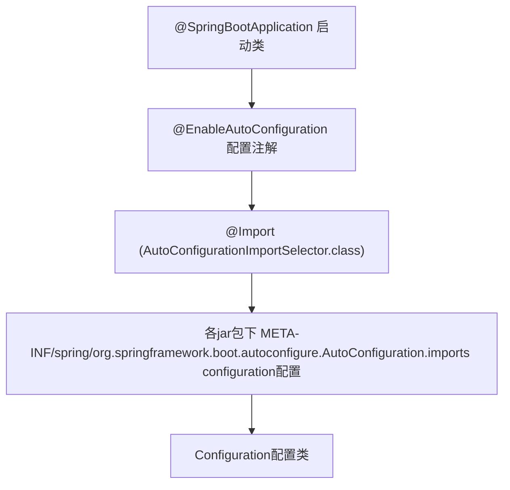

# 一轮考核的总结，SpringAOP，Spring底层

## 前言
一轮考核结束了，其实我对于自己的表现并不是特别满意。主要的问题还是语言的表述上，以及如何在有限的时间内去尽可能呈现自己的内容。最好对自己暂时解决不了的问题进行一定的思考，对于使用中的框架，应当思考如果自己来做，应该怎么解决这个问题。重要的是细节，特别是对于整个项目来说至关重要的细节，当意识到问题的时候，就应该第一时间去思考处理方案，哪怕暂时解决不了，也一定要记录下来。

接下来还是会恢复到日常的学习中，主要针对以下几个方向：
- AOP编程
- 补全缺失的前端知识
- 项目的部署
- 多线程

此外，也要注意到被落下的学科。一段事情的结束并不是轻松的开始，当决定要提升自己的时候，就注定要做出一定的牺牲。

山崖复远望，是仓皇，无告，不回的河流。

## 日程
- 3点多一点，学完SpringAOP，来做一做blog。
- 晚上8：30，磨磨蹭蹭，把SpringBoot的原理部分学了学。
- 10：30下班了，今天还得看看学科怎么补。

## 学习内容

### 1. SpringAOP
AOP（面向切面编程）是将与业务无关但需要多处使用的功能（如日志、事务、安全等）抽取出来，形成独立的模块，然后通过“织入”（weaving）的方式应用到目标代码中。

#### SpringAOP入门
引入依赖：
```xml
<dependency>
    <groupId>org.springframework.boot</groupId>
    <artifactId>spring-boot-starter-aop</artifactId>
</dependency>
```

入门程序：
```java
@Slf4j
@Aspect // AOP的注解
@Component
public class RecordTimeAspect { // 类名命名规范：Aspect
    @Around("execution(* com.itheima.service.impl.*.*(..))") // 定义作用的方法范围
    public Object recodeTime(ProceedingJoinPoint pjp) throws Throwable {
        long begin = System.currentTimeMillis();
        Object result = pjp.proceed(); // 执行原生方法
        long end = System.currentTimeMillis();
        log.info("方法{}: 耗时{}ms", pjp.getSignature(), end - begin);
        return result;
    }
}
```

#### 核心概念
- **连接点（JoinPoint）**：可以被AOP控制的方法。
- **通知（Advice）**：在切面中实现的功能。
- **切入点（PointCut）**：匹配连接点的条件。
- **切面（Aspect）**：通知 + 切入点。
- **目标对象（Target）**：通知应用的对象（连接点所对应的方法的对象）。

AOP通过将目标对象通过动态代理，生成代理对象并在其中执行原生方法和通知。

Class1 ----》 Class1@xxx(代理对象)

#### 通知类型
- `@Before`（方法执行前通知）
- `@After`（方法执行后通知）
- `@Around`（前后都通知）
- `@AfterReturning`（方法执行后通知，抛出异常则不通知）
- `@AfterThrowing`（方法抛出异常才通知）

**注意**：
- `@Around` 需要手动调用 `proceed()` 执行原始方法，其他自动执行方法。
- `@Around` 返回值为 `Object`，用于接收原始方法返回值。

#### 通知顺序
- 默认按照切面类的类名字典序。
- 目标方法前，字典序小优先。
- 目标方法后，字典序大优先。
- 可以在类名上注解 `@Order(数字)` 来控制通知顺序，数字小 -> 字典序小。

#### 切面表达式
```java
@Before("execution(public void com.itheima.service.impl.DeptServiceImpl.delete(java.lang.Integer))")
```

- **execution** 主要根据方法的返回值、包名、类名、方法名、方法参数等信息来匹配，语法为：
  
  ```
  execution(访问修饰符？返回值 包名.类名.？方法名(方法参数) throws 异常？)
  ```
- 其中带 `?` 的表示可以省略的部分：
  1. 访问修饰符：可省略（比如：`public`、`protected`）。
  2. 包名.类名：可省略（不建议省略）。
  3. `throws` 异常：可省略（注意是方法上声明抛出的异常，不是实际抛出的异常）。

- 可以使用通配符描述切入点：
  1. `*`：单个独立的任意符号，可以通配任意返回值、包名、类名、方法名、任意类型的一个参数，也可以通配包、类、方法名的一部分。
     ```java
     execution(* com.*.service.*.update*(*))
     ```
  2. `..`：多个连续的任意符号，可以通配任意层级的包，或任意类型、任意个数的参数。
     ```java
     execution(* com.itheima..DeptService.*(..))
     ```

#### 其他
```java
@Pointcut("execution(* com.itheima.service.impl.*.*(..))")
public void pt() {} // 声明public时可以在外部切面类引用
@Around("pt()")
```

**基于注解的切面表达式**：
1. 定义注解类：
   ```java
   @Target(ElementType.METHOD) // 作用对象：方法
   @Retention(RetentionPolicy.RUNTIME) // 保留策略：运行时有效
   public @interface LogOperation {}
   ```
2. 在通知注解上声明：
   ```java
   @Around("@annotation(com.itheima.anno.LogOperation)")
   ```
3. 在作用的方法上注解：
   ```java
   @LogOperation // 切面注解
   @RequestMapping(value = "/depts", method = RequestMethod.POST)
   public Result addDept(@RequestBody Dept dept) {
       ...
   }
   ```

**连接点**：
- `@Around` 中连接点为 `ProceedingJoinPoint`，且作为方法的参数，其他为其父类 `JoinPoint`，不作为方法的参数。
- 获取目标类名：
  ```java
  String className = joinPoint.getTarget().getClass().getName();
  ```
- 获取目标方法签名：
  ```java
  Signature signature = joinPoint.getSignature();
  ```
- 获取目标方法名：
  ```java
  String methodName = joinPoint.getSignature().getName();
  ```
- 获取目标方法运行参数：
  ```java
  Object[] args = joinPoint.getArgs();
  ```

### 2. ThreadLocal
`ThreadLocal` 是每个线程独立的存储空间（局部变量）。

#### 简单入门
```java
public class CurrentHolder {
    private static final ThreadLocal<Integer> CURRENT_LOCAL = new ThreadLocal<>();
    // 常用的方法：set，get，remove
    public static void setCurrentId(Integer id) {
        CURRENT_LOCAL.set(id);
    }
    public static Integer getCurrentId() {
        return CURRENT_LOCAL.get();
    }
    public static void remove() {
        CURRENT_LOCAL.remove();
    }
}
```

假设要记录操作员工的ID，就可以在 token 解析后存入 local 中：
```java
// 将userId存入Local
Integer userId = Integer.valueOf(claims.get("id").toString());
CurrentHolder.setCurrentId(userId);
```

需要时从 local 中获取：
```java
CurrentHolder.getCurrentId();
```

在处理完毕后清除（可放在放行之后作为递归清理）：
```java
// 放行
filterChain.doFilter(request, response);
// 清除local
CurrentHolder.remove();
```

### 3. Springboot 配置优先级
从低到高，高优先级起效果：
1. `application.yaml`
2. `application.yml`
3. `application.properties`
4. Java系统属性（`-Dserver.port=xxx`）
5. 命名行参数（`--server.port=xxx`）

### 4. Springboot Bean管理

#### Bean作用域
Spring 支持五种作用域，后三种在 web 环境才生效：

| 作用域       | 说明                                                         |
|--------------|--------------------------------------------------------------|
| singleton    | 容器内同名称的 bean 只有一个实例（单例）（默认）                 |
| prototype    | 每次使用该 bean 时会创建新的实例（非单例/多例）                 |
| request      | 每个请求范围内会创建新的实例（web 环境）               |
| session      | 每个会话范围内会创建新的实例（web 环境）               |
| application  | 每个应用范围内会创建新的实例（web 环境）               |

定义域注解 `@Scope`：
```java
@Scope("singleton")
```

选择 `singleton` / `prototype`：
- 对于无状态的 bean（即内部不会保存任何信息/状态），用 `singleton` 单例即可保证线程安全。
- 对于有状态的 bean，则需要用 `prototype`，防止多线程操作时出现的数据不一致问题。

单例 Bean 默认是在项目启动时进行实例化，使用 `@Lazy` 注解可以实现懒加载。

对于第三方 Bean，可以放在配置类下，通过 `@Bean` 注解将返回值交给 IOC 管理：
```java
@Configuration
public class CommonConfig {
    @Bean
    public AliyunOSSOperator aliyunOSSOperator(AliyunOSSProperties aliyunOSSProperties) {
        return new AliyunOSSOperator(aliyunOSSProperties);
    }
}
```

### 5. Springboot 起步依赖，自动配置

#### 起步依赖
- 本质是 Maven 的依赖传递。
- 通常以 `starter` 作为根依赖，包域名 - spring-boot-starter。

#### 自动配置
SpringBoot 在启动时自动将部分配置类和 bean 对象存入 IOC 容器中。

1. **通过包扫描**
   ```java
   @ComponentScan(basePackages = {"包名1", "包名2"})
   @SpringBootApplication
   public class TliasWebManagementApplication {
       ...
   }
   ```
   - 包扫描是默认存在的，且扫描启动类所在的目录。

2. **通过 `@Import` 注解**
   ```java
   @Import({普通类Example.class})
   @Import({配置类ExampleConfig.class})
   @Import({ImportSelector接口实现类})
   ```

   `ImportSelector` 接口实现类：用于批量导入配置类。
   ```java
   public class MyImportSelector implements ImportSelector {
       public String[] selectImports(AnnotationMetadata importingClassMetadata) {
           return new String[]{"com.example.HeaderConfig"};
       }
   }
   ```

3. **通过注解（本质是对 `ImportSelector` 实现类的再封装）**
   
   ```java
   【@EnableHeaderConfig】
   @Retention(RetentionPolicy.RUNTIME)
   @Target(ElementType.TYPE)
   @Import(MyImportSelector.class)
   public interface EnableHeaderConfig {}
   ```

#### 源码追踪


#### @Conditional
设置注册 bean 对象需要满足的条件：
- `@ConditionalOnClass(name = "io.jsonwebtoken.Jwts")`：判断环境中是否有对应的字节码文件，如果有就创建 bean。
- `@ConditionalOnMissingBean`：判断环境中有没有对应的 bean，没有就创建 bean。
- `@ConditionalOnProperty(name="myname", havingValue = "itheima")`：判断配置文件中`myname` 的属性值是否等于 `itheima`，是就创建 bean。

#### 自定义 starter
1. 创建自定义 `spring-boot-starter`。
2. 创建自定义 `spring-boot-autoconfigure`。
3. 在 `spring-boot-autoconfigure` 进行配置：
   ```java
   @EnableConfigurationProperties(AliyunOSSProperties.class)
   @Configuration
   public class AliyunOSSAutoConfiguration {
       @Bean
       @ConditionalOnMissingBean
       public AliyunOSSOperator aliyunOSSOperator(AliyunOSSProperties aliyunOSSProperties) {
           return new AliyunOSSOperator(aliyunOSSProperties);
       }
   }
   ```
4. 定义 `\META-INF\spring\org.springframework.boot.autoconfigure.AutoConfiguration.imports` 文件，将 Autoconfigure 全类名写入。

## 结语
平原不可见，晦暗，无声，未知的存亡。