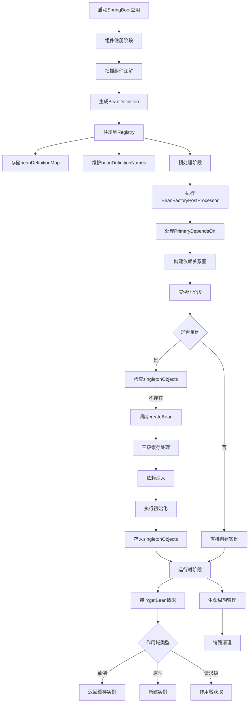

# 技术探索之旅：YAML配置，依赖注入、控制反转与Java注解

## 前言
最近有点懒了，太松懈可不行。为了让自己保持学习的动力，我决定将最近的学习内容整理成博客，目标是让未来的自己也能轻松理解。我会尽量以整体记录的方式呈现，所以一篇博客可能会分几天完成。今天，我们先来研究一下依赖注入和控制反转，顺便把昨天的 YAML 配置映射的博客补充一下。

## 日程
- 8点：中午稍微看了一点内容，先来写博客，再看看今天晚上能学到多少东西。
- 11点：下班吧，复习一会儿。

## 学习记录
### 操作系统
1. 分段存储管理
2. 段页式管理

## 学习内容
### 省流
1. YAML 配置文件
2. 依赖注入与控制反转
3. Java 注解

### 1. YAML 配置文件
#### 问题背景
在一轮项目中，我将一些配置相关的常量写到了单例里面。这种方法的优点是实现简单，但不利于更改，尤其是在将项目作为 JAR 包部署到服务器时。将配置信息写入 YAML 文件，主要就是为了解决这个问题。

#### 实现方式
主要调用了 Jackson 的 YAML 解析依赖：
```xml
<!-- YAML 格式解析器 -->
<dependency>
    <groupId>com.fasterxml.jackson.dataformat</groupId>
    <artifactId>jackson-dataformat-yaml</artifactId>
    <version>2.17.1</version>
</dependency>
```

以我现在的 YAML 配置文件为例：
```yaml
# Tomcat 相关配置
tomcat:
  # 端口
  port: 8080
  # webapp 目录
  webappDir: "Anykat-application/src/webapp"
  # 扫描的目录
  classesDir: "Anykat-application/target/classes"

# Jwt 相关配置
jwt:
  # Jwt 密钥
  secretKey:  "ProjectAnykatKaCatIsMyLongLongSecretKeyTo256Bits"
  # 管理员 Jwt 密钥
  adminSecretKey: "ProjectAnykatKaCatIsMyLongLongSecretKeyTo256BitsUsingByAdmin"
  # 有效时间
  expireTime: 21600000 # 6h
```

通过一个单例来管理：
```java
public class AppConfig {
    private TomcatConfig tomcat;
    private JwtConfig jwt;

    // 私有静态实例变量
    private static volatile AppConfig instance;

    // 私有构造函数防止外部实例化
    private AppConfig() throws FileNotFoundException {}

    // 获取单例的静态方法
    public static AppConfig getInstance() throws FileNotFoundException {
        if (instance == null) {
           ...
        }
        return instance;
    }
}
```

在单例实例化时进行加载：
```java
// 加载配置文件
Yaml yaml = new Yaml();
instance = yaml.loadAs(
        new FileInputStream("config.yml"),
        AppConfig.class
);
```

#### 缺点
这种方法的实现比较粗糙简单，它对 YAML 字段的对应有严格要求，且必须有相应的实体类来接收 YAML 映射。因为通过单例进行加载，所以不支持热更新。

#### 改进建议
- 通过反射和动态代理来生成对应字段的实体类，不依赖硬编码的实体类。
- 把单例模式换成其他模式，来支持配置的热更新。

### 2. 依赖注入与控制反转
#### 作用分析
首先，我们来了解一下这是一种什么工作模式：
- 不直接创建实体类的对象，而是先把实体类交给 IoC 容器管理（控制反转），在需要使用时，再从容器中取出对应的对象（依赖注入）。
- 对比直接通过 `new` 创建对象，这样做的好处包括：
  - **生命周期管理**：自动处理对象销毁，避免内存泄漏；处理复杂的生命周期（单独实例/共享单例实例）。
  - **依赖关系管理**：装配时自动处理依赖的装配；解决循环依赖、嵌套依赖（三层缓冲）。
  - **低耦合度**：实例替换；单元测试（`mockBean` 替换）。
  - **可配置性和灵活性**：可以在不修改代码的情况下通过配置改变应用程序行为；支持运行时决定具体实现（如根据环境选择不同实现）。
  - **集中管理**：所有对象的创建和依赖关系在一个地方管理；便于维护和了解系统整体结构。

#### 原理分析
Spring Boot 中的依赖注入主要有以下核心功能：
- 注册组件（类）
- 管理组件实例
- 自动解析依赖关系
- 提供获取 Bean 的接口

工作流程如下：
1. **组件注册阶段**：
   - 启动时扫描配置的包路径。
   - 将被注解的类转换为 `BeanDefinition` 对象。
   - 注册到 `BeanDefinitionRegistry`（由 `DefaultListableBeanFactory` 实现）：
     - 使用 `beanDefinitionMap`（`ConcurrentHashMap`）存储 Bean 的定义。
     - 维护 `beanDefinitionNames` 列表保持顺序。

2. **预处理阶段**：
   - 执行 `BeanFactoryPostProcessor`（可修改 `BeanDefinition`）。
   - 处理一些元数据相关的注解。
   - 预解析依赖关系。

3. **实例化管理阶段**（`DefaultListableBeanFactory`）：
   - 按依赖顺序实例化：
     - 通过 `createBean()` 创建实例。
     - 使用三级缓存解决循环依赖。
     - 依赖注入（`@Autowired` 由 `AutowiredAnnotationBeanPostProcessor` 处理）。
     - 调用初始化方法（`@PostConstruct`）。
   - 存储单例 Bean 到 `singletonObjects`（`ConcurrentHashMap`）。

4. **运行时阶段**：
   - 处理 `getBean()` 请求。
   - 管理生命周期（包括销毁过程）。
   - 处理作用域（单例/原型/请求/会话等）。

**重要概念**：
- `BeanDefinition` 不等同于 Bean 本身，它是 Bean 的解释。
  - 比如：Bean 是一道要做的菜，`BeanDefinition` 是这道菜的菜谱。
  - `Registry` 是管理这些菜谱的管理员。
  - `Factory` 是负责做菜的那个厨神。

**流程图**：


#### 源码分析
这是不得不品鉴的一环。先 clone 一下 Spring Framework 的源码：[Spring Framework 源码](https://github.com/spring-projects/spring-framework.git)。然后我自己慢慢看源码（略过了哈）。

### 3. Java 注解
在正式编写自己的 BeanFactory 方法之前，先来了解一下关于 Java 注解的基本知识。

Java 提供了一些内置注解：
- `@Override`：表示方法覆盖了父类中的方法。
- `@Deprecated`：表示元素已过时，不推荐使用。
- `@SuppressWarnings`：告诉编译器忽略特定警告。
- `@SafeVarargs`：断言方法或构造器不会对其可变参数执行不安全的操作。
- `@FunctionalInterface`：表示接口是函数式接口（Java 8）。

而实现自己的注解，则要用到 Java 的元注解：
- `@Target`：指定注解可以应用的位置（如 `TYPE`（类、接口、注解、枚举）、`METHOD`（方法）、`FIELD`（字段、常量）等）。
- `@Retention`：指定注解的保留策略（`SOURCE`（源码级，编译时丢弃）、`CLASS`（类文件，运行时不加载）、`RUNTIME`（运行时））。
- `@Documented`：表示注解应包含在 Javadoc 中。
- `@Inherited`：表示子类可以继承父类的注解。
- `@Repeatable`：表示注解可以在同一位置重复使用（Java 8）。

示例：
```java
@Target({ElementType.CONSTRUCTOR, ElementType.FIELD, ElementType.METHOD})
@Retention(RetentionPolicy.RUNTIME)
public @interface Autowired {
}
```

**重要说明**：
注解的本身没有任何作用，它只是做了一个标记。例如，`@Retention(RetentionPolicy.RUNTIME)` 以属性表的形式存储在 `.class` 文件中，在运行时可以通过反射扫描到对应的字段。

## 结语
真的快把我看麻了，距离能够自己实现一个依赖注入还有很长的路要走，加油吧！