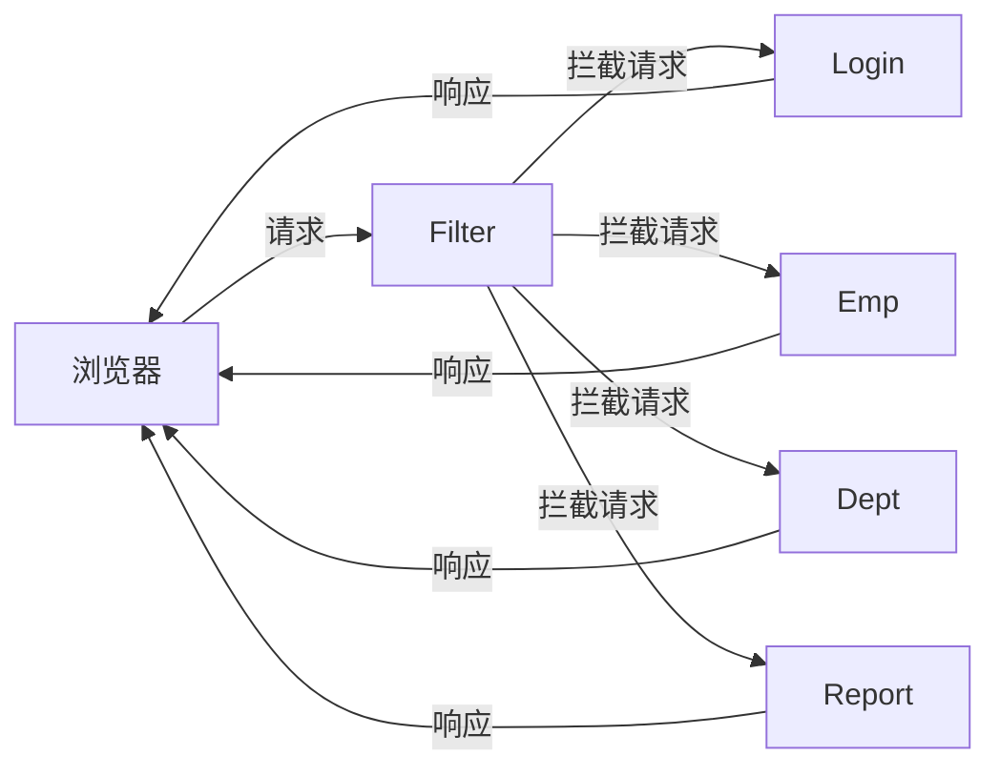
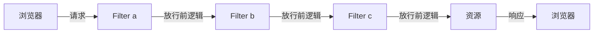

# 前言

现在是早上8:40，没课就是好啊。今天要把登录验证弄完，然后稍微复习一下，明天就要开始自己构建项目了。

---

# 日程

- 11:50 把实战部分写完了（有点肝痛了，什么赛博搬砖）。
- 休息到下午。
- 床单杀人类的可能性很小，但不是没有。本来3:30的闹钟，现在4:30了，脑袋还晕晕乎乎的。
- 7:46了，byd午觉的后劲还没有消退，先洗个澡，以后午觉一定不能睡太久。
- 21:30 搞定了，到后面感觉自己有点敷衍了。百里路，九十行半里啊。

---

# 学习内容

## 省流：1.登录验证

## 小知识：

在 SQL 查询中，如果某些字段可能为 NULL，你可以使用 COALESCE 函数来将 NULL 值替换为其他值。COALESCE 函数会返回其参数列表中的第一个非 NULL 值。

## 登录验证

### 会话：用户与服务器资源进行连接的过程。

| 技术方案 | 优点 | 缺点 |
| --- | --- | --- |
| 方案一（Cookie） | - HTTP协议中支持的技术 | - 移动端APP无法使用Cookie<br>- 不安全，用户可以自己禁用Cookie<br>- Cookie不能跨域 |
| 方案二（Session） | - 存储在服务端，安全 | - 服务器集群环境下无法直接使用Session<br>- Cookie的缺点 |
| 方案三（令牌） | - 支持PC端、移动端<br>- 解决集群环境下的认证问题<br>- 减轻服务器端存储压力 | - 需要自己实现 |

> 目前主流的方案是令牌

## JWT令牌：

定义了一种简洁的、自包含的格式，用于在通信双方以json数据格式安全的传输信息。以Base64作为编码格式。

### 组成：

1. **第一部分**：Header（头），记录令牌类型、签名算法等。例如：
   ```json
   {"alg": "HS256", "type": "JWT"}
   ```

2. **第二部分**：Payload（有效载荷），携带一些自定义信息、默认信息等。例如：
   ```json
   {"id": "1", "username": "Tom"}
   ```

3. **第三部分**：Signature（签名），防止Token被篡改、确保安全性。将header、payload融入，并加入指定秘钥，通过指定签名算法计算而来。

## 入门程序：

### 引入依赖

**JWT**

```xml
<dependency>
    <groupId>io.jsonwebtoken</groupId>
    <artifactId>jjwt</artifactId>
    <version>0.9.1</version>
</dependency>
```

### 定义生成和解析令牌的工具类

```java
public class JwtUtils {
    private static final String SECRET_KEY = "aXRoZWltYQ=="; // 秘钥 把字符串转成base64格式
    private static final long EXPIRATION_TIME = 12 * 60 * 60 * 1000; // 12小时

    /**
     * 生成JWT令牌
     * @param claims 令牌中包含的信息
     * @return 生成的JWT令牌字符串
     */
    public static String generateToken(Map<String, Object> claims) {
        return Jwts.builder()
                .signWith(SignatureAlgorithm.HS256, SECRET_KEY)
                .addClaims(claims)
                .setExpiration(new Date(System.currentTimeMillis() + EXPIRATION_TIME))
                .compact();
    }

    /**
     * 解析JWT令牌
     * @param token 要解析的JWT令牌字符串
     * @return 包含令牌信息的Claims对象
     * @throws Exception 如果令牌无效或已过期，则抛出异常
     */
    public static Claims parseToken(String token) throws Exception {
        return Jwts.parser()
                .setSigningKey(SECRET_KEY)
                .parseClaimsJws(token)
                .getBody();
    }
}
```

## 过滤器Filter：



### 拦截路径：

```java
@WebFilter(urlPatterns = "/*")
```

| 拦截路径   | urlPatterns值  | 含义                                       |
|------------|----------------|--------------------------------------------|
| 拦截具体路径 | /login         | 只有访问 /login 路径时，才会被拦截         |
| 目录拦截   | /emps/*        | 访问/emps下的所有资源，都会被拦截           |
| 拦截所有   | /*             | 访问所有资源，都会被拦截                    |

### 入门程序：

1. 定义filter类实现Filter的接口

```java
@WebFilter(urlPatterns = "/*")
public class DemoFilter implements Filter {
    @Override
    public void init(FilterConfig filterConfig) throws ServletException {
    }

    @Override
    public void doFilter(ServletRequest servletRequest, ServletResponse servletResponse, FilterChain filterChain) throws IOException, ServletException {
        log.info("拦截请求");
        //放行 -- 注意一定要手动放行，不然请求是过不去的
        filterChain.doFilter(servletRequest, servletResponse);
    }

    @Override
    public void destroy() {
    }
}
```

2. 在启动类中添加@ServletComponentScan注解

Filter接口定义了三个方法：
- 初始化，web服务器启动时调用
- 拦截到请求后调用
- 销毁，web服务器关闭后调用

## 过滤器链：



> 注解配置的过滤器，执行顺序按的类名的字典序从小到大

## 拦截器Interceptor

与Filter的功能层次相同，是Spring提供的技术方案

### 入门程序：

1. 定义拦截器，实现HandlerInterceptor接口

```java
@Slf4j
@Component
public class DemoInterceptor implements HandlerInterceptor {
    //在目标资源方法运行之前运行 - 返回值: true 放行, false 不放行
    @Override
    public boolean preHandle(HttpServletRequest request, HttpServletResponse response, Object handler) throws Exception {
        log.info("preHandle ....");
        return true;
    }

    //在目标资源方法运行之后运行
    @Override
    public void postHandle(HttpServletRequest request, HttpServletResponse response, Object handler, ModelAndView modelAndView) throws Exception {
        log.info("postHandle ....");
    }

    //视图渲染完毕后运行
    @Override
    public void afterCompletion(HttpServletRequest request, HttpServletResponse response, Object handler, Exception ex) throws Exception {
        log.info("afterCompletion ....");
    }
}
```

2. 定义配置类，对拦截的请求路径进行配置

```java
@Configuration
public class WebConfig implements WebMvcConfigurer {
    @Autowired
    private DemoInterceptor demoInterceptor;
    @Autowired
    private TokenInterceptor tokenInterceptor;

    @Override
    public void addInterceptors(InterceptorRegistry registry) {
        registry.addInterceptor(tokenInterceptor)
                .addPathPatterns("/**") // 拦截所有请求
                .excludePathPatterns("/login"); // 不拦截哪些请求
    }
}
```

### 拦截器的路径设置与过滤器有所区别

| 拦截路径     | 含义                   | 举例                                      |
|--------------|------------------------|-------------------------------------------|
| /*           | 一级路径               | 能匹配/depts, /emps, /login, **不能匹配** /depts/1 |
| /**          | 任意级路径             | 能匹配/depts, /depts/1, /depts/1/2         |
| /depts/*     | /depts下的一级路径     | 能匹配/depts/1, **不能匹配** /depts/1/2, /depts |
| /depts/**    | /depts下的任意级路径   | 能匹配/depts, /depts/1, /depts/1/2, **不能匹配** /emps/1 |

## 拦截器与过滤器的区别：

### Filter 与 Interceptor 区别：

1. **接口规范不同**：
   - 过滤器需要实现 `Filter` 接口，而拦截器需要实现 `HandlerInterceptor` 接口。

2. **拦截范围不同**：
   - 过滤器 `Filter` 会拦截所有的资源，而 `Interceptor` 只会拦截 Spring 环境中的资源。

> 在执行时先执行过滤器，然后是拦截器

---

# 结语

🔥😡🫵
