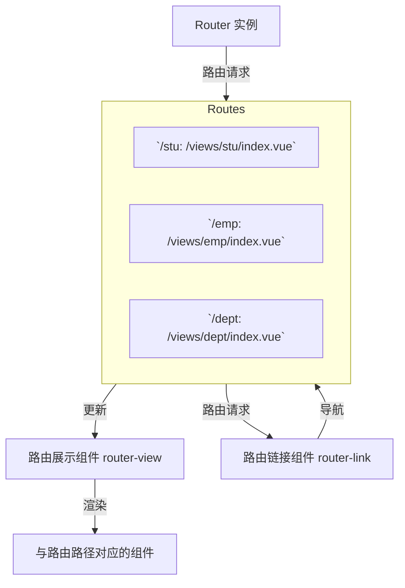

# Vue前端学习之旅：工程化、ElementPlus与路由配置

## 前言
有两天没更新blog了，不是因为我懒哈，主要是确实没有学什么新东西。昨天做前端的时候被狠狠卡住了，因为不会构建Vue工程。所以花点时间学学前端，大概两到三天。

## 日程
2：00起床，写了一会接口文档，开始学习前端。  
18:00，吃了顿饭，回来继续。  
经典修bug不看报错位置，找半天问题发现找错地方了😑  
22:00，快进了一些地方，来写写要点。

## 学习内容
### 1. Vue工程化
#### 1）环境配置
- 首先要安装Node.js。
- 进行npm包管理工具的配置：以管理员身份运行：
  ```bash
  npm config set prefix "NodeJS的安装路径"
  ```
- 切换到国内的镜像以提高下载速度：
  ```bash
  npm config set registry https://registry.npmmirror.com
  ```

#### 2）创建工程化的Vue项目
```bash
npm create vue@3.3.4
```
在定义项目名字后会提供一些组件包的选择：

| 配置项                          | 描述                                                         | 默认值          |
|---------------------------------|--------------------------------------------------------------|-----------------|
| Project name                    | 项目名称，可输入想要的项目名称。                             | vue-project     |
| Add TypeScript?                 | 是否加入TypeScript组件？                                     | No              |
| Add JSX Support?                | 是否加入JSX支持？                                            | No              |
| Add Vue Router                  | 是否为单页应用程序开发添加Vue Router路由管理组件？           | No              |
| Add Pinia                       | 是否添加Pinia组件来进行状态管理？                            | No              |
| Add Vitest                      | 是否添加Vitest来进行单元测试？                               | No              |
| Add an End-to-End               | 是否添加端到端测试？                                         | No              |
| Add ESLint for code quality?    | 是否添加ESLint来进行代码质量检查？                           | No              |

进入项目的目录，安装对应依赖：
```bash
npm install
```

**Vue项目结构**
- **.vscode**  
  存放VS Code编辑器的配置文件。
- **node_modules**  
  存放通过npm或yarn下载的第三方包。
- **public**  
  存放静态资源，如：图标、图片等。
- **src**  
  存放源代码的目录。
  - **assets**  
    存放静态资源，如：图片、字体等。
  - **components**  
    存放Vue组件的目录。
  - **App.vue**  
    应用的根组件。
  - **main.js**  
    应用的入口文件，用于初始化Vue实例并挂载根组件。

其他文件：
- **.gitignore**  
  Git忽略文件配置。
- **index.html**  
  应用的入口HTML文件。
- **package-lock.json**  
  锁定项目依赖的确切版本。
- **package.json**  
  项目的配置文件，包括项目名、版本号、依赖包、脚本等。
- **README.md**  
  项目的说明文档。
- **vite.config.js**  
  Vue项目的配置文件，如：端口号等。

**启动Vue项目**
```bash
npm run dev
```
除了通过命令行，也可以通过`package.json`脚本启动项目。可能需要对本地脚本的权限进行设置：
```bash
Set-ExecutionPolicy -ExecutionPolicy RemoteSigned -Scope LocalMachine
```

#### 3）入门程序
`App.vue`是Vue项目的根组件，在`main.js`中进行了配置，通过`index.html`作为页面的访问。  
一个经典的`.vue`组件的结构如下：
```vue
<!-- 定义JS，控制模板部分的数据和行为(JS) -->
<script setup>
</script>

<!-- 模板部分，控制的是页面的结构(HTML) -->
<template>
</template>

<!-- 当前组件的CSS样式 -->
<style scoped>
</style>
```

#### 4）API风格
Vue组件提供了两种API风格：选项式API，组合式API。  
官方推荐选项式API，它具有较高的灵活度：
```vue
<script setup>
    //引入 ref和钩子函数
    import { ref, onMounted } from 'vue';

    //声明响应式数据
    const count = ref(0);

    //声明函数
    function increment() {
        count.value++;
    }
    
    //钩子函数
    onMounted(() => {
        console.log('组件已挂载');
    });
</script>

<template>
    <button @click="increment">count: {{ count }} </button>
</template>
```

在`App.vue`中导入：
```vue
<script setup>
    import demo from './views/demo.vue';
</script>

<template>
  <demo></demo>
</template>
```

### 2. ElementPlus
基于Vue3的组件库：[Design | Element Plus](https://element-plus.org/zh-CN/guide/design.html)  
引入依赖：参考官方文档的安装部分。  
官网有对组件使用的详细说明，常用的有表格、分页条、表单等。

### 3. 路由配置
路由配置是用于定义应用程序中不同URL路径与页面组件之间映射关系的设置。它是构建单页应用（SPA）的基础，使得应用能够根据URL动态显示不同的内容，而无需重新加载整个页面。

#### 路由配置的作用
1. **URL与组件的映射**：通过路由配置，可以将不同的URL路径映射到不同的组件上。例如，当用户访问`/home`时，显示主页组件；访问`/about`时，显示关于页面组件。
2. **动态加载**：在SPA中，路由配置可以帮助实现组件的按需加载，即只有在需要时才加载相应的组件，从而提高应用的性能。
3. **导航控制**：通过路由配置，可以控制用户在应用中的导航行为，例如通过链接或编程方式导航到不同的页面。

**路由配置示意图**


**通过`<router-view></router-view>`标签来动态指定路径**
```vue
<template>
  <router-view></router-view>
</template>
```

**`router-link`示例**
```vue
<!-- 首页菜单 -->
<router-link to="/index">
  <el-menu-item index="/index">
    <el-icon><Promotion /></el-icon> 首页
  </el-menu-item>
</router-link>
```

**ElementPlus提供的更简便API**
- **router**  
  - 是否启用`vue-router`模式。启用该模式会在激活导航时以`index`作为`path`进行路由跳转，使用`default-active`来设置加载时的激活项。
  - 类型：`boolean`
  - 默认值：`false`

**路由表的配置**
```javascript
import { createRouter, createWebHistory } from 'vue-router'

import IndexView from '@/views/index/index.vue'
import ClazzView from '@/views/clazz/index.vue'
import DeptView from '@/views/dept/index.vue'
import LoginView from '@/views/login/index.vue'

const router = createRouter({
  history: createWebHistory(import.meta.env.BASE_URL),
  routes: [
    { //作为嵌套的路由，先匹配到LayoutView，再根据LayoutView的<router-view></router-view>来进行子路由的访问
     path: '/', 
     name: '',
     component: LayoutView,
     redirect: '/index', //重定向对于根路径的访问
     children: [
      {path: 'index', name: 'index', component: IndexView},
      {path: 'clazz', name: 'clazz', component: ClazzView},
      {path: 'dept', name: 'dept', component: DeptView},
     ]
    },
    {path: '/login', name: 'login', component: LoginView}
  ]
})

export default router
```

## 结语
多花点时间去理解项目的构建和结构真的比自己一步步硬试要高效很多。