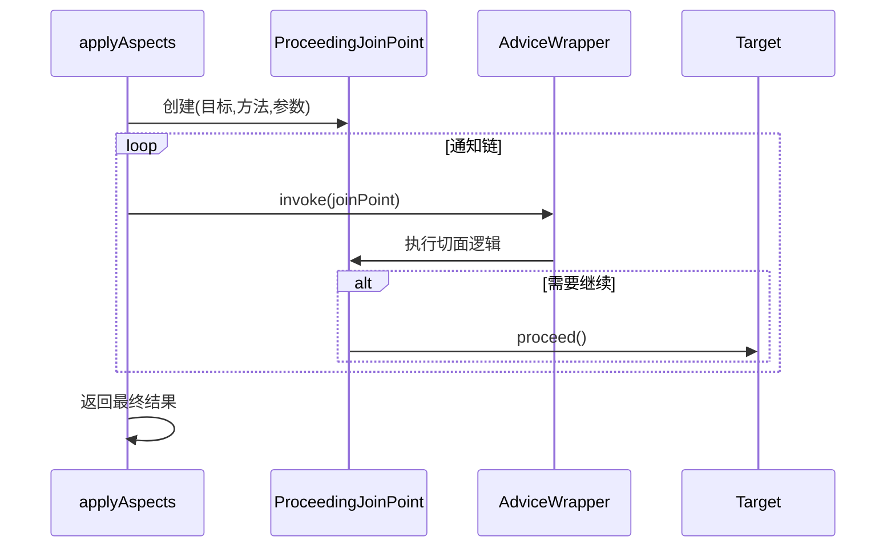
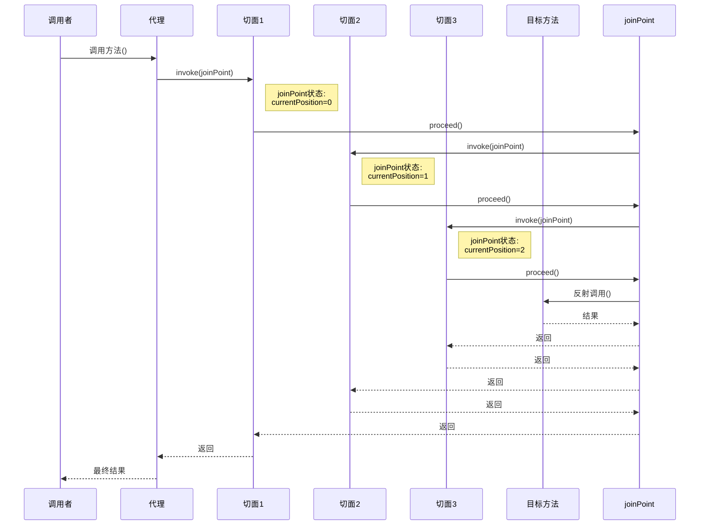
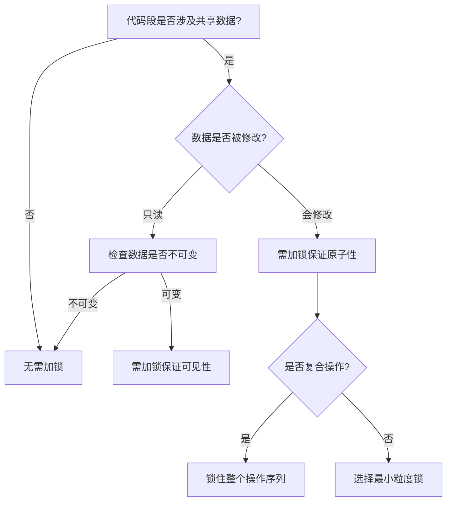

# 我的重生开发之旅：优化DI容器，git提交规范，AOP处理器，锁与并发安全

## 前言
----------------------------------------
我重生了，重生到了五一开始的一天。上一世，我天天摆烂，最后惨遭实习生优化。这一世，我要好好内卷.....

今天的目标是继续优化DI容器的功能，尝试兼容AOP，并简单做一个后端联调测试。

----------5.2-----------
今天继续完善DI容器，如果有时间就研究一下多线程。

----------------------------------------

## 日程
----------------------------------------
8点，起的最早的一集。  
被类加载器问题卡了一下午，晚上先摸摸🐟，看看git提交的规范  
晚上9点，不摸了不摸了  
凌晨1点了，被AOP逼疯了。  

----------5.2-----------  
弄了一早上，可算把AOP弄出来了，下午写写代码分析  
晚上快8点了，来看看多线程问题  

----------------------------------------


## 学习内容
----------------------------------------
### 省流：
1. 优化DI容器
2. 类加载器隔离问题和类加载器桥接
3. 关于git提交的一些规范
4. 手搓AOP处理器
5. 锁与并发安全

### 1. 优化DI容器
先来看看现在存在的问题：
1. **循环依赖处理不足**：
   - 当前实现只能检测循环依赖，但没有解决它（比如通过三级缓存）。
   - 对于构造器注入的循环依赖无法处理。

2. **作用域支持有限**：
   - 只有单例(Singleton)和原型(未标注时)两种作用域。
   - 缺少request/session等其他常用作用域。

3. **接口映射问题**：
   - 一个接口只能有一个实现类（第一个遇到的会被保留）。
   - 没有处理多个实现的情况（比如通过`@Qualifier`）。

4. **初始化顺序问题**：
   - 没有考虑依赖的初始化顺序。
   - 缺少`@PostConstruct`等生命周期回调支持。

5. **配置灵活性不足**：
   - 缺少XML/注解/JavaConfig等多种配置方式。
   - 没有环境配置(dev/test/prod)支持。

6. **性能问题**：
   - 每次`getBean`都会反射创建新实例（原型作用域时）。
   - 没有缓存反射元数据。

7. **类型安全**：
   - 大量使用强制类型转换(cast)。
   - 泛型支持不完善。

8. **线程安全性**：
   - 没有考虑并发场景下的线程安全。
   - singletonInstances等集合不是并发安全的。

9. **异常处理**：
   - 异常信息不够详细。
   - 缺少特定的异常类型。

10. **扩展性**：
    - 没有提供扩展点(如`BeanPostProcessor`)。
    - 不支持AOP等高级功能。

11. **资源管理**：
    - 没有提供销毁钩子或资源清理机制。
    - 对于需要close的资源没有特殊处理。

12. **测试支持**：
    - 缺少mock注入等测试支持功能。

13. **其他功能缺失**：
    - 不支持条件化Bean(`@Conditional`)。
    - 不支持profile。
    - 不支持懒加载(`@Lazy`)。
    - 不支持`@Value`等属性注入。

#### 解决方案：
1）支持多包扫描，并写入配置文件  
这个比较简单，就不记录了。

2）预处理依赖
```java
// 构建依赖图 查询解析依赖的Bean名称，查询其被@KatAutowired标记的子段,
// 然后通过拓扑排序重排依赖处理顺序
private void buildDependencyGraph() {
    // 初始化图和入度
    registry.getClassRegistry().keySet().forEach(beanName -> {
        dependencyGraph.put(beanName, new ArrayList<>());
        inDegree.put(beanName, 0);
    });

    // 构建依赖关系
    registry.getClassRegistry().forEach((beanName, clazz) -> {
        // 处理字段依赖
        for (Field field : clazz.getDeclaredFields()) {
            if (field.isAnnotationPresent(KatAutowired.class)) {
                String dependencyName = registry.resolveBeanName(field.getType());
                dependencyGraph.get(beanName).add(dependencyName);
                inDegree.put(dependencyName, inDegree.get(dependencyName) + 1);
            }
        }

        // 处理构造器依赖
        Constructor<?> autowiredCtor = findAutowiredConstructor(clazz);
        if (autowiredCtor != null) {
            for (Class<?> paramType : autowiredCtor.getParameterTypes()) {
                String dependencyName = registry.resolveBeanName(paramType);
                dependencyGraph.get(beanName).add(dependencyName);
                inDegree.put(dependencyName, inDegree.get(dependencyName) + 1);
            }
        }
    });
}
```

3）AOP支持  
关于这一大块内容比较复杂，移步到一个大分支进行分析。

4）并发安全  
**需要注意的是，Tomcat服务器是实现了多线程的**  
通过`synchronized`互斥锁和`ConcurrentHashMap`（内部实现了`synchronized`）  
在map插入时使用`putIfAbsent`而不是`put`，因为`putIfAbsent`是原子操作，更适合并发环境。

### 2. 类加载器隔离问题
Java类加载器是Java运行时环境(JRE)的重要组成部分，负责在运行时动态加载Java类到JVM内存中。可以通过继承`java.lang.ClassLoader`类并重写`findClass()`方法来实现自定义类加载器(这里不展开讲)。

**类加载器的隔离原理**：  
每个类加载器实例都有独立的命名空间，**同一个类被不同类加载器加载会被JVM视为不同的类**。  

Tomcat等Web容器为每个Web应用创建独立的`WebAppClassLoader`：
```
Common ClassLoader
  ├── WebApp1 ClassLoader
  └── WebApp2 ClassLoader
```
这也是Tomcat热部署的工作原理：创建新的类加载器加载修改后的类。

在我构建的DI容器中，类路径扫描器使用的是系统类加载器（`AppClassLoader`），而Tomcat实现了自己的类加载器，导致了类加载隔离。

**问题描述**：  
因为Tomcat没有被Bean容器管理，并且`@WebServlet("/*")`使得Tomcat对类有自己的实现，与`@KatComponent`产生了冲突。因此需要在controller层重写`init`方法，手动注入依赖：
```java
public void init() throws ServletException {
    super.init();
    // 从 ServletContext 获取 ContainerFactory
    ContainerFactory factory = (ContainerFactory) getServletContext().getAttribute("ContainerFactory");
    if (factory == null) {
        throw new ServletException("ContainerFactory 未初始化！");
    }
    try {
        factory.injectDependencies(this); // 手动注入依赖
    } catch (Exception e) {
        throw new RuntimeException(e);
    }
}
```
如果不更改类加载器，`factory.injectDependencies(this)`这一步将会注入失败，因为controller层的`movieService`是由Tomcat类加载器实例化的，而`movieServiceImpl`则是`Class.forName(className, false, Thread.currentThread().getContextClassLoader())`时由当前线程的上下文加载器决定的。

**解决方法**：  
在启动服务器后
```java
tomcat.start();
// 获取Tomcat类加载器
ClassLoader tomcatLoader = ctx.getLoader().getClassLoader();
// 设置类加载器
Thread.currentThread().setContextClassLoader(tomcatLoader);
ClassPathScanner.setClassLoader(tomcatLoader);
```
这里的关键是`Thread.currentThread().setContextClassLoader(tomcatLoader)`。为什么？  
在Java的类加载机制中，默认情况下，类的加载遵循*双亲委派模型*：  
类加载器会先委托父类加载器加载，如果父类加载器找不到，才自己加载。而Tomcat的`WebAppClassLoader`是`AppClassLoader`的子加载器。  
```
Bootstrap ClassLoader (JVM内置)
  ↓
Extension ClassLoader (JVM内置)
  ↓
System/App ClassLoader (JVM内置，加载CLASSPATH)
  ↓
Common ClassLoader (Tomcat)
  ├── Catalina ClassLoader (Tomcat容器专用)
  ├── Shared ClassLoader (Web应用共享)
  └── WebApp ClassLoader (每个Web应用独立)
```
通过设置上下文类加载器，`DriverManager`使用当前线程的`ContextClassLoader`（即`WebAppClassLoader`）来打破双亲委派机制的限制，让父加载器（`AppClassLoader`）能访问子加载器（`WebAppClassLoader`）加载的类。

### 3. 关于git提交的一些规范
**基本格式**  
`<type>(<scope>): <subject>`  
`Footer`

**常用type**：  
- `feat`：新功能（feature）的添加。
- `fix`：修复bug或问题。
- `docs`：仅文档内容的更改（如 README、注释）。
- `style`：代码格式的更改（不影响代码运行的变动，例如空格、制表符、等号等）。
- `refactor`：代码重构（既不添加新功能也不修复bug的代码变动）。
- `test`：添加或修改测试（包括单元测试、集成测试等）。
- `chore`：构建过程或辅助工具的变动（例如更新依赖、修改构建脚本等）。`gitignore`用这个。
- `build`：影响项目构建或外部依赖项的更改（例如，更新了`package.json`、`pom.xml`或`build.gradle`文件）。
- `ci`：持续集成配置文件和脚本的更改（例如，更新`.travis.yml`、`.gitlab-ci.yml`等）。配置文件更改用这个。
- `perf`：性能优化。
- `revert`：撤销之前的提交。
- `merge`：合并分支（通常由Git自动生成）。
- `init`：项目的初始化提交。

**scope**：  
可以是项目中任何可识别的部分，例如文件名、模块名、功能区域等。  
**影响范围比较大时用模块名，比较小时用类/影响**  
以下是一些常用的影响`scope`值示例：
- `ui`：用户界面相关的更改。
- `api`：API接口或后端服务的更改。
- `db`：数据库相关的更改，如模式、迁移等。
- `auth`：认证和授权相关的更改。
- `config`：配置文件或设置的更改。
- `deps`或`dependencies`：依赖项的更新或更改。
- `tests`：测试代码的更改。
- `cli`：命令行界面相关的更改。
- `docs`：文档内容的更改。
- `build`：构建系统或脚本的更改。
- `ci`：持续集成配置的更改。
- `perf`：性能优化相关的更改。
- `security`：安全性相关的更改。
- `logging`：日志系统的更改。
- `internationalization`或`i18n`：国际化和本地化的更改。
- `migration`：数据迁移或系统迁移相关的更改。
- `cleanup`：代码清理，如删除无用代码或重构。
- `refactor`：代码重构，不改变外部行为的内部结构调整。
- `feature`：特定功能模块的更改。
- `bugfix`：特定bug修复的更改。

**Footer**：  
- 关联 Issue：如`Closes #123`或`Fixes #456`。
- 破坏性变更：以`BREAKING CHANGE:`开头，描述不兼容的改动。  
通常在长期维护的项目中使用。

### 4. 手搓AOP处理器
先来看看AOP的工作流程：  
1. 扫描注解  
2. 注册切面类/方法  
3. 解析，匹配切面表达式  
4. 动态代理实现类  

#### 1）扫描注解  
这里可以集成到我的DI容器注册中。  
定义切面类映射：
```java
private final Set<Class<?>> aspectClasses = new HashSet<>();
```
通过路径扫描切面(与`Component`的扫描类似)：
```java
private void scanAspects() {
    List<Class<?>> aspectList = basePackages.stream()
            .flatMap(pkg -> ClassPathScanner.scanClassesWithAnnotation(pkg, KatAspect.class).stream())
            .toList();

    aspectList.forEach(aspect -> {
        aspectClasses.add(aspect);
        registerClass(aspect);  // 切面也需要作为普通Bean注册
    });
}
```

#### 2）注册切面类/方法  
在`BeanBuilder`中，执行依赖图处理后对AOP进行注册：
```java
// 处理aop注册
private void processAspects() {
    registry.getAspectClasses().forEach(aspectClass -> {
        try {
            Object aspect = createAspectInstance(aspectClass);
            aspectInstances.put(aspectClass, aspect);
            aspectProcessor.registerAspect(aspect);
        } catch (Exception e) {
            throw new RuntimeException("Aspect initialization failed: " + aspectClass.getName(), e);
        }
    });
}
```
切面也需要依赖注入：
```java
private Object createAspectInstance(Class<?> aspectClass) throws Exception {
    Object instance = createRawInstance(aspectClass);
    injectFields(instance);
    return instance;
}
```
在调用`aspectProcessor.registerAspect(aspect)`方法时，将切面实例返回给`AspectProcessor`类，注册到切面映射中：
```java
// 缓存切点表达式与对应通知方法的映射
private final Map<String, List<AdviceWrapper>> aspectCache = new ConcurrentHashMap<>();
// 注册切面类
public void registerAspect(Object aspect) {
    Class<?> aspectClass = aspect.getClass();
    Arrays.stream(aspectClass.getMethods())
            .filter(m -> m.isAnnotationPresent(KatAround.class))
            .forEach(method -> registerAdvice(aspect, method));
}
// 注册单个通知方法
private void registerAdvice(Object aspect, Method adviceMethod) {
    KatAround around = adviceMethod.getAnnotation(KatAround.class);
    String pointcut = around.value();
    int priority = adviceMethod.isAnnotationPresent(KatOrder.class)
            ? adviceMethod.getAnnotation(KatOrder.class).value() : 0;

    // 编译切点表达式
    compiledPatterns.computeIfAbsent(pointcut, this::compilePointcut);

    // 注册通知方法并按优先级排序
    aspectCache.computeIfAbsent(pointcut, k -> new CopyOnWriteArrayList<>())
            .add(new AdviceWrapper(aspect, adviceMethod, priority));

    aspectCache.get(pointcut).sort(Comparator.comparingInt(AdviceWrapper::priority));
}
```
`AdviceWrapper`是一个通知包装类，包含了切面实例，通知方法，优先级等信息：
```java
// 通知包装类
private record AdviceWrapper(Object aspectInstance, Method adviceMethod, int priority) {
    private AdviceWrapper(Object aspectInstance, Method adviceMethod, int priority) {
        this.aspectInstance = aspectInstance;
        this.adviceMethod = adviceMethod;
        this.priority = priority;
        this.adviceMethod.setAccessible(true);
    }

    public Object invoke(ProceedingJoinPoint joinPoint) throws Throwable {
        return adviceMethod.invoke(aspectInstance, joinPoint);
    }
}
```
关于切面表达式部分，则是实现了较为复杂的逐字符匹配，来避免直接替换导致的问题：
```java
// 编译切点表达式为正则
private Pattern compilePointcut(String expression) {
    String regex = convertToRegex(expression);
    return Pattern.compile(regex);
}

// 转换切点表达式为正则
private static String convertToRegex(String pointcut) {
    // 先处理特殊字符转义（但不处理通配符）
    StringBuilder regex = new StringBuilder();
    char[] chars = pointcut.toCharArray();

    for (int i = 0; i < chars.length; i++) {
        char c = chars[i];

        // 处理..通配符（需要看后续字符）
        if (c == '.' && i + 1 < chars.length && chars[i + 1] == '.') {
            regex.append("\\..+?"); // 非贪婪匹配
            i++; // 跳过下一个点
            continue;
        }

        // 处理普通字符转义
        switch (c) {
            case '.':
                regex.append("\\.");
                break;
            case '$':
                regex.append("\\$");
                break;
            case '*':
                // 临时标记，后面统一处理
                regex.append("\u0001");
                break;
            case '(':
                // 参数部分临时标记
                regex.append(handleParameters(chars, i));
                i = skipParameters(chars, i);
                break;
            default:
                regex.append(c);
        }
    }

    // 最后处理*通配符（避免被前面替换影响）
    String result = regex.toString().replace("\u0001", "[^.]+");
    return "^" + result + "$";
}

// 处理参数部分
private static String handleParameters(char[] chars, int start) {
    int end = findParameterEnd(chars, start);
    String params = new String(chars, start, end - start + 1);

    return switch (params) {
        case "(..)" -> "\\(.*\\)";
        case "()" -> "\\(\\)";
        case "(*)" -> "\\([^,]+\\)";
        default -> Pattern.quote(params); // 其他参数形式原样匹配
    };
}
```
`skipParameters`和`findParameterEnd`用于处理嵌套括号。

**转换规则**：  
| 切点语法       | 正则表达式      | 说明                          |
|----------------|-----------------|-----------------------------|
| `.`            | `\\.`           | 转义包分隔符                   |
| `..`           | `\\..+?`        | 匹配任意子包（非贪婪）          |
| `*`            | `[^.]+`         | 匹配非点字符（不跨越包层级）     |
| `(..)`         | `\\(.*\\)`      | 匹配任意参数                   |
| `()`           | `\\(\\)`        | 匹配无参数方法                 |
| `(*)`          | `\\([^,]+\\)`   | 匹配单个任意类型参数            |
| 其他参数形式     | 原样保留         | 如 `(String,int)`            |

**示例转换过程**：  
输入切点：  
`com.example..service.*.*(..)`  

转换步骤：  
- `..` → `\\..+?`  
- `.` → `\\.`  
- `*` → `\u0001`（临时）  
- `(..)` → `\\(.*\\)`  
- 替换 `\u0001` → `[^.]+`  
- 添加边界符  

最终正则：  
`^com\.example\..+?service\.[^.]+\.[^.]+\(.*\)$`  

#### 3）解析，匹配切面表达式  
在`BeanBuilder`方法中，在创建实例这一步加入对AOP代理的判断：
```java
// 创建实例
private Object createInstance(Class<?> clazz) throws Exception {
    // 1. 创建原始实例（不区分单例/原型）
    Object rawInstance;
    Constructor<?> autowiredCtor = findAutowiredConstructor(clazz);
    if (autowiredCtor != null) {
        rawInstance = createInstanceWithConstructor(autowiredCtor);
    } else {
        rawInstance = clazz.getDeclaredConstructor().newInstance();
    }

    // 2. 注入依赖
    injectFields(rawInstance);

    // 3. 统一应用AOP代理（无论是否单例）
    return wrapWithAopIfNeeded(rawInstance, clazz);
}
// 判断是否要生成代理
private Object wrapWithAopIfNeeded(Object rawInstance, Class<?> targetClass) {
    try {
        if (shouldProxy(targetClass)) {
            return createProxy(rawInstance, targetClass);
        }
        return rawInstance;
    } catch (Exception e) {
        throw new RuntimeException("AOP proxy creation failed for " + targetClass.getName(), e);
    }
}
private boolean shouldProxy(Class<?> targetClass) {
    // 不是切面类 && 有匹配的切面逻辑
    return !targetClass.isAnnotationPresent(KatAspect.class) &&
            aspectProcessor.hasMatchingAdvice(targetClass);
}
```
转交给`Aspectprocessor`类检查切面匹配：
```java
// 检查类是否有匹配的切面
public boolean hasMatchingAdvice(Class<?> targetClass) {
    return aspectCache.keySet().stream()
            .anyMatch(pointcut -> {
                // 构建类名模式：com.example.Service -> com.example.Service.*(..)
                String classPattern = targetClass.getName() + ".*(..)";
                return matchesPointcut(pointcut, classPattern);
            });
}

// 检查方法是否有匹配的切面
public boolean hasMatchingAdvice(Method method) {
    String methodSignature = buildMethodSignature(method);
    return aspectCache.keySet().stream()
            .anyMatch(pointcut -> matchesPointcut(pointcut, methodSignature));
}

// 检查切点是否匹配签名
private boolean matchesPointcut(String pointcut, String signature) {
    Pattern pattern = compiledPatterns.get(pointcut);
    if (pattern == null) {
        pattern = compilePointcut(pointcut);
        compiledPatterns.put(pointcut, pattern);
    }
    return pattern.matcher(signature).matches();
}
```
切面处理成正则的处理逻辑已经在上面给出。

#### 4）动态代理实现类  
如果找到匹配的切面则返回`BeanBuilder`类中进行代理对象的创建：
```java
private Object createProxy(Object target, Class<?> targetClass) throws Exception {
    if (targetClass.isInterface()) { //JDK的代理只能处理接口对象
        return Proxy.newProxyInstance(
                targetClass.getClassLoader(),
                new Class<?>[]{targetClass},
                (proxy, method, args) -> aspectProcessor.applyAspects(target, method, args) //调用委托给AspectProcessor
        );
    } else { 
        return new ByteBuddy()
                .subclass(targetClass) // 创建子类
                .method(not(isDeclaredBy(Object.class))) // 排除Object原生方法
                .intercept(MethodDelegation.to(new AspectInterceptor(target, aspectProcessor))) // 委托给拦截器
                .make()
                .load(targetClass.getClassLoader(),  ClassLoadingStrategy.Default.INJECTION) // 使用INJECTION策略(新类注入到目标类的ClassLoader中)
                .getLoaded()
                .getDeclaredConstructor()
                .newInstance();
    }
}
```

**ByteBuddy**是一个字节码增强管理库：
```xml
<!-- bytebuddy -->
<dependency>
    <groupId>net.bytebuddy</groupId>
    <artifactId>byte-buddy</artifactId>
    <version>1.15.11</version>
</dependency>
<dependency>
    <groupId>net.bytebuddy</groupId>
    <artifactId>byte-buddy-agent</artifactId>
    <version>1.15.11</version>
</dependency>
```

**AspectInterceptor**方法拦截器  
通过方法拦截器，将调用委托给`AspectProcessor`：
```java
public class AspectInterceptor {
    private final Object target;
    private final AspectProcessor aspectProcessor;

    public AspectInterceptor(Object target, AspectProcessor aspectProcessor) {
        this.target = target;
        this.aspectProcessor = aspectProcessor;
    }

    //在运行时，拦截目标方法，并执行切面逻辑
    @RuntimeType
    public Object intercept(@Origin Method method,
                            @AllArguments Object[] args,
                            @SuperCall Callable<?> callable) throws Exception {
        try {
            return aspectProcessor.applyAspects(target, method, args);
        } catch (Throwable throwable) {
            if (throwable instanceof Exception) {
                throw (Exception) throwable;
            }
            throw new Exception(throwable);
        }
    }
}
```

回到`AspectInterceptor`类，执行委托的切面逻辑：
```java
// 执行切面逻辑
public Object applyAspects(Object target, Method method, Object[] args) throws Throwable {
    // 构建更精确的方法签名
    String methodSignature = target.getClass().getName() + "." + method.getName() +
            "(" + Arrays.stream(method.getParameterTypes())
            .map(Class::getName)
            .collect(Collectors.joining(",")) + ")";

    // 查找匹配的切面
    List<AdviceWrapper> matchedAdvices = aspectCache.entrySet().stream()
            .filter(entry -> matchesPointcut(entry.getKey(), methodSignature))
            .flatMap(entry -> entry.getValue().stream())
            .sorted(Comparator.comparingInt(AdviceWrapper::priority))
            .toList();

    if (matchedAdvices.isEmpty()) {
        return method.invoke(target, args);
    }

    // 创建连接点
    ProceedingJoinPoint joinPoint = new ProceedingJoinPoint(target, method, args);

    // 执行通知链
    Object result = null;
    for (AdviceWrapper advice : matchedAdvices) {
        result = advice.invoke(joinPoint);
    }
    return result;
}
```

**通知链执行流程**：  


### **典型场景示例**
#### **场景**：执行 `userService.save(user)` 方法
1. **签名生成**  
   → `"com.service.UserService.save(com.entity.User)"`

2. **切面匹配**  
   - 匹配 `@Around("com.service..*.save*(..)")`  
   - 匹配 `@Before("execution(* save(*))")`

3. **执行顺序**  
   ```text
   1. @Before 切面
   2. @Around 切面（内部调用 proceed()）
   3. 实际执行 save() 方法
   4. @Around 剩余逻辑
   5. @AfterReturning 切面
   ```

**连接点`joinPoint`**，是连接通知和代理实例的桥梁：
```java
public record ProceedingJoinPoint(Object target, Method method, Object[] args) {

    public Object proceed() throws Exception {
        return method.invoke(target, args);
    }
}
```
**注意**：每个切面都收到同一个`joinPoint`对象，用于记录当前的进程状态。通过以下的示例，可以更好地理解通知链的执行流程：


### 5. 锁与并发安全
**基本的线程锁**：  
- **互斥锁 (synchronized)**  
  最基础的并发控制机制，确保同一时间只有一个线程能访问共享资源。
  ```java
  private final Object lock = new Object();
  public void safeMethod() {
      synchronized(lock) {
          // 临界区代码
      }
  }
  ```

- **读写锁 (ReadWriteLock)**  
  允许多个线程同时读，只允许一个线程写，且写时不能读。
  ```java
  ReadWriteLock rwLock = new ReentrantReadWriteLock();
  public void readData() {
      rwLock.readLock().lock();
      try {
          // 读取操作
      } finally {
          rwLock.readLock().unlock();
      }
  }
  public void writeData() {
      rwLock.writeLock().lock();
      try {
          // 写入操作
      } finally {
          rwLock.writeLock().unlock();
      }
  }
  ```

**基本的并发容器**：  
- `ConcurrentHashMap`  
- `CopyOnWriteArrayList`  
- `BlockingQueue`  

**锁粒度**：  
指锁的作用范围大小，合理选择锁粒度能平衡线程安全与系统性能。  
- **粗粒度锁**  
  ```java
  // 锁整个对象
  public synchronized void process() {
      // 所有操作都在锁内
  }

  // 锁整个集合
  synchronized(map) {
      // 操作map的所有方法
  }
  ```

- **细粒度锁**  
  ```java
  // 为每个数据项单独加锁
  public class FineGrainedCache {
      private final Map<Key, Lock> keyLocks = new HashMap<>();
      private final Map<Key, Value> cache = new HashMap<>();
      
      public void update(Key key, Value value) {
          Lock keyLock;
          synchronized(this) {
              keyLock = keyLocks.computeIfAbsent(key, k -> new ReentrantLock());
          }
          keyLock.lock();
          try {
              // 只锁定当前key的操作
              cache.put(key, value);
          } finally {
              keyLock.unlock();
          }
      }
  }
  ```

**应当使用细粒度锁的场景**：  
- 临界区包含I/O或耗时计算  
- 高并发访问  
- 资源可自然分片（如用户ID、订单ID等）  
- 需要最大化吞吐量  

**常见优化模式**：  
1. **锁分解**：将一个大锁拆分为多个小锁  
   ```java
   // 优化前
   public class Account {
       private final Object lock = new Object();
       private long balance;
       private int transactionCount;
       
       public void transfer(Account to, long amount) {
           synchronized(lock) {
               this.balance -= amount;
               to.balance += amount;
               this.transactionCount++;
           }
       }
   }

   // 优化后
   public class Account {
       private final Object balanceLock = new Object();
       private final Object countLock = new Object();
       private long balance;
       private int transactionCount;
       
       public void transfer(Account to, long amount) {
           synchronized(balanceLock) {
               this.balance -= amount;
               to.balance += amount;
           }
           synchronized(countLock) {
               this.transactionCount++;
           }
       }
   }
   ```

2. **锁分段**：  
   单个粗粒度锁拆分为多个细粒度锁，通过哈希算法将数据映射到对应的锁。只有操作同一分段的线程才会竞争同一把锁。  
   ```java
   public class StripedDictionary<K, V> {
       private final int NUM_LOCKS = 16; // 分段数
       private final Map<K, V> map = new HashMap<>();
       private final Object[] locks = new Object[NUM_LOCKS]; // 锁数组

       public StripedDictionary() {
           for (int i = 0; i < NUM_LOCKS; i++) {
               locks[i] = new Object(); // 初始化所有锁
           }
       }

       // 通过key的哈希决定使用哪个锁分段
       private int getLockIndex(K key) {
           return Math.abs(key.hashCode() % NUM_LOCKS);
       }

       public void put(K key, V value) {
           int lockIndex = getLockIndex(key);
           synchronized (locks[lockIndex]) { // 只锁定当前分段
               map.put(key, value);
           }
       }

       public V get(K key) {
           int lockIndex = getLockIndex(key);
           synchronized (locks[lockIndex]) { // 只锁定当前分段
               return map.get(key);
           }
       }
   }
   ```

3. **读写锁分离**，例如`ReadWriteLock`的设计模式。

**注意**：粒度越细的锁，越容易面临复杂编程下的死锁风险。

**简单判断是否需要加锁**：  


**避免死锁风险的技巧**：  
- **锁顺序固定化**  
  ```mermaid
  flowchart TD
      B0[转账示例] --> B1[比较账户A和B的ID]
      B1 -->|A.id < B.id| B2[先锁A再锁B]
      B1 -->|A.id > B.id| B3[先锁B再锁A]
      B2 & B3 --> B4[执行转账]
  ```

- **尝试锁机制**：尝试获取锁，若失败立即返回，而不会像`synchronized`等传统锁一样阻塞直到成功。  
  ```mermaid
  sequenceDiagram
      participant T as 线程
      participant L1 as 锁A
      participant L2 as 锁B
      
      T->>L1: tryLock()
      alt 锁A获取成功
          T->>L2: tryLock(剩余超时)
          alt 锁B获取成功
              T->>T: 执行业务逻辑
              T->>L2: unlock()
          else 锁B获取失败
              T->>L1: unlock()
          end
      else 锁A获取失败
          T->>T: 等待后重试
      end
  ```

- **超时释放**  
  ```mermaid
  stateDiagram-v2
      [*] --> 获取锁A
      获取锁A --> 获取锁B: 带超时(500ms)
      
      获取锁B --> 业务操作: 成功
      获取锁B --> 释放锁A: 超时
      释放锁A --> [*]
  ```

- **死锁检测**  
  ```mermaid
  graph LR
      E1[检测线程] --> E2[扫描所有线程]
      E2 --> E3[构建等待图]
      E3 --> E4{发现环路?}
      E4 -->|是| E5[中断死锁线程]
      E4 -->|否| E6[继续监控]
  ```

**注意**：实际开发中，要养成对共享资源的访问必须加锁的意识。

## 结语
----------------------------------------
大概先做这么多内容，如果还有更多内容，我会放在第二天的blog里。

---------------------------------------