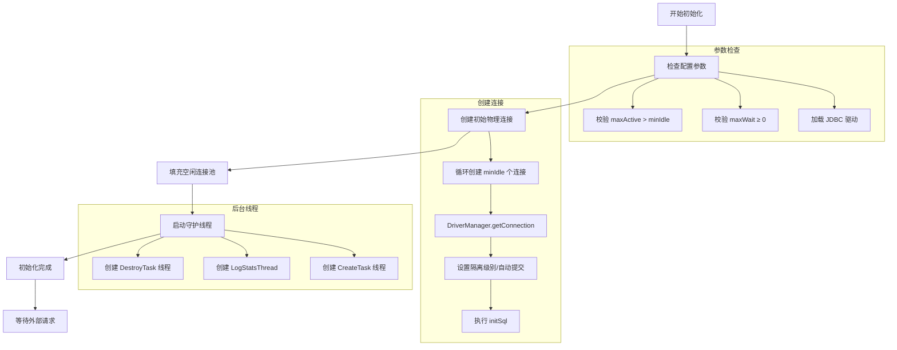
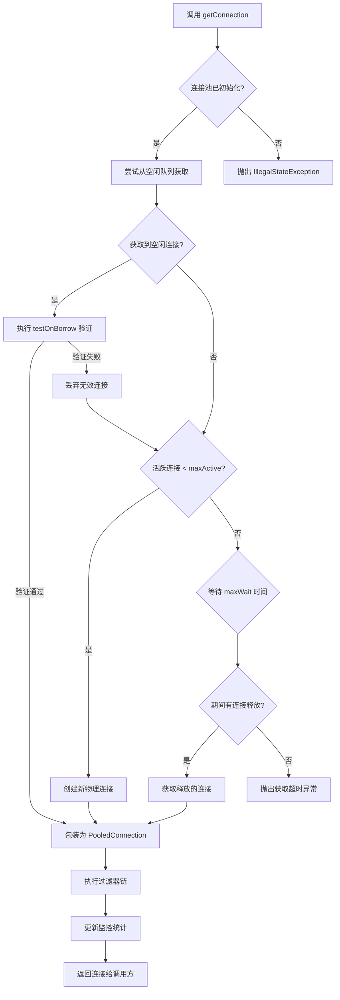
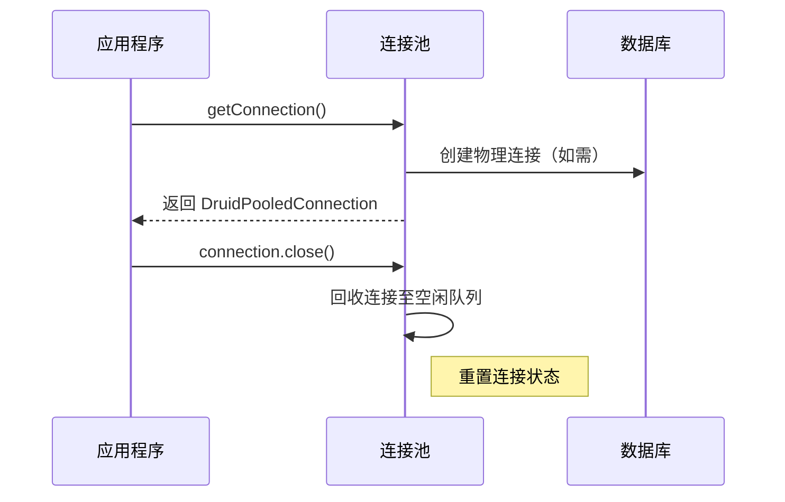
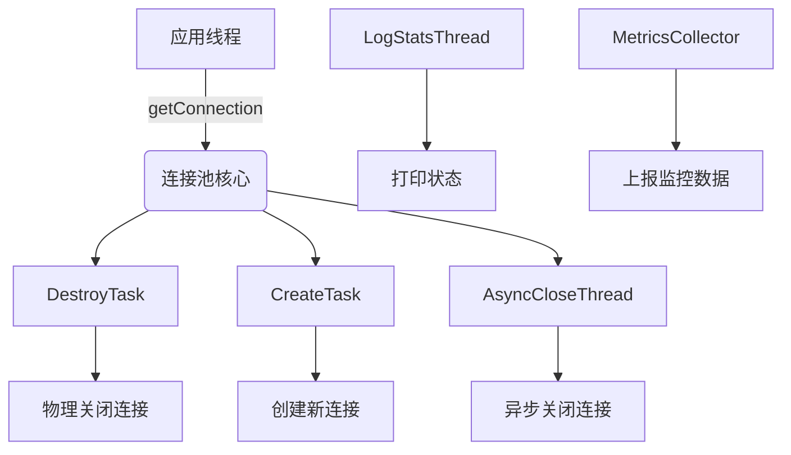
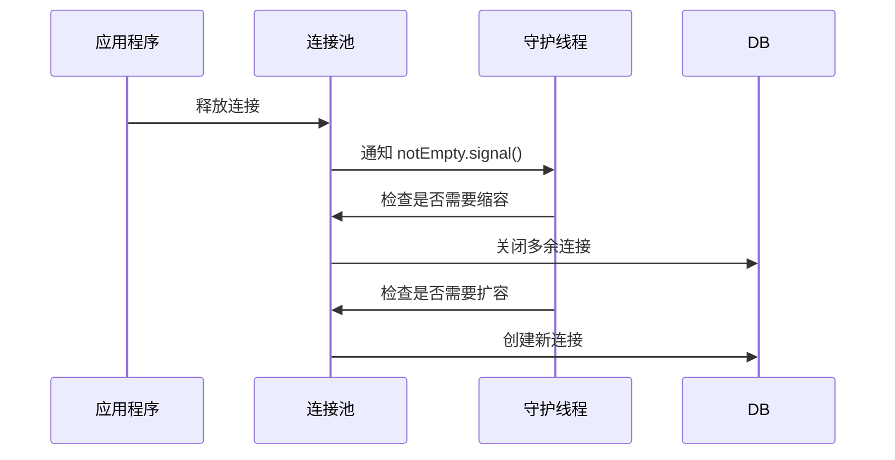
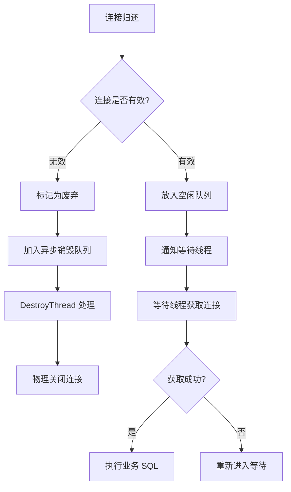

# 数据库连接池与事务管理实践

## 前言
------------------------------
😰 五一已经过去一半了吗，这种事情补药啊  
今天来研究数据库连接池。

------------------------------

## 日程
------------------------------
今天早上有点摸鱼，不知不觉就 11 点了，明明起得不算晚啊。  
总之来看看数据库连接池。  
晚上 11：30，下班。轻轻松松解决了注解式事务和连接上下文，感觉爽飞了🥵。

------------------------------

## 学习内容
------------------------------
### 省流
1. 数据库连接池
2. AOP 嵌套问题与修复
3. 连接上下文和注解式事务

### 1. 数据库连接池
#### 1）原理剖析
以 **Druid** 连接池为例：

##### a. 线程池的初始化


##### b. 从线程池获取一个连接




##### c. 三个守护线程是连接池的核心线程




通过定时激活守护线程 **DestroyTask（缩容）** 来实现释放空闲连接。在需要更多连接时激活守护线程 **CreateTask（扩容）** 来创建新连接。

##### d. 从等待队列到空闲队列/异步销毁的工作机制


#### 2）基础连接池实现
设计上依旧使用了 **单例模式**，通过类路径扫描器加载配置。

```java
// 单例实例
private static volatile HakimiConnectionPool instance;

// 配置参数
private final HakimiConfig hakimiConfig;

// 连接存储（存储原始连接）
private final BlockingQueue<Connection> idleConnections;
private final Set<Connection> activeConnections;

// 监控统计
private final AtomicInteger createdCount = new AtomicInteger(0);
private final AtomicInteger waitCount = new AtomicInteger(0);
```

在获取连接时检查初始化，并进行懒加载：

```java
private final Object initLock = new Object();
private void ensureInitialized() throws SQLException, FileNotFoundException {
    // 双重检查锁定模式确保线程安全
    if (!initialized) {
        synchronized (initLock) {
            if (!initialized) {
                // 1. 检查单例实例是否已创建
                if (instance == null) {
                    instance = getInstance();
                }

                // 2. 初始化连接池数据结构
                // 初始化最小空闲连接
                for (int i = 0; i < hakimiConfig.getMinIdle(); i++) {
                    idleConnections.add(createPhysicalConnection());
                }

                initialized = true;
                log.info("Connection pool initialized with {} idle connections", hakimiConfig.getMinIdle());
            }
        }
    }
}
```

获取连接（目前没有通过守护进程处理）：

```java
public Connection getConnection() throws SQLException, FileNotFoundException {
    ensureInitialized();

    Connection rawConn = null;
    try {
        // 1. 尝试获取空闲连接
        ...

        // 2. 创建新连接
        ...

        // 3. 等待可用连接
        ...

        // 验证连接有效性
        closeConnection(rawConn);
        createdCount.decrementAndGet();
        return getConnection(); // 递归重试

        activeConnections.add(rawConn);
        return createProxyConnection(rawConn);
    } catch (Exception e) {
        if (rawConn != null) {
            closeConnection(rawConn);
            createdCount.decrementAndGet();
        }
        throw e;
    }
}
```

##### 1. 尝试获取空闲连接：从活跃连接池中获取原始连接
```java
while ((rawConn = idleConnections.poll()) != null) {
    if (testConnection(rawConn)) {
        break;
    }
    closeConnection(rawConn);
    createdCount.decrementAndGet();
    rawConn = null;
}
```

通过简单的验证查询连接有效性：

```java
// 测试连接有效性
private boolean testConnection(Connection conn) {
    if (conn == null) return false;

    try {
        if (conn.isClosed()) {
            return false;
        }

        // 验证查询
        try (Statement stmt = conn.createStatement()) {
            stmt.setQueryTimeout(1);
            return stmt.execute("/* ping */ SELECT 1");
        }
    } catch (SQLException e) {
        return false;
    }
}
```

##### 2. 当目前空闲连接不足时，创建新的连接
```java
if (rawConn == null) {
    while (createdCount.get() < hakimiConfig.getMaxSize()) {
        if (createdCount.compareAndSet(createdCount.get(), createdCount.get() + 1)) {
            try {
                rawConn = createPhysicalConnection();
                break;
            } catch (SQLException e) {
                createdCount.decrementAndGet();
                throw e;
            }
        }
    }
}
```

这里从数据库中获取到原始的 JDBC 连接：

```java
private Connection createPhysicalConnection() throws SQLException {
    Connection rawConn = DriverManager.getConnection(
        hakimiConfig.getUrl(),
        hakimiConfig.getUsername(),
        hakimiConfig.getPassword()
    );
    createdCount.incrementAndGet();

    try {
        rawConn.setAutoCommit(true);
        rawConn.setTransactionIsolation(Connection.TRANSACTION_READ_COMMITTED);
        return rawConn;
    } catch (SQLException e) {
        closeConnection(rawConn);
        throw e;
    }
}
```

##### 3. 如果超过当前最大连接上限，则等待可用连接
```java
if (rawConn == null) {
    waitCount.incrementAndGet();
    try {
        rawConn = idleConnections.poll(hakimiConfig.getMaxWaitMillis(), TimeUnit.MILLISECONDS); // 丢到等待队列中，当 idleConnections.off 方法触发时，会激活休眠的线程
        if (rawConn == null) {
            throw new SQLException("Wait timeout");
        }
    } catch (InterruptedException e) {
        Thread.currentThread().interrupt(); // 设置中断标志，传播中断链
        throw new SQLException("Interrupted");
    } finally {
        waitCount.decrementAndGet();
    }
}
```

##### 4. 添加到活跃连接池中，并返回包装后的代理连接对象
```java
activeConnections.add(rawConn);
return createProxyConnection(rawConn);
```

为什么要使用代理连接对象？  
这是因为连接的生命周期应该由连接池进行管理，而直接将原始连接暴露给业务层会带连接池数据不同步的风险。

```java
private Connection createProxyConnection(Connection rawConn) {
    return (Connection) Proxy.newProxyInstance(
            PooledConnection.class.getClassLoader(),
            new Class<?>[]{Connection.class, PooledConnection.class}, // 实现的接口列表
            new ConnectionInvocationHandler(rawConn) // 方法拦截器
    );
}

// 方法拦截类
private class ConnectionInvocationHandler implements InvocationHandler {
    private final Connection rawConnection;
    private volatile boolean closed = false;
    private volatile long lastUsedTime = System.currentTimeMillis();

    public ConnectionInvocationHandler(Connection rawConn) {
        this.rawConnection = rawConn;
    }

    @Override
    public Object invoke(Object proxy, Method method, Object[] args) throws Throwable {
        lastUsedTime = System.currentTimeMillis();

        switch (method.getName()) {
            case "close" -> {
                if (!closed) {
                    closed = true;
                    releaseConnection((Connection) proxy); // 调用实际方法将连接返回到连接池。
                }
                return null;
            }
            case "isClosed" -> {
                return closed;
            }
            case "getRawConnection" ->
                    throw new UnsupportedOperationException("Direct access to raw connection is prohibited");
            case "getLastUsedTime" -> {
                return lastUsedTime;
            }
            case "realClose" -> {
                closeConnection(rawConnection);
                createdCount.decrementAndGet();
                return null;
            }
        }

        if (closed) {
            throw new SQLException("Connection already closed");
        }

        try {
            return method.invoke(rawConnection, args);
        } catch (InvocationTargetException e) {
            throw e.getCause();
        }
    }
}
```

```java
// 释放连接
private void releaseConnection(Connection proxyConn) {
    try {
        InvocationHandler handler = Proxy.getInvocationHandler(proxyConn);
        if (handler instanceof ConnectionInvocationHandler invocationHandler) {
            Connection rawConn = invocationHandler.rawConnection;

            synchronized (activeConnections) {
                if (!activeConnections.remove(rawConn)) {
                    return; // 连接已被其他线程释放
                }
            }

            if (testConnection(rawConn)) {
                resetConnection(rawConn);
                if (!idleConnections.offer(rawConn)) {
                    closeConnection(rawConn); // 关闭原始连接
                    createdCount.decrementAndGet();
                }
            } else {
                closeConnection(rawConn);
                createdCount.decrementAndGet();
            }
        }
    } catch (Exception e) {
        log.error("Error releasing connection", e);
    }
}
```

接下来就是要检查并发安全性，并对连接池的效率进行优化。

### 2. AOP 嵌套问题与修复
在我昨天的通知链逻辑中，我忽略了 AOP 的嵌套问题，导致了原始方法被多次调用。

```java
// 创建连接点
ProceedingJoinPoint joinPoint = new ProceedingJoinPoint(target, method, args);

// 执行通知链
Object result = null;
for (AdviceWrapper advice : matchedAdvices) {
    result = advice.invoke(joinPoint);
}
return result;
```

解决方法是将通知链也作为 `joinPoint` 的参数，递归执行方法，记录当前通知方法的执行次数，只有通知方法执行完毕，才执行原始的方法。

```java
@Override
public Object proceed() throws Throwable {
    if (currentPosition < advices.size()) {
        // 执行下一个切面
        AdviceWrapper currentAdvice = advices.get(currentPosition++);
        return currentAdvice.invoke(this); // 递归调用
    } else {
        // 所有切面执行完毕，执行目标方法
        return method.invoke(target, args);
    }
}
```

### 3. 连接上下文和注解式事务
在之前编写的 Jdbc 工具类中，连接是在 service 层中手动获取的，这样不仅会造成代码冗余，还会无缘无故增加连接的占用时间，浪费效率。通过 `ThreadLocal` 储存连接资源，可以轻松地传递当前线程使用的连接。

#### ConnectionContext
```java
/**
 * 连接上下文（基于 ThreadLocal）
 */
public class ConnectionContext {
    private static final ThreadLocal<Connection> connectionHolder = new ThreadLocal<>();

    public static Connection getConnection() throws SQLException {
        Connection conn = connectionHolder.get();
        if (conn == null) {
            throw new IllegalStateException("No active transaction connection found!");
        }
        return conn;
    }

    public static boolean isActive() {
        try {
            Connection conn = connectionHolder.get();
            return conn != null && !conn.isClosed();
        } catch (SQLException e) {
            return false;
        }
    }

    public static void bindConnection(Connection conn) {
        connectionHolder.set(conn);
    }

    public static void unbindConnection() {
        connectionHolder.remove();
    }
}
```

#### JdbcUtils
```java
// 优先从事务上下文获取连接，没有则从连接池获取
public static Connection getConnection() throws SQLException, FileNotFoundException {
    try {
        // 1. 尝试从事务上下文获取
        Connection txConn = ConnectionContext.getConnection();
        if (txConn != null && !txConn.isClosed()) {
            return txConn;
        }
        // 2. 没有事务则从连接池获取
        return HakimiConnectionPool.getInstance().getConnection();
    } catch (IllegalStateException e) {
        // 上下文未初始化时回退到连接池
        return HakimiConnectionPool.getInstance().getConnection();
    }
}
```

完成了连接上下文绑定器，就可以开始着手注解式事务。

#### 事务注解类
```java
@Target(ElementType.METHOD)
@Retention(RetentionPolicy.RUNTIME)
public @interface KatTransactional {
    /**
     * 指定事务超时时间(秒)，默认-1表示使用系统默认值
     */
    int timeout() default -1;

    /**
     * 指定事务隔离级别，默认-1表示使用系统默认值
     */
    int isolation() default -1;

    /**
     * 指定事务是否只读，默认false
     */
    boolean readOnly() default false;
}
```

#### 事务处理（基于 AOP）
```java
@KatAspect
public class TransactionAspect {

    @KatAround("@annotation(com.anyview.xiazihao.annotation.KatTransactional)")
    public Object around(ProceedingJoinPoint joinPoint) throws Throwable {
        Connection conn = null;
        try {
            // 1. 获取数据源连接
            conn = HakimiConnectionPool.getInstance().getConnection();
            conn.setAutoCommit(false);

            // 2. 绑定连接到当前线程
            ConnectionContext.bindConnection(conn); // 确保执行事务的连接一致性

            // 3. 执行业务方法
            Object result = joinPoint.proceed();

            // 4. 提交事务
            conn.commit();
            return result;

        } catch (Throwable e) {
            // 5. 回滚事务
            if (conn != null) conn.rollback();
            throw e;
        } finally {
            // 6. 清理资源
            ConnectionContext.unbindConnection();
            if (conn != null) conn.close();
        }
    }
}
```

因为我在前面已经实现了 AOP 扫描，所以只需要处理一下 `@annotation(com.anyview.xiazihao.annotation.KatTransactional)` 切面表达式的转义就可以了。

#### AspectProcessor 类
```java
private boolean matchesPointcut(String pointcut, Method method) {
    // 注解匹配逻辑
    if (pointcut.startsWith("@annotation(")) {
        String annotationName = pointcut.substring("@annotation(".length(), pointcut.length() - 1);
        return hasAnnotation(method, annotationName);
    }

    // 原有方法签名匹配
    String methodSignature = buildMethodSignature(method);
    return matchesPointcut(pointcut, methodSignature);
}

// 检查方法是否带有指定注解
private boolean hasAnnotation(Method method, String annotationName) {
    try {
        Class<? extends Annotation> annotationClass =
                (Class<? extends Annotation>) Class.forName(annotationName);
        return method.isAnnotationPresent(annotationClass);
    } catch (ClassNotFoundException e) {
        return false;
    }
}

// 处理注解切点
private Pattern compileAnnotationPointcut(String expression) {
    // 提取注解全限定名，如 "@annotation(com.example.Transactional)" -> "com.example.Transactional"
    String annotationName = expression.substring("@annotation(".length(), expression.length() - 1);

    // 匹配所有带有该注解的方法
    return Pattern.compile(".*" + Pattern.quote(annotationName) + ".*");
}
```

------------------------------

## 结语
------------------------------
明天学 JMeter！

------------------------------