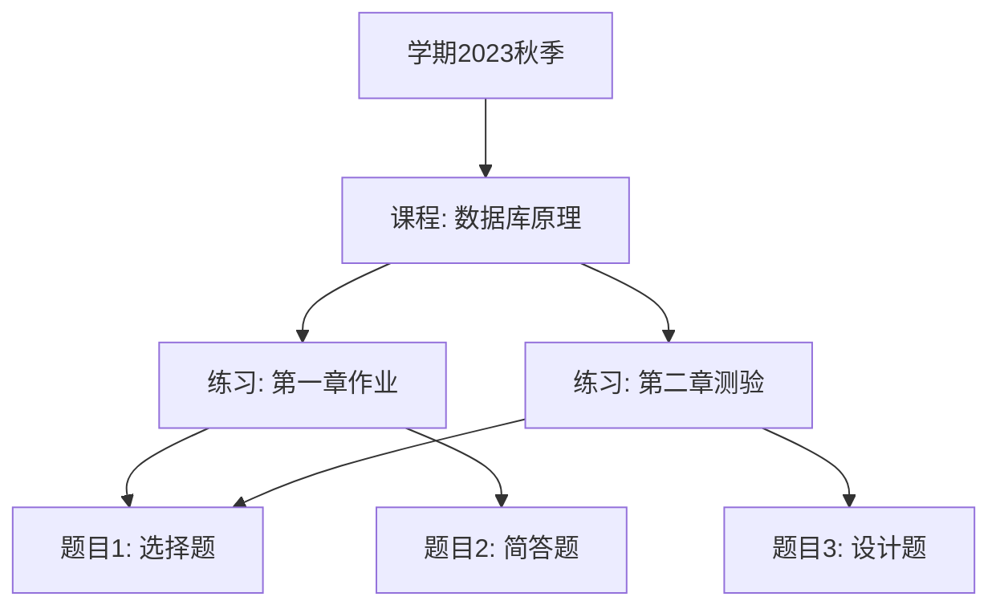

# 日常开发与学习记录

## 前言
怎么感觉自己越来越懒了。

## 日程
忘记写了，大概是早上做了 SQL 表单，晚上写了 `DispatcherController`。

## 学习记录
### 操作系统
1. 页面分配置换策略

## 学习内容
### 省流
1. SQL 表单构建
2. 关于嵌套注解的生效机制
3. `DispatcherController` 统一路由接收/转发器

### 1. SQL 表单构建
#### 表结构设计
每张表的通用表单项：创建时间，更新时间。

- **用户表**
  ```sql
  CREATE TABLE 用户 (
      id INT PRIMARY KEY,
      姓名 VARCHAR(50),
      用户名 VARCHAR(50) UNIQUE,
      密码 VARCHAR(100),
      身份标识符 INT CHECK (身份标识符 IN (0, 1, 2)) -- 0: 学生，1：老师，2：管理员
  );
  ```

- **学生班级关联表**
  ```sql
  CREATE TABLE 学生班级关联 (
      id INT PRIMARY KEY,
      学生id INT,
      班级id INT,
      FOREIGN KEY (学生id) REFERENCES 用户(id),
      FOREIGN KEY (班级id) REFERENCES 班级(id)
  );
  ```

- **教师课程关联表**
  ```sql
  CREATE TABLE 教师课程关联 (
      id INT PRIMARY KEY,
      教师id INT,
      课程id INT,
      FOREIGN KEY (教师id) REFERENCES 用户(id),
      FOREIGN KEY (课程id) REFERENCES 课程(id)
  );
  ```

- **班级表**
  ```sql
  CREATE TABLE 班级 (
      id INT PRIMARY KEY,
      名称 VARCHAR(100)
  );
  ```

- **题目表**
  ```sql
  CREATE TABLE 题目 (
      id INT PRIMARY KEY,
      题目类型标识符 INT CHECK (题目类型标识符 IN (0, 1)), -- 0：选择题，1：简答题
      描述 TEXT,
      题干 TEXT,
      答案 TEXT,
      难度 INT,
      分值 INT,
      创建者id INT,
      FOREIGN KEY (创建者id) REFERENCES 用户(id)
  );
  ```

- **练习列表表**
  ```sql
  CREATE TABLE 练习列表 (
      id INT PRIMARY KEY,
      名称 VARCHAR(100),
      课程id INT,
      开始时间 DATETIME,
      截止时间 DATETIME,
      状态 INT CHECK (状态 IN (0, 1, 2)), -- 0: 未开始, 1: 进行中, 2: 已结束
      创建者id INT,
      FOREIGN KEY (课程id) REFERENCES 课程(id),
      FOREIGN KEY (创建者id) REFERENCES 用户(id)
  );
  ```

- **练习题目表**
  ```sql
  CREATE TABLE 练习题目 (
      id INT PRIMARY KEY,
      练习id INT,
      题目id INT,
      排序号 INT,
      FOREIGN KEY (练习id) REFERENCES 练习列表(id),
      FOREIGN KEY (题目id) REFERENCES 题目(id)
  );
  ```

- **学生答题记录表**
  ```sql
  CREATE TABLE 学生答题记录表 (
      id INT PRIMARY KEY,
      学生id INT,
      练习id INT,
      题目id INT,
      提交答案 TEXT,
      得分 INT,
      批改状态 INT CHECK (批改状态 IN (0, 1)), -- 0: 未批改, 1: 已批改
      批改备注 TEXT,
      批改时间 DATETIME,
      提交时间 DATETIME,
      FOREIGN KEY (学生id) REFERENCES 用户(id),
      FOREIGN KEY (练习id) REFERENCES 练习列表(id),
      FOREIGN KEY (题目id) REFERENCES 题目(id)
  );
  ```

- **练习班级表**
  ```sql
  CREATE TABLE 练习班级 (
      id INT PRIMARY KEY,
      练习id INT,
      班级id INT,
      FOREIGN KEY (练习id) REFERENCES 练习列表(id),
      FOREIGN KEY (班级id) REFERENCES 班级(id)
  );
  ```

- **学期表**
  ```sql
  CREATE TABLE 学期 (
      id INT PRIMARY KEY,
      名称 VARCHAR(100),
      开始时间 DATETIME,
      截至时间 DATETIME
  );
  ```

- **课程表**
  ```sql
  CREATE TABLE 课程 (
      id INT PRIMARY KEY,
      名称 VARCHAR(100),
      学期id INT,
      FOREIGN KEY (学期id) REFERENCES 学期(id)
  );
  ```

- **提醒表**
  ```sql
  CREATE TABLE 提醒表 (
      id INT PRIMARY KEY,
      目标用户id INT,
      发起者id INT,
      生效时间 DATETIME,
      内容 TEXT,
      FOREIGN KEY (目标用户id) REFERENCES 用户(id),
      FOREIGN KEY (发起者id) REFERENCES 用户(id)
  );
  ```

#### 核心层级关系
**课程 → 练习 → 题目**  
（1对多） （1对多）

#### 具体关联方式
| 层级 | 关联表       | 关键字段               | 说明                     |
|------|--------------|------------------------|--------------------------|
| **课程层** | `课程`       | `学期id`               | 课程属于特定学期         |
|           | `教师课程关联` | `教师id`+`课程id`       | 定义教师授课权限         |
| **练习层** | `练习列表`   | `课程id`               | 练习必须归属于一个课程   |
|           | `练习班级`   | `练习id`+`班级id`       | 练习可分配给多个班级     |
| **题目层** | `练习题目`   | `练习id`+`题目id`       | 题目可被多个练习复用     |

#### 数据流动示例


### 2. 关于嵌套注解的生效机制
想简化注解，我理解的注解机制和实际的有不少偏差。

#### 元注解
元注解（Meta-annotation）是注解在其他注解上的注解。例如：
```java
@Inherited
@Retention(RetentionPolicy.RUNTIME)
@Target(ElementType.TYPE)
@KatComponent
public @interface KatController {
    String value() default "";
}
```

默认情况下注解不具备继承性。`@Inherited` 只对类注解有效，对方法/字段注解无效。
```java
@Inherited // 只有加上这个注解才能被继承
public @interface MyAnnotation {}
```

#### 直接获取
```java
// 只能获取直接注解，不会获取元注解
if (clazz.isAnnotationPresent(KatComponent.class)) {...}
```

#### 递归获取元注解
```java
// 获取所有注解（包括元注解）
Annotation[] annotations = clazz.getAnnotations();

// 递归检查元注解
public static boolean isAnnotationPresent(
    Class<?> targetClass, 
    Class<? extends Annotation> annotationClass) {
    // 检查直接注解
    if (targetClass.isAnnotationPresent(annotationClass)) {
        return true;
    }
    // 检查元注解
    for (Annotation annotation : targetClass.getAnnotations()) {
        if (annotation.annotationType().isAnnotationPresent(annotationClass)) {
            return true;
        }
    }
    return false;
}
```

在 Spring Boot 中，实现了 `AnnotatedElementUtils` 来进行多级注解查找，而且还支持注解属性合并：子注解可以覆盖元注解的属性值。

### 3. `DispatcherController` 统一路由接收/转发器
#### 包装类设置
```java
// 路由表: 路径 -> 控制器方法映射
private final Map<RouteKey, HandlerMethod> routeMappings = new ConcurrentHashMap<>();

// 路由键定义
private record RouteKey(String path, String httpMethod) {
    private RouteKey(String path, String httpMethod) {
        this.path = PathUtils.normalize(path);
        this.httpMethod = httpMethod.toUpperCase();
    }

    @Override
    public boolean equals(Object o) {
        if (this == o) return true;
        if (o == null || getClass() != o.getClass()) return false;
        RouteKey routeKey = (RouteKey) o;
        return path.equals(routeKey.path) &&
                httpMethod.equals(routeKey.httpMethod);
    }

    @Override
    public String toString() {
        return httpMethod + " " + path;
    }
}

// 处理器方法封装
private record HandlerMethod(Object controllerInstance, Method method) {}
```

#### 初始化路由表
```java
@Override
public void init(){
    // 获取ContainerFactory进而获取BeanRegistry
    this.containerFactory = (ContainerFactory) getServletContext()
            .getAttribute("ContainerFactory");
    // 构建路由表
    buildRouteMappings();
}

private void buildRouteMappings() {
    // 获取所有控制器类（标记了@KatComponent和@Controller）
    containerFactory.getRegistry().getClassRegistry().forEach((beanName, clazz) -> {
        if (clazz.isAnnotationPresent(KatController.class)) {
            registerControllerRoutes(clazz, containerFactory.getBean(clazz));
        }
    });
}
```

#### 路由表的构建
```java
private void registerControllerRoutes(Class<?> controllerClass, Object controllerInstance) {
    // 类级别的路径
    String basePath = "";
    if (controllerClass.isAnnotationPresent(KatRequestMapping.class)) {
        basePath = controllerClass.getAnnotation(KatRequestMapping.class).path();
    }

    // 方法级别的映射
    for (Method method : controllerClass.getDeclaredMethods()) {
        if (method.isAnnotationPresent(KatRequestMapping.class)) {
            KatRequestMapping mapping = method.getAnnotation(KatRequestMapping.class);
            String fullPath = PathUtils.normalize(basePath + mapping.path());
            String httpMethod = mapping.method().toUpperCase();

            RouteKey key = new RouteKey(fullPath, httpMethod);
            routeMappings.put(key, new HandlerMethod(controllerInstance, method));
        }
    }
}
```

#### 请求处理
```java
@Override
protected void service(HttpServletRequest req, HttpServletResponse resp)
        throws IOException {
    // 标准化请求路径
    String path = PathUtils.normalize(req.getRequestURI().replace(req.getContextPath(), ""));
    String method = req.getMethod().toUpperCase();

    RouteKey key = new RouteKey(path, method);

    // 查找处理器
    HandlerMethod handler = routeMappings.get(key);
    if (handler == null) {
        resp.sendError(HttpServletResponse.SC_NOT_FOUND);
        return;
    }

    // 调用处理器方法
    try {
        Object result = handler.method.invoke(handler.controllerInstance, req, resp);

        // 处理返回结果
        ServletUtils.sendResponse(resp, Result.success(result));

    } catch (Exception e) {
        handleError(resp, e);
    }
}
```

## 结语
被蚊子轮着咬。  
天生万物以养人，人滋血性以养蚊。