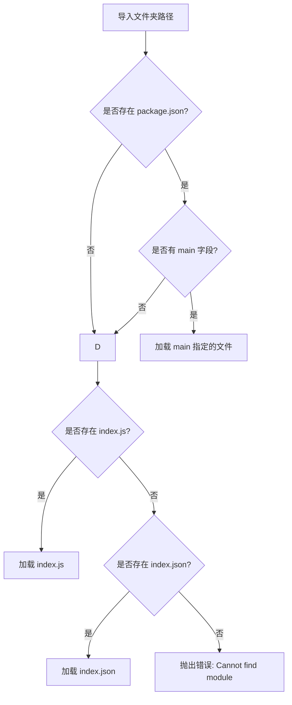

# Nodejs 学习之旅：模块化与 Express 框架入门

## 前言
----------------------------------------
早起又失败了，我定了8点的闹钟啊，这闹钟怎么没声呢。简单给昨天的blog收个尾，今天继续学Nodejs。

## 日程
----------------------------------------
### 6.25
晚上6点，感觉没什么学习的动力，跳了一部分内容。目前进度来到了一半。

### 6.27
今天进行完成express剩下的部分。

## 学习内容
----------------------------------------
### 省流
1. Nodejs 模块化
2. express框架入门

### 1. Nodejs 模块化
模块化，也可以被认为是通俗的多文件设计。在Nodejs中，通过`module.exports`来暴露模块。

```javascript
const doTest = () => {
    console.log('I do a Test');
}
// exports.doTest = doTest; //与module.exports的功能相同
module.exports = {
    doTest,
}
```

通过`require`导入模块：
```javascript
const mode1 = require('./test')
console.log(mode1);
mode1.doTest();
```

**注意**：自定义模块需要写明是相对路径，如`./test`，而`test`不被允许，因为这是内部模块的写法。

默认可导入的文件是js和JSON，导入其他文件会作为js文件进行处理。也可以导入一个文件夹：
```javascript
const mode2 = require('./testdir')
console.log(mode2);
mode2.doTest();
```

默认会导入文件夹中`package.json`的`main`指向的模块：
```json
{
    "main": "test.js"
}
```

以下是更完整的寻找过程：


### 2. express框架入门
基于nodejs的WEB应用开发框架。[npmjs.com/package](https://www.npmjs.com/package) 查询关于依赖的api以及其他信息。

#### 0）引入依赖
初始化npm包：
```bash
npm init
```

导入express 4包（目前最新是5，但是兼容性没有4好）：
```bash
npm install express@4
```

#### 1）入门程序
```javascript
//导入express
const express = require('express')

//创建应用对象
const app = express();

//创建路由
app.get('/', (req, rep) => {
    rep.end('hello express');
})

app.get('/*', (req, rep) => {
    rep.status(404).end('404 Not Found');
})

//监听端口
app.listen(9000, () => {
    console.log('start')
})
```

**路由**是一个重要的概念，它确定了应用程序应该怎样响应请求。

#### 2）参数获取
express支持大部分nodejs原生的http请求api，如：
```javascript
console.log(req.method);
console.log(req.url);
console.log(req.httpVersion);
console.log(req.headers);
```

获取请求参数：
```javascript
app.get('/', (req, res) => {
    console.log(req.path); //请求路径
    console.log(req.query); //请求参数
    console.log(req.body); //请求体
    console.log(req.get('host')); //请求头
    res.end();
})
```

获取请求体：
使用`console.log(req.body)`获取请求体时得到的是`undefined`，此时需要使用`body-parser`工具。

安装依赖：
```bash
npm i body-parser
```

导入模块：
```javascript
const bodyParser = require('body-parser');
```

解析JSON：
```javascript
const jsonParser = bodyParser.json()
```

解析queryString --对应 HTML 表单提交或 axios 发送 URL-encoded 数据：
```javascript
const urlencodedParser = bodyParser.urlencoded({extended:false})
```

作为路由中间件使用：
```javascript
app.post('/body',urlencodedParser,(req,res) =>{
    console.log('post');
    console.log(req.body);
})
```

获取路由参数 `:id`是一个占位符，可以匹配一个字符串，如`test1234`：
```javascript
app.get('/:id/html', (req, res) => {
    console.log(req.params.id)
    res.end();
})
```

#### 3）响应设置
```javascript
app.get('/', (req, res) => {
    res.status(203); //设置响应码
    res.set('test', 'header'); //响应头
    res.send('自动设置中文字符集'); //响应体
})
```

也可以写成链式编程的模式：
```javascript
res.status(203).set('test', 'header').send('自动设置中文字符集');
```

**重定向redirect**：会将请求路径重定向。
```javascript
app.get('/home', (req, res) => {
    res.redirect('/test')
});
```

也可以是一个外部连接：
```javascript
app.get('/baidu', (req, res) => {
    res.redirect('http://baidu.com')
});
```

**下载响应**：触发浏览器的下载行为。
```javascript
res.download(__dirname + '/test.txt');
```

**JSON响应**：
```javascript
res.json({
    name: 'heyi',
    age: 18
});
```

**文件响应**：
```javascript
res.sendFile(__dirname + '/test.txt');
```

#### 4）中间件
本质是一个回调函数，在机制上类似于过滤器。

定义中间件：
```javascript
const middleWare = (req, res, next) => {
    console.log('doing middleWare');
    next(); //放行
}
```

类似于一个函数，`(req, res, next)`是固定的参数，最后要通过`next`放行。

**全局中间件**：将函数交给app使用，任何路由的匹配都会触发。
```javascript
app.use(middleWare);
```

**路由中间件**：作为指定路由的参数，匹配时触发。
```javascript
app.get('/', middleWare, (req, res) => {
    res.end();
})
```

**静态中间件**：响应静态资源。
```javascript
app.use(express.static(__dirname + '/public'));
```

**注意**：
1. 默认打开`index.html`。
2. 会尝试匹配根路径，如果有匹配根路径的路由，谁先匹配谁响应（代码从上到下）。

#### 5）防盗链
在图片等带连接的网页资源，在请求头中会带有`referer`：请求源的IP地址。

```html
<body>
    <h1>朋友你好</h1>
    
</body>
```

可以设置全局中间件，对`referer`进行检查，来达到设置访问权限的效果。
```javascript
app.use((req,res,next)=>{
    let referer = req.get('referer');
    if(referer){
        let url = new URL(referer);
        let hostname = url.hostname;
        if(hostname !== '127.0.0.1'){
            res.send(`<h1>你不是我指定的访问源<h1>`)
            return;
        } 
    }
    next();
})
```

#### 6）模板引擎
模板引擎用于分离用户界面和业务数据，EJS是其中一种。

安装EJS：
```bash
npm i ejs
```

简单示例：
```javascript
const ejs = require('ejs');
let data = '测试数据';
let result = ejs.render('我是<%= data %>',{data:data});
```

在EJS模块中，`<% %>`标签内的代码会被视为Js代码执行（它支持完全的JS语法）。
- `<%= %>`输出转义后的值
- `<%- %>`输出原始的HTML
- `<%# %>`注释
- `<%%`输出字面量`'<%'`

示例：if-else语法
```javascript
let isLogin = true;
console.log(
    ejs.render(`
        <% if(isLogin){ %>
        <span>已经登录</span>
        <% }else{ %>
        <span>你需要登录</span>
        <% }%>  
    `,{isLogin:isLogin})
)
```

ejs也可以使用外部导入的html文件：
```javascript
const fs = require('fs');
let arr = [1,2,3,4,5,6,7,8]
let html = fs.readFileSync(__dirname+'/6-test.html').toString();

console.log(
    ejs.render(html,{arr:arr})
)
```

`6-test.html`：
```html
<!DOCTYPE html>
.....
<body>
    <ul>
        <% arr.forEach(item=>{ %>
        <li><%= item %></li>
        <% })%>
    </ul>
</body>
</html>
```

本质是使用了String格式html，与直接使用没有太大区别。

ejs也支持在express中使用：
```javascript
const express = require('express')
const path = require('path')
const app = express()

//设置模板引擎
app.set('view engine','ejs');

//设置模板文件位置
app.set('views',path.resolve(__dirname,'./views'))

//创建路由
app.get('/home',(req,res)=>{
    let title = '测试标题';
    //模板文件名，数据
    res.render('test',{title});
});

app.listen(9000,()=>{
})
```

#### 7）express-generator
express的应用生成工具，用于快速生成应用模板。

全局安装：
```bash
npm i -g express-generator
```

初始化npm包：
```bash
npm init
```

创建模板，并添加对ejs的支持：
```bash
express -e
```

启动命令：
```bash
npm run start
```

#### 8）文件上传处理
`upload.ejs`：
```html
<!DOCTYPE html>
<html lang="en">
......
<body>
    <form action="/upload" method="post" enctype="multipart/form-data">
        用户名：<input type="text" name="username"><br/>
        头像：<input type="file" name="uploadedfile">
        <button>提交</button>
    </form>
</body>
</html>
```

注意要将设置`enctype`为多文件数据。

这里使用了`formidable`工具进行文件处理：
```bash
npm i formidable
```

`upload.js`：
```javascript
const express = require('express');
const router = express.Router();

router.get('/',(req,res)=>{
    res.render('upload');
})

//处理文件上传
const {formidable} = require('formidable');
router.post('/',(req,res,next)=>{
    const form = formidable({
        multiples: true,
        //保存目录
        uploadDir:__dirname+'./../public/images',
        //保持文件后缀
        keepExtensions: true
    })
    //解析请求报文
    form.parse(req,(err,fields,files)=>{
        if(err) {
            next(err);
            return;
        }
        console.log(fields);
        console.log(files);

        //保存url
        let url = '/images/' + files.uploadedfile[0].newFilename;
        console.log(url)
        res.send(url); 
    })
})

module.exports = router;
```

## 结语
----------------------------------------
6.27结的尾，又躺了两天🫥