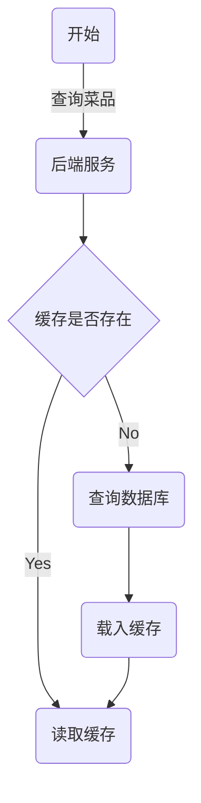

# 前言
----------------------------------------
自从得了精神病，整个人精神多了！

----------------------------------------

# 日程
----------------------------------------
今天也早起了，美中不足的是昨天没怎么睡。
本来很气很暴躁的，学了一会释怀了，反正这种状态也不是不能学，多来几天就习惯了。
--------7.2--------
偷懒了，这两天几乎就没干什么事情

----------------------------------------

# 学习内容
----------------------------------------
省流：
1. redis入门
2. HttpClient
3. 微信小程序
4. 缓存机制

## 1. redis入门
基于内存储存的数据库 [redis.net.cn](https://redis.net.cn)

### 0）安装
window版本：[Releases · microsoftarchive/redis](https://github.com/microsoftarchive/redis/releases) 

### 1）启动
cmd中输入命令，启动Redis的服务
```bash
redis-server.exe redis.windows.conf
```
连接服务
```bash
redis-cli.exe -h localhost -p 6379
```
redis的连接默认是没有密码的，需要在redis.windows.conf中进行配置
把`# requirepass foobared` 的注释取消
示例
```bash
requirepass 123456
```
因为配置了密码，所以建立连接时也要带上相应参数
```bash
redis-cli.exe -h localhost -p 6379 -a 123456
```

### 2）常用命令
redis的常用命令对应了其使用的不同数据类型

#### 字符串命令

| 命令                  | 描述                                                         |
|-----------------------|--------------------------------------------------------------|
| SET key value         | 设置指定key的值                                              |
| GET key               | 获取指定key的值                                              |
| SETEX key seconds value | 设置指定key的值，并将key的过期时间设为seconds秒               |
| SETNX key value       | 只有在key不存在时设置key的值                                 |

#### Redis hash 是一个string类型的 field 和 value 的映射表，hash特别适合用于存储对象

| 命令                  | 描述                                                         |
|-----------------------|--------------------------------------------------------------|
| HSET key field value  | 将哈希表key中的字段field的值设为value                         |
| HGET key field        | 获取存储在哈希表中指定字段的值                               |
| HDEL key field        | 删除存储在哈希表中的指定字段                                 |
| HKEYS key             | 获取哈希表中所有字段                                         |
| HVALS key             | 获取哈希表中所有值                                           |

#### Redis 列表是简单的字符串列表，按照插入顺序排序

| 命令                  | 描述                                                         |
|-----------------------|--------------------------------------------------------------|
| LPUSH key value1 [value2...] | 将一个或多个值插入到列表头部                               |
| LRANGE key start stop | 获取列表指定范围内的元素                                     |
| RPOP key              | 移除并获取列表最后一个元素                                   |
| LLEN key              | 获取列表长度                                                 |

#### Redis set 是string类型的无序集合，集合成员是唯一的，集合中不能出现重复的数据

| 命令                  | 描述                                                         |
|-----------------------|--------------------------------------------------------------|
| SADD key member1 [member2...] | 向集合添加一个或多个成员                                   |
| SMEMBERS key         | 返回集合中的所有成员                                         |
| SCARD key             | 获取集合的成员数                                             |
| SINTER key1 [key2]   | 返回给定所有集合的交集                                       |
| SUNION key1 [key2]    | 返回所有给定集合的并集                                       |
| SREM key member1 [member2...] | 删除集合中一个或多个成员                                   |

#### Redis有序集合是string类型元素的集合，且不允许有重复成员，每个元素都会关联一个double类型的分数

| 命令                  | 描述                                                         |
|-----------------------|--------------------------------------------------------------|
| ZADD key score1 member1 [score2 member2] | 向有序集合添加一个或多个成员                               |
| ZRANGE key start stop [WITHSCORES] | 通过索引区间返回有序集合中指定区间内的成员                   |
| ZINCRBY key increment member | 有序集合中对指定成员的分数加上指定 increment                  |
| ZREM key member [member...] | 移除有序集合中的一个或多个成员                               |

#### 通用命令

| 命令                  | 描述                                                         |
|-----------------------|--------------------------------------------------------------|
| KEYS pattern          | 查找所有符合给定模式（pattern）的key                          |
| EXISTS key            | 检查给定key是否存在                                           |
| TYPE key              | 返回key所储存的值的类型                                       |
| DEL key               | 该命令用于在key存在是删除key                                 |

### 3）Spring Data Redis
spring提供的redis-java接口

引入依赖
```xml
<spring-redis>2.7.3</spring-redis>
<dependency>
    <groupId>org.springframework.boot</groupId>
    <artifactId>spring-boot-starter-data-redis</artifactId>
    <version>${spring-redis}</version>
</dependency>
```

配置application.yml
```yaml
redis:
    host: ${sky.redis.host}
    port: ${sky.redis.port}
    password: ${sky.redis.password}
    database: ${sky.redis.database}
```
注：redis默认有16个隔离的数据库（database）

配置类，创建RedisTemplate模板对象
```java
@Configuration
@Slf4j
public class RedisConfiguration {
    @Bean
    public RedisTemplate redisTemplate(RedisConnectionFactory redisConnectionFactory){
        log.info("开始创建RedisTemplate对象...");
        RedisTemplate redisTemplate = new RedisTemplate();
        //设置key的序列化器
        redisTemplate.setKeySerializer(new StringRedisSerializer());
        redisTemplate.setConnectionFactory(redisConnectionFactory);
        return redisTemplate;
    }
}
```

在依赖注入后，可以获取到对应的命令方法
```java
@Autowired
private RedisTemplate redisTemplate;

ValueOperations valueOperations = redisTemplate.opsForValue();
HashOperations hashOperations = redisTemplate.opsForHash();
SetOperations setOperations = redisTemplate.opsForSet();
ListOperations listOperations = redisTemplate.opsForList();
ZSetOperations zSetOperations = redisTemplate.opsForZSet();
```

之后就可以通过命令方法来执行命令（格式上与redis原生命令相似）
```java
valueOperations.set("value","1234",3, TimeUnit.MINUTES);
```

## 2. HttpClient 
工具包，Java程序作为客户端来发送Http请求

依赖
```xml
<dependency>
    <groupId>org.apache.httpcomponents</groupId>
    <artifactId>httpclient</artifactId>
    <version>4.5.13</version>
</dependency>
```

要使用HttpClient发送请求，首先要创建一个HttpClient对象
```java
CloseableHttpClient httpClient = HttpClients.createDefault();
```
注：CloseableHttpClient可以主动把连接池释放掉

接着创建一个请求对象
```java
HttpGet httpGet = new HttpGet("http://localhost:8080/user/shop/status");
```

如果是Post请求（如Json请求体）需要设置请求体的格式
```java
HttpPost httpPost = new HttpPost("http://localhost:8080/admin/employee/login");

JSONObject jsonObject = new JSONObject();
jsonObject.put("username","admin");
jsonObject.put("password","123456");
//设置格式
StringEntity entity = new StringEntity(jsonObject.toString());
entity.setContentEncoding("utf-8");
entity.setContentType("application/json");

httpPost.setEntity(entity);
```

发送请求，并通过请求体接收
```java
CloseableHttpResponse response = httpClient.execute(httpPost);
```

获取返回的状态码
```java
int statusCode = response.getStatusLine().getStatusCode();
log.info(String.valueOf(statusCode));
```

获取相应体
```java
HttpEntity entity = response.getEntity();
String body = EntityUtils.toString(entity);
log.info(body);
```

关闭资源
```java
response.close();
httpClient.close();
```

## 3. 微信小程序
### 0）准备工作
注册[小程序](https://mp.weixin.qq.com/wxopen/waregister?action=step1&source=mpregister&token=&lang=zh_CN) 

开发文档[微信开放文档](https://developers.weixin.qq.com/miniprogram/dev/framework/) 

获取开发工具[微信开发者工具下载地址与更新日志 | 微信开放文档](https://developers.weixin.qq.com/miniprogram/dev/devtools/download.html) 

### 1）项目结构
微信小程序是非常经典的前端项目

小程序主体由以下三个核心文件组成，放置在项目根目录：

| 文件       | 必需 | 作用               |
|------------|------|--------------------|
| `app.js`   | 是   | 小程序逻辑入口     |
| `app.json` | 是   | 全局配置（页面路由、窗口样式等） |
| `app.wxss` | 否   | 全局样式表         |

每个小程序页面由四个文件组成，存放在 `pages/页面名/` 目录下：

| 文件类型   | 必需 | 作用               |
|------------|------|--------------------|
| `.js`      | 是   | 页面逻辑（数据、事件处理） |
| `.wxml`    | 是   | 页面结构（类似HTML）     |
| `.json`    | 否   | 页面单独配置（覆盖全局）   |
| `.wxss`    | 否   | 页面样式表（覆盖全局）     |

### 2）入门程序

#### 动态数据
在index.js中定义数据
```javascript
Page({
  data:{
    msg:'hello world',
  },
})
```
在index.wxml中定义`{{}}`即可
```html
<view class="container">
    <view>
      {{msg}}
    </view>
</view>
```

对应函数来说，也是类似的,其中`wx.xxx`都是微信内置的函数，参数类似于键值对的格式
```javascript
Page({
  data:{
    msg:'hello world',
    nickname:'',
    url:'',
    code:'',
  },
  //获取用户信息
  getUserInfo(){
    wx.getUserProfile({
      desc: '获取用户信息',
      success: (res)=>{
        console.log(res.userInfo)
        this.setData({ //赋值数据
          nickname:res.userInfo.nickName,
          url:res.userInfo.avatarUrl
        })
      }
    })
  },
  //微信登陆
  wxLogin(){
    wx.login({
      success:(res)=>{
        console.log(res.code)
        this.setData({
          code: res.code
        })
      }
    })
  },
})
```
使用`bind:tap`来绑定函数
```html
<view class="container">
    <view>
      <button type="primary" bind:tap="getUserInfo">获取用户信息</button>

      昵称：{{nickname}}
      </img>
    </view>

    <view>
      <button bind:tap="wxLogin" type="warn">微信登录</button>
    </view>
</view>
```

#### 发送异步请求
```javascript
sendRequest(){
    wx.request({
        url: 'http://localhost:8080/user/shop/status',
        method:'GET',
        success:(res)=>{
        console.log(res.data)
        }
    })
},
```

### 3）微信登陆
微信官方规定了微信登陆使用的接口文档[小程序登录 | 微信开放文档](https://developers.weixin.qq.com/miniprogram/dev/OpenApiDoc/user-login/code2Session.html) 

简单地说，服务端收到登录请求后需要向微信服务器发送请求来获取用户标识（openid），并把相关信息返回给小程序前端

在后端程序中：
在发送请求时，需要携带appid和密钥secret信息
```yaml
wechat:
    appid: ${sky.wechat.appid}
    secret: ${sky.wechat.secret}
```

使用HttpClient来发送请求
```java
Map<String,String> map = new HashMap<>();
map.put("appid",weChatProperties.getAppid());
map.put("secret",weChatProperties.getSecret());
map.put("js_code",userLoginDTO.getCode());
map.put("grant_type","authorization_code");

String json = HttpClientUtil.doGet(WX_LOGIN,map);
JSONObject jsonObject = JSON.parseObject(json);
String openid = jsonObject.getString("openid");
if(openid == null) throw new LoginFailedException(MessageConstant.LOGIN_FAILED);

//是否为新用户
User user = userMapper.getByOpenid(openid);
if(user == null){
    user = User.builder()
            .openid(openid)
            .createTime(LocalDateTime.now())
            .build();
    userMapper.insert(user);
}

return user;
```

## 4. 缓存机制
面对一些高频的查询时，频繁的询问数据库会带来大量的开销，更明智的做法是将高频数据放在内存中，直接可以通过访问内存得到（类似于cache的作用）

### 核心思路


### 1）利用redis缓存
```java
//redis——key
String key = "dish_" + categoryId;

//查询redis缓存
List<DishVO> list = (List<DishVO>) redisTemplate.opsForValue().get(key);
if(list != null && list.size() > 0){
    return Result.success(list);
}

......

//缓存数据
redisTemplate.opsForValue().set(key,list);
```

对于能够得到key信息的请求，清理对应缓存
```java
String key = "dish_" + dishDTO.getCategoryId();
redisTemplate.delete(key);
```

而多数的请求是得不到key信息的请求的，例如只有id参数的批量删除，此时直接把所有的缓存都删除即可，因为试图得到key信息的开销可能更大，而且会更加复杂
```java
cleanCache("dish_*");
private void cleanCache(String pattern){
    Set keys = redisTemplate.keys(pattern);
    redisTemplate.delete(keys);
}
```

### 2）spring cache
基于注解的缓存功能（中间件会根据依赖智能选择）

依赖
```xml
<dependency>
    <groupId>org.springframework.boot</groupId>
    <artifactId>spring-boot-starter-cache</artifactId>
    <version>${spring-cache}</version>
</dependency>
```

常用注解
| 注解            | 说明                                                                 |
|-----------------|----------------------------------------------------------------------|
| @EnableCaching   | 开启缓存注解功能，通常加在启动类上                                    |
| @Cacheable      | 在方法执行前先查询缓存中是否有数据，如果有数据，则直接返回缓存数据；如果没有缓存数据，调用方法并将方法返回值放到缓存中 |
| @CachePut       | 将方法的返回值放到缓存中                                              |
| @CacheEvict     | 将一条或多条数据从缓存中删除                                          |

注解的value格式
```java
@Cacheable(cacheNames = "setmealCache",key = "#user.id")
```
最终拼接的key是`${cacheNames}::${key}`

`#user.id`是spring的一种模板格式，`user`必须与参数的名称一致
也可以写成`#p0.id`，`p0，1，2，3`代表方法中的第`i`个参数

`CacheEvict`可以用`allEntries`来表示全部清除
```java
@CacheEvict(cacheNames = "setmealCache",allEntries = true)
```

----------------------------------------

# 结语
----------------------------------------
七月份了，快放假了，不能太懒散了。
赶紧回家吧舍友😭都放假了还搁学校里做什么牢啊

---------------------------------------
