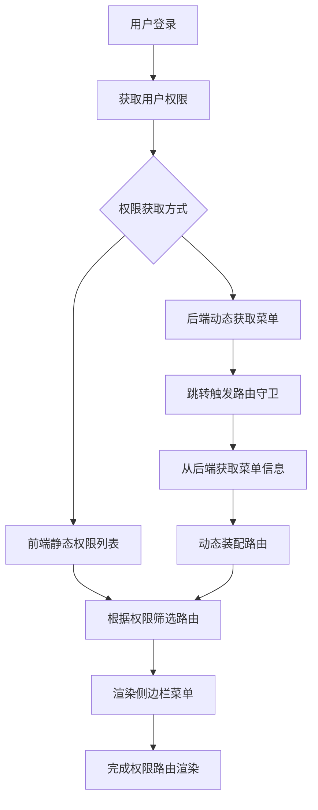

# 导航

## 学习内容

1. PostgreSQL 简单入门
2. Vue3 动态路由

---

# 学习内容

## 1. PostgreSQL 简单入门

注：本文基于已了解 MySQL 的前提。

### 下载

[PostgreSQL 官方下载地址](https://www.enterprisedb.com/downloads/postgres-postgresql-downloads)

### 官方帮助文档

[PostgreSQL 官方文档](http://www.postgres.cn/docs/current/index.html)

### 环境变量

设置环境变量路径为：`C:\Program Files\PostgreSQL\<版本号>\bin`

### 检查连接

在命令行中输入以下命令检查 PostgreSQL 是否正常连接：

```bash
psql -U postgres
```

### 连接到数据库

使用以下命令连接到指定的数据库：

```bash
psql -h <主机名或IP地址> -p <端口号> -d <数据库名称> -U <用户名>
```

默认的数据库和用户名都是 `postgres`。

---

接下来是 PostgreSQL 的层级结构与 MySQL 的区别：

- **服务器层**：负责处理客户端连接、权限验证和查询解析等任务。
- **数据库层**：数据存储的逻辑单元。每个数据库可以包含多个模式（Schema），模式是数据库中的命名空间，用于组织表、视图和其他数据库对象。
- **模式层**：与 MySQL 结构的主要区别，模式是数据库中的逻辑分区，用于组织表、视图、序列等对象。模式之间相互隔离。在 MySQL 中由数据库层包含表层。
- **表层**：即表单。

在 PostgreSQL 中，创建数据库的命令如下：

```sql
CREATE DATABASE new_db;
```

在 PostgreSQL 中，双引号 `""` 用于引用标识符（如表名、列名等），而反引号 `` ` `` 不是有效的引用符号。这与 MySQL 不同，MySQL 使用反引号来引用标识符。

自增主键 `bigserial primary key`：

在 PostgreSQL 中，`serial` 类型是一个自增的整数类型，它实际上等同于 `integer` 类型。因此，作为主键的 `serial` 类型的长度（即占用的存储空间）是 4 字节（2³¹ - 1）。`bigserial`，占用 8 字节（即 2⁶³ - 1）。

一个比较让人不舒服的点是 `comment` 不能直接在创建语句中定义：

```sql
COMMENT ON TABLE    sys_user                IS '用户表';
COMMENT ON COLUMN   sys_user.user_id        IS '用户id';
```

至于 CURD 和外键则没有什么区别，不多说。

字段长度限制：

假设我们有一个表，其中包含一个 `created_by` 字段，定义为 `VARCHAR(50)`。在 pgsql 中，如果尝试插入一个长度超过 50 的字符串，系统会报错，这很正常。但在 MySQL 中，会默认截断超出长度的字符串（只能说不愧是你！）。

Maven 依赖：

```xml
<dependency>
    <groupId>org.postgresql</groupId>
    <artifactId>postgresql</artifactId>
    <scope>runtime</scope>
</dependency>
```

Spring 配置：

```yaml
datasource:
    driver-class-name: org.postgresql.Driver
    url: jdbc:postgresql://localhost:5432/postgres
    username: postgres
    password:
```

## 2. Vue3 动态路由

### 2.1 搭建界面

首先，我们需要一个看起来像这么回事的侧栏组件，以展示我们现在的路由：

```html
<div class="layout-body">
    <!-- 左侧 Sidebar -->
    <aside class="layout-sidebar">
        <h3>导航菜单</h3>
        <Sidebar/>
    </aside>

    <!-- 右侧主内容区 -->
    <main class="main-content">
        <div class="router-view-container">
            <router-view />
        </div>
    </main>
</div>
```

我们将 `Sidebar` 一分为二：`Sidebar` 负责渲染整个侧栏区，`SidebarItem` 负责渲染每个单独的路由：

```html
<el-scrollbar wrap-class="scrollbar-wrapper"> <!-- Sidebar -->
    <el-menu
        :default-active="activeMenu"
        :collapse="isCollapse"
        :unique-opened="true"
        :collapse-transition="false"
        :router="true"
    > <!-- SidebarItem -->
        <sidebar-item 
            v-for="(route, index) in menuRoutes"
            :key="route.path + index"
            :item="route"
            :base-path="route.path"
        />
    </el-menu>
</el-scrollbar>
```

我们需要渲染的路由由公共路由和权限路由组成，这里先暂时不关注具体的实现：

```javascript
const menuRoutes = computed(() => {
    return [...publicRouter, ...permissionRouter];
});
```

接下来是 `SidebarItem` 的实现，这里的难点主要是要对子路由进行递归渲染。

首先需要了解路由的结构：

```javascript
/** 定义组件可以接收的 props */
const props = defineProps<{
    // 路由对象
    item: RouteItem,
    // 基础路径，用于拼接嵌套路由
    basePath: string,
}>();
```

在渲染路由时，重要的参数是 `path`、`hidden` 和 `children`：

```typescript
/** 路由接口 */
export interface RouteItem extends Omit<RouteRecordRaw, 'meta' | 'children'> {
    path: string | null | undefined;
    meta: RouteRecordRaw['meta'] & {
        title?: string | null;
        icon?: string | null; // 图标
        hidden?: boolean; // 是否隐藏
        permission?: string[]; // 权限数组
    };
    children?: RouteItem[]; // 子路由
}
```

`path` 决定了我们点击之后跳转的路由，就像静态路由时的那样，完整的路径由父路由的路径 + 子路由拼接而成：

```javascript
const resolvePath = (routePath: string) => {
    // 使用 path.resolve 来正确拼接路径
    // 如果 basePath 未提供，则默认为 '/'
    return path.resolve(props.basePath || '/', routePath);
};
```

`hidden`，显然隐藏的路由不需要渲染：

```html
<div v-if="!item.meta?.hidden">
    <!-- 处理路由的渲染 -->
</div>
```

`children` 即该路由的子路由信息，我们对于路由处理的逻辑主要基于有几个子路由。先来看单个渲染的情况：

```html
<template v-if="showSingleMenuItem">
    <el-menu-item v-if="theOnlyOneChild" :index="resolvePath(theOnlyOneChild.path)">
        <template #title>
            <span class="menu-title" :title="hasTitle(theOnlyOneChild.meta?.title)">
                {{ theOnlyOneChild.meta?.title }}
            </span>
        </template>
    </el-menu-item>
</template>
```

在有多个子路由的时候，需要对子路由进行递归渲染：

```html
<el-sub-menu v-else ref="subMenu" :index="resolvePath(item.path)" teleported>
    <template v-if="item.meta" #title>
        <span class="menu-title" :title="hasTitle(item.meta?.title)">
            {{ item.meta?.title }}
        </span>
    </template>
    <sidebar-item
        v-for="(child, index) in item.children"
        :key="child.path + index"
        :item="child"
        :base-path="resolvePath(child.path)"
    />
</el-sub-menu>
```

注意：为了让递归组件能够找到自己，需要设置一个主键名：

```javascript
export default {
    name: 'SidebarItem' // 主键名，让递归组件能找到自己
};
```

### 2.2 获取动态路由

这里的获取是指从后端动态获取路由信息。菜单表参考了 Ruoyi 的设计：

```typescript
export interface SysMenu extends BaseEntity {
    menuId?: number | null; // 菜单ID
    menuName?: string | null; // 菜单名称
    parentId?: number | null; // 父菜单ID
    menuIcon?: string | null; // 菜单图标
    menuSort?: number | null; // 菜单排序
    path?: string | null; // 路由地址
    component?: string | null; // 组件路径
    query?: string | null; // 路由参数
    isFrame?: string | null; // 菜单类型(1:内链 0:外链)
    isCache?: string | null; // 是否缓存(1:缓存 0:不缓存)
    menuType?: string | null; // 菜单类型(1:目录 2:菜单 3:按钮)
    visible?: string | null; // 可见性(1:可见 0:不可见)
    status?: string | null; // 状态(1:启用 0:禁用)
    menuKey?: string | null; // 菜单标识字符串
}

export interface SysMenuTree extends SysMenu {
    children?: SysMenuTree[]; // 子菜单
}
```

假设我们已经获取并处理好了路由，那么只需要使用 `router.addRoute()` 把路由全部添加进去即可：

```javascript
accessibleRoutes.forEach(route => {
    router.addRoute(route as RouteRecordRaw);
});
```

我们来看看获取菜单信息后应该怎么处理为路由：

```typescript
/**
 * 从后端获取动态路由
 */
const getDynamicRoutes = async () => {
    const res = await getSysMenuTreeApi();
    if (res.code === 200) {
        try {
            return buildNestedRoutes(res.data);
        } catch (e) {
            console.error(e);
        }
    }
};
```

因为我在后端就已经将菜单转换成树形结构返回了，所以前端不需要对结构上进行额外处理：

```typescript
/**
 * 构建嵌套路由
 */
export const buildNestedRoutes = (menus: SysMenuTree[]): RouteItem[] => {
    const routes: RouteItem[] = [];
    for (let i = 0; i < menus.length; i++) {
        const menu = menus[i];
        const route = convertToRoute(menu);
        if (route) routes.push(route);
    }
    return routes;
};
```

在处理 `children` 的时候，使用 `buildNestedRoutes` 处理，就能简单地完成递归构建的工作：

```typescript
/**
 * 将后端菜单数据转换为前端路由数据
 */
export const convertToRoute = (menu: SysMenuTree): RouteItem | null => {
    // 忽略按钮类型 和 禁用的菜单
    if (menu.menuType === '3' || menu.status === '0') {
        return null;
    }
    const route: RouteItem = {
        path: menu.path,
        meta: {
            title: menu.menuName,
            icon: menu.menuIcon,
            hidden: menu.visible === '0',
            permission: menu.menuKey ? [menu.menuKey] : [],
            cache: menu.isCache === '1',
        },
        component: findMatchingComponent(menu),
        children: menu.children ? buildNestedRoutes(menu.children) : [],
    };
    // 处理外链
    if (menu.isFrame === '0') {
        route.meta.isFrame = true;
        route.redirect = menu.path!;
    }
    return route;
};
```

因为 Vue 的加载机制，我们必须先静态地获取所有的路由资源，再进行查找匹配：

```typescript
/** 获取所有组件 */
const components = import.meta.glob('@/views/**/index.vue');

/**
 * 寻找匹配的组件
 */
export const findMatchingComponent = (menu: SysMenuTree) => {
    if (menu.component) {
        // 构建完整的组件路径
        const componentPath = `@/views/${menu.component}.vue`;

        // 查找匹配的组件
        const moduleKey = Object.keys(components).find(key =>
            key === componentPath || key.includes(menu.component!)
        );

        if (moduleKey && components[moduleKey]) {
            return components[moduleKey];
        } else {
            console.warn(`组件未找到: ${menu.component}`);
            return ErrorView;
        }
    } else {
        if (menu.menuType === '1') {
            return LayoutView;
        } else if (menu.menuType === '2') {
            return ErrorView;
        }
    }
};
```

### 2.3 路由权限控制

在原有路由的基础上，根据 `route.permission` 和当前用户的实际权限进行对比，过滤出用户实际可访问的路由。定义一个 `permissionStore` 通过 Pinia 持久化：

```typescript
export const usePermissionStore = defineStore('permission', () => {
    const permissionRoutes = ref<RouteItem[]>([]);
    const isLoad = ref(false);

    /**
     * 从后端获取动态路由
     */
    const getDynamicRoutes = async () => {
        // ...
    };

    /**
     * 路由权限过滤
     * @param allRoutes 路由数组
     * @param userPermissions 用户权限
     */
    const filterRoutes = (allRoutes: RouteItem[], userPermissions: string[]): RouteItem[] => {
        const accessibleRoutes: RouteItem[] = [];
        // 过滤权限
        allRoutes.forEach((route) => {
            if (hasPermission(route, userPermissions)) {
                if (route.children && route.children.length) { // 递归处理子路由
                    route.children = filterRoutes(route.children, userPermissions);
                }
                accessibleRoutes.push(route);
            }
        });
        return accessibleRoutes;
    };

    /**
     * 判断权限
     * @param route 路由
     * @param userPermissions 用户权限
     */
    const hasPermission = (route: RouteItem, userPermissions: string[]) => {
        if (!route.meta.permission || route.meta.permission.length === 0) {
            return true;
        }
        // 判断用户权限 是否包含路由需要的至少一个权限
        return route.meta.permission.some((requiredPermission: string) => {
            return userPermissions.some((userPermission: string) => {
                return matchPermissionWithWildcard(userPermission, requiredPermission);
            });
        });
    };

    /**
     * 通配符权限匹配
     * @param userPermission 用户拥有的权限
     * @param requiredPermission 路由需要的权限
     */
    const matchPermissionWithWildcard = (userPermission: string, requiredPermission: string): boolean => {
        // ...
    };

    const clearPermission = () => {
        permissionRoutes.value = [];
        isLoad.value = false;
    };

    return {
        permissionRoutes,
        isLoad,
        clearPermission,
        filterRoutes,
        hasPermission,
        getDynamicRoutes
    };
}, {
    persist: {
        storage: localStorage,
        serializer: { // 自定义序列化器
            serialize: JSON.stringify,
            deserialize: parse,
        },
    },
});
```

通过路由护卫，实现登录时加载动态路由：

```typescript
/**
 * 路由守卫
 */
router.beforeEach(async (to, from, next) => {
    const userStore = useUserStore();
    const permissionStore = usePermissionStore();
    const hasToken = userStore.token;
    if (hasToken) { // 已登录
        if (to.path === '/public/login') {
            // next('/');
            next();
        } else {
            // 是否获取了权限
            if (permissionStore.isLoad) {
                next();
            } else {
                // 获取动态路由并添加到路由器
                const dynamicRoutes = await permissionStore.getDynamicRoutes();
                dynamicRoutes?.map(route => {
                    permissionRouter.push(route);
                });
                // 获取用户权限
                const userPermissions = userStore.permissions;
                // 根据用户权限过滤出可访问的路由
                const accessibleRoutes = permissionStore.filterRoutes(permissionRouter, userPermissions);

                // 将可访问的路由存入 Pinia store
                permissionStore.permissionRoutes = accessibleRoutes;
                permissionStore.isLoad = true;

                // 使用 router.addRoute() 动态添加路由
                accessibleRoutes.forEach(route => {
                    router.addRoute(route as RouteRecordRaw);
                });

                // 重新导航
                next({ ...to, replace: true });
            }
        }
    } else { // 未登录
        const isWhiteListed = whiteList.some(path => to.path.startsWith(path));
        if (isWhiteListed) {
            next();
        } else { // 跳转登录页
            next(`/public/login?redirect=${to.path}`);
        }
    }
});
```

### 2.4 整体流程图


